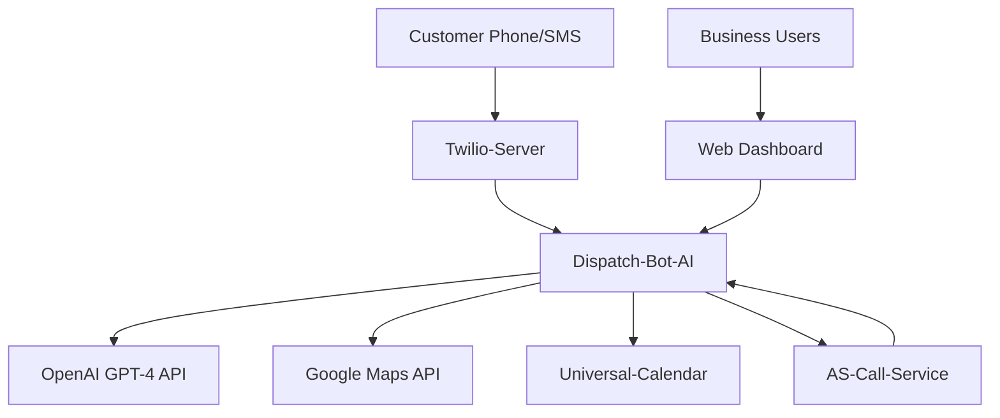
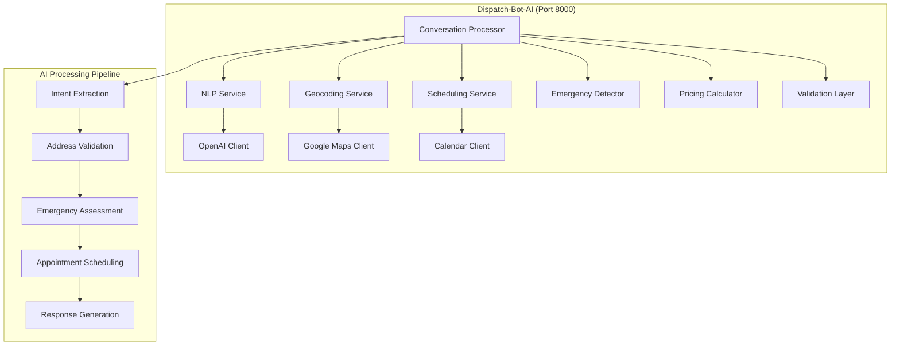

# Dispatch-Bot-AI Architecture

## Context Diagram

### Users & Systems

### Service Boundaries
- **Internal**: AI-powered conversation handler for missed call SMS automation
- **External**: Stateless intelligent conversation processor for field service businesses
- **AI Hub**: Central AI integration point with OpenAI, Google Maps, and calendar services

## Components & Data Flow

### Core Components

### Data Flow Patterns
1. **Basic Conversation Flow**: 
   - SMS message → Intent extraction → Address validation → Service area check → Appointment generation → Response
2. **Emergency Detection Flow**: 
   - Message analysis → Emergency keyword detection → Urgency assessment → Time-based pricing → Immediate scheduling
3. **Multi-Trade Flow**: 
   - Trade classification → Job type detection → Trade-specific rules → Specialized scheduling → Industry responses
4. **Advanced Scheduling Flow**: 
   - Calendar integration → Traffic analysis → Optimal slot selection → Weather consideration → Booking confirmation

### Implementation Phases
- **Phase 1** (Weeks 1-3): Basic plumbing services, business hours only, simple scheduling
- **Phase 2** (Weeks 4-6): Emergency detection, multi-trade support, time-based pricing
- **Phase 3** (Weeks 7-9): Advanced scheduling with traffic/weather integration
- **Phase 4** (Weeks 10-12): Production features, monitoring, multi-business support

## SLOs & Scaling Notes

### Service Level Objectives
- **Availability**: 99.9% uptime (critical for customer conversation handling)
- **Latency**: 
  - Conversation processing: < 2s (P95)
  - Emergency detection: < 1s (P95)
  - Address validation: < 1.5s (P95)
  - Appointment scheduling: < 3s (P95)
- **Throughput**: 
  - 1000 conversations/hour
  - 500 concurrent processing requests
  - 100 appointment bookings/hour
- **Accuracy**: 90% conversation success rate, 95% emergency detection accuracy

### Performance Characteristics
- **Stateless Design**: No persistent state enabling horizontal scaling
- **AI Optimization**: Optimized OpenAI API usage with prompt engineering
- **External API Management**: Rate limiting and retry logic for Google Maps and OpenAI
- **Response Time Optimization**: Sub-2-second customer response times

### Scaling Approach
- **Horizontal Scaling**: Stateless FastAPI design supporting multiple instances
- **AI API Scaling**: Intelligent rate limiting and request batching for OpenAI
- **Cache Strategy**: Address geocoding and business rule caching
- **Load Balancing**: Round-robin distribution of conversation processing

## Risks & Mitigations

### Technical Risks
| Risk | Impact | Probability | Mitigation |
|------|---------|-------------|------------|
| OpenAI API failures | Critical | Medium | Fallback to rule-based processing |
| Google Maps API limits | High | Medium | Geocoding cache + rate limiting |
| Calendar service outages | Medium | Low | Graceful degradation + manual booking |
| Address validation failures | Medium | Medium | Fallback validation methods |

### AI & Processing Risks
- **AI Hallucinations**: Incorrect information generation by AI models
- **Intent Misclassification**: Misunderstanding customer requests
- **Emergency False Positives**: Incorrect emergency detection causing pricing issues
- **Context Loss**: Lost conversation context in stateless processing

### Business Risks
- **Customer Experience**: Poor AI responses affecting customer satisfaction
- **Appointment Accuracy**: Incorrectly scheduled appointments causing service issues
- **Emergency Response**: Delayed or missed emergency service requests
- **Cost Management**: High AI API costs affecting profitability

### Mitigation Strategies
- **Fail-Fast Approach**: Clear error messages when uncertain rather than incorrect responses
- **Confidence Scoring**: AI confidence thresholds for automated responses
- **Human Handoff**: Seamless transition to human agents when needed
- **Comprehensive Testing**: Test-driven development with real-world scenarios

## Open Questions

### AI & ML Strategy
- [ ] **Model Selection**: OpenAI GPT-4 vs alternatives (Claude, Llama) for different use cases?
- [ ] **Fine-tuning**: Custom model fine-tuning for field service industry specifics?
- [ ] **Prompt Engineering**: Optimal prompt strategies for consistent performance?
- [ ] **AI Model Updates**: Strategy for handling AI model updates and changes?

### Conversation Management
- [ ] **Context Preservation**: How to maintain conversation context in stateless design?
- [ ] **Multi-turn Conversations**: Complex multi-message conversation handling?
- [ ] **Conversation Timeouts**: Optimal timeout handling for abandoned conversations?
- [ ] **Human Handoff**: Seamless AI-to-human transition mechanisms?

### Emergency Detection
- [ ] **Detection Accuracy**: Improving emergency detection accuracy across trades?
- [ ] **Context Sensitivity**: Contextual emergency detection based on time/location?
- [ ] **False Positive Handling**: Managing false positive emergency detections?
- [ ] **Emergency Escalation**: Integration with emergency dispatch systems?

### Scheduling Intelligence
- [ ] **Calendar Integration**: Deep integration with multiple calendar providers?
- [ ] **Smart Scheduling**: AI-powered optimal scheduling based on multiple factors?
- [ ] **Conflict Resolution**: Handling scheduling conflicts and rebooking?
- [ ] **Availability Optimization**: Dynamic availability based on demand patterns?

### Multi-Trade Support
- [ ] **Trade Classification**: Accurate classification of customer requests by trade?
- [ ] **Industry Specialization**: Trade-specific conversation flows and terminology?
- [ ] **Cross-Trade Services**: Handling requests spanning multiple trades?
- [ ] **Pricing Complexity**: Different pricing models across trades and regions?

### Performance Optimization
- [ ] **Response Time Optimization**: Sub-second response time requirements?
- [ ] **API Cost Management**: Optimizing AI API costs while maintaining quality?
- [ ] **Caching Strategy**: What conversation data should be cached and for how long?
- [ ] **Batch Processing**: Batch processing opportunities for efficiency?

### Integration Architecture
- [ ] **Service Communication**: Optimal communication patterns with other NMC services?
- [ ] **Event-Driven Architecture**: Event publishing for conversation state changes?
- [ ] **API Versioning**: Handling API version changes across integrated services?
- [ ] **Error Propagation**: Error handling and propagation across service boundaries?

### Business Intelligence
- [ ] **Conversation Analytics**: Analytics on conversation success rates and patterns?
- [ ] **AI Performance Metrics**: Measuring AI accuracy and improvement opportunities?
- [ ] **Customer Satisfaction**: Measuring customer satisfaction with AI interactions?
- [ ] **Business Impact**: ROI measurement for AI conversation handling?

### Security & Privacy
- [ ] **Data Privacy**: Customer conversation data privacy and retention policies?
- [ ] **AI Model Security**: Security considerations for AI model usage and data?
- [ ] **API Security**: Secure integration with external AI and mapping services?
- [ ] **Audit Requirements**: Conversation audit logging and compliance requirements?

### Future Enhancements
- [ ] **Voice AI**: Real-time voice conversation processing capabilities?
- [ ] **Multi-language**: Support for multiple languages and regional dialects?
- [ ] **Advanced AI**: Integration with specialized AI models for specific industries?
- [ ] **Predictive Analytics**: Predictive scheduling and demand forecasting?

### Operational Excellence
- [ ] **Monitoring Strategy**: Key metrics for AI service health and performance?
- [ ] **A/B Testing**: Framework for testing AI conversation improvements?
- [ ] **Model Performance**: Ongoing monitoring and optimization of AI model performance?
- [ ] **Disaster Recovery**: AI service disaster recovery and failover procedures?

### Development Strategy
- [ ] **Test-Driven Development**: TDD approach for AI conversation logic?
- [ ] **Integration Testing**: Testing strategy with real external APIs?
- [ ] **Performance Testing**: Load testing for high-volume conversation processing?
- [ ] **Quality Assurance**: Quality assurance processes for AI-generated responses?