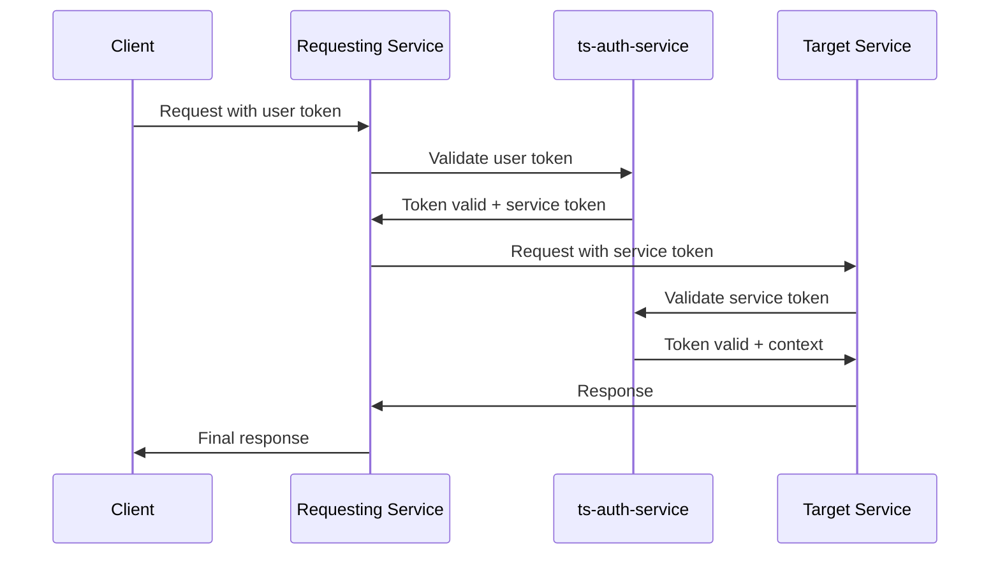

# API Integration Patterns

## Overview
This document defines the standard integration patterns, authentication flows, error handling strategies, and API design principles used across all NeverMissCall microservices.

## Standard API Patterns

### 1. RESTful Service Communication

#### Standard HTTP Methods
```python
from typing import Optional, Union, Dict, Any
from dataclasses import dataclass
from enum import Enum

class HTTPMethod(Enum):
    GET = "GET"
    POST = "POST"
    PUT = "PUT"
    DELETE = "DELETE"
    PATCH = "PATCH"

@dataclass
class ServiceRequest:
    method: HTTPMethod
    endpoint: str
    headers: Dict[str, str]
    body: Optional[Dict[str, Any]] = None
    
    def __init__(self, method: HTTPMethod, endpoint: str, 
                 authorization: str, tenant_id: str, request_id: str,
                 user_id: Optional[str] = None, body: Optional[Dict[str, Any]] = None):
        self.method = method
        self.endpoint = endpoint
        self.headers = {
            'Authorization': authorization,      # JWT token
            'X-Tenant-ID': tenant_id,           # Tenant context
            'X-Request-ID': request_id,         # Correlation ID
            'Content-Type': 'application/json'
        }
        if user_id:
            self.headers['X-User-ID'] = user_id  # User context (optional)
        self.body = body

@dataclass
class ErrorDetails:
    code: str
    message: str
    details: Optional[Dict[str, Any]] = None

@dataclass
class ServiceMetadata:
    timestamp: str
    request_id: str
    processing_time_ms: float
    total_count: Optional[int] = None
    page: Optional[int] = None
    limit: Optional[int] = None

@dataclass
class ServiceResponse:
    success: bool
    data: Optional[Any] = None
    error: Optional[ErrorDetails] = None
    metadata: Optional[ServiceMetadata] = None
```

#### URL Structure Standards
```
https://service-host:port/api/v1/{resource}/{id?}/{sub-resource?}

Examples:
GET  /api/v1/calls                    # List calls
GET  /api/v1/calls/{call-id}          # Get specific call
POST /api/v1/calls                    # Create new call
PUT  /api/v1/calls/{call-id}          # Update call
GET  /api/v1/calls/{call-id}/messages # Get call messages
POST /api/v1/calls/{call-id}/messages # Add message to call
```

### 2. Authentication and Authorization Pattern

#### JWT Token Flow


#### Token Types and Scopes
```python
from dataclasses import dataclass
from typing import List, Optional
from enum import Enum

class TokenScope(Enum):
    USER = "user"
    SERVICE = "service"
    ADMIN = "admin"

@dataclass
class UserJWT:
    sub: str              # user_id
    tenant_id: str        # tenant context
    role: str             # user role
    permissions: List[str] # specific permissions
    iat: int              # issued at
    exp: int              # expires at
    scope: TokenScope = TokenScope.USER

@dataclass
class ServiceJWT:
    sub: str              # service_name
    iat: int
    exp: int
    scope: TokenScope = TokenScope.SERVICE
    permissions: List[str] = None
    tenant_id: Optional[str] = None  # tenant context (if applicable)

@dataclass
class AdminJWT:
    sub: str              # admin_user_id
    iat: int
    exp: int
    scope: TokenScope = TokenScope.ADMIN
    permissions: List[str] = None
```

### 3. Error Handling Patterns

#### Standard Error Response Format
```python
from dataclasses import dataclass
from typing import List, Optional, Dict, Any
from enum import Enum

@dataclass
class ValidationError:
    field: str
    message: str
    code: str

@dataclass
class ErrorDetails:
    field: Optional[str] = None           # Field that caused error
    validation_errors: Optional[List[ValidationError]] = None
    retry_after: Optional[int] = None     # Seconds to wait before retry

@dataclass
class ErrorInfo:
    code: str                             # Machine-readable error code
    message: str                          # Human-readable message
    details: Optional[ErrorDetails] = None # Additional error context

@dataclass
class ErrorMetadata:
    timestamp: str
    request_id: str
    service: str

@dataclass
class ErrorResponse:
    success: bool = False
    error: ErrorInfo = None
    metadata: ErrorMetadata = None

class ErrorCodes(Enum):
    # Authentication & Authorization
    AUTH_TOKEN_INVALID = 'AUTH_TOKEN_INVALID'
    AUTH_TOKEN_EXPIRED = 'AUTH_TOKEN_EXPIRED'
    AUTH_INSUFFICIENT_PERMISSIONS = 'AUTH_INSUFFICIENT_PERMISSIONS'
    
    # Validation
    VALIDATION_FAILED = 'VALIDATION_FAILED'
    REQUIRED_FIELD_MISSING = 'REQUIRED_FIELD_MISSING'
    INVALID_FORMAT = 'INVALID_FORMAT'
    
    # Business Logic
    RESOURCE_NOT_FOUND = 'RESOURCE_NOT_FOUND'
    RESOURCE_ALREADY_EXISTS = 'RESOURCE_ALREADY_EXISTS'
    BUSINESS_RULE_VIOLATION = 'BUSINESS_RULE_VIOLATION'
    
    # External Services
    EXTERNAL_SERVICE_UNAVAILABLE = 'EXTERNAL_SERVICE_UNAVAILABLE'
    EXTERNAL_API_RATE_LIMIT = 'EXTERNAL_API_RATE_LIMIT'
    EXTERNAL_API_ERROR = 'EXTERNAL_API_ERROR'
    
    # System
    INTERNAL_SERVER_ERROR = 'INTERNAL_SERVER_ERROR'
    SERVICE_UNAVAILABLE = 'SERVICE_UNAVAILABLE'
    RATE_LIMIT_EXCEEDED = 'RATE_LIMIT_EXCEEDED'
```

#### Circuit Breaker Pattern
```python
import time
from typing import Callable, TypeVar, Awaitable
from enum import Enum

T = TypeVar('T')

class CircuitBreakerState(Enum):
    CLOSED = "CLOSED"
    OPEN = "OPEN"
    HALF_OPEN = "HALF_OPEN"

class CircuitBreakerError(Exception):
    pass

class CircuitBreaker:
    def __init__(self, failure_threshold: int = 5, timeout: float = 60.0, monitoring_period: float = 10.0):
        self.failure_count = 0
        self.last_failure_time = 0.0
        self.state = CircuitBreakerState.CLOSED
        self.failure_threshold = failure_threshold
        self.timeout = timeout  # seconds
        self.monitoring_period = monitoring_period  # seconds
    
    async def execute(self, operation: Callable[[], Awaitable[T]]) -> T:
        if self.state == CircuitBreakerState.OPEN:
            if time.time() - self.last_failure_time > self.timeout:
                self.state = CircuitBreakerState.HALF_OPEN
            else:
                raise CircuitBreakerError('Circuit breaker is OPEN')
        
        try:
            result = await operation()
            self._on_success()
            return result
        except Exception as error:
            self._on_failure()
            raise error
    
    def _on_success(self) -> None:
        self.failure_count = 0
        self.state = CircuitBreakerState.CLOSED
    
    def _on_failure(self) -> None:
        self.failure_count += 1
        self.last_failure_time = time.time()
        
        if self.failure_count >= self.failure_threshold:
            self.state = CircuitBreakerState.OPEN
```

### 4. Retry and Backoff Strategies

#### Exponential Backoff with Jitter
```python
import asyncio
import random
import math
from typing import Callable, TypeVar, Awaitable, Any
from dataclasses import dataclass

T = TypeVar('T')

@dataclass
class RetryOptions:
    max_retries: int
    base_delay: float
    max_delay: float
    backoff_multiplier: float
    jitter_max: float

class RetryHandler:
    async def execute_with_retry(
        self,
        operation: Callable[[], Awaitable[T]],
        options: RetryOptions
    ) -> T:
        last_error: Exception = None
        
        for attempt in range(options.max_retries + 1):
            try:
                return await operation()
            except Exception as error:
                last_error = error
                
                if attempt == options.max_retries:
                    break
                
                if not self._is_retryable_error(error):
                    raise error
                
                delay = self._calculate_delay(attempt, options)
                await asyncio.sleep(delay)
        
        raise last_error
    
    def _calculate_delay(self, attempt: int, options: RetryOptions) -> float:
        exponential_delay = min(
            options.base_delay * (options.backoff_multiplier ** attempt),
            options.max_delay
        )
        
        jitter = random.random() * options.jitter_max
        return exponential_delay + jitter
    
    def _is_retryable_error(self, error: Any) -> bool:
        """Retry on network errors, timeouts, and 5xx errors"""
        error_code = getattr(error, 'code', None)
        error_status = getattr(error, 'status', None)
        
        return (error_code in ['NETWORK_ERROR', 'TIMEOUT'] or
                (error_status and 500 <= error_status < 600))
```

## External API Integration Patterns

### 1. Twilio API Integration

#### Webhook Handling Pattern
```python
import hashlib
import hmac
import base64
import logging
from typing import Dict, Any, Optional
from dataclasses import dataclass
from enum import Enum

logger = logging.getLogger(__name__)

class TwilioEventType(Enum):
    CALL_INITIATED = "call-initiated"
    CALL_ANSWERED = "call-answered"
    CALL_COMPLETED = "call-completed"
    MESSAGE_RECEIVED = "message-received"

@dataclass
class TwilioWebhookEvent:
    event_type: TwilioEventType
    call_sid: Optional[str] = None
    message_sid: Optional[str] = None
    from_number: Optional[str] = None
    to_number: Optional[str] = None
    body: Optional[str] = None

@dataclass
class SendSMSOptions:
    status_callback: Optional[str] = None
    media_url: Optional[str] = None

class TwilioWebhookHandler:
    def __init__(self, auth_token: str):
        self.auth_token = auth_token
    
    def validate_webhook(self, payload: str, signature: str, url: str) -> bool:
        """Validate Twilio webhook signature"""
        expected_signature = base64.b64encode(
            hmac.new(
                self.auth_token.encode('utf-8'),
                (url + payload).encode('utf-8'),
                hashlib.sha1
            ).digest()
        ).decode('utf-8')
        
        return hmac.compare_digest(signature, expected_signature)
    
    async def process_webhook(self, event: TwilioWebhookEvent) -> None:
        """Process incoming Twilio webhook events"""
        event_handlers = {
            TwilioEventType.CALL_INITIATED: self._handle_call_initiated,
            TwilioEventType.CALL_ANSWERED: self._handle_call_answered,
            TwilioEventType.CALL_COMPLETED: self._handle_call_completed,
            TwilioEventType.MESSAGE_RECEIVED: self._handle_message_received,
        }
        
        handler = event_handlers.get(event.event_type)
        if handler:
            await handler(event)
        else:
            logger.warning(f"Unknown Twilio event type: {event.event_type}")
    
    async def _handle_call_initiated(self, event: TwilioWebhookEvent) -> None:
        # Implementation for call initiated
        pass
    
    async def _handle_call_answered(self, event: TwilioWebhookEvent) -> None:
        # Implementation for call answered
        pass
    
    async def _handle_call_completed(self, event: TwilioWebhookEvent) -> None:
        # Implementation for call completed
        pass
    
    async def _handle_message_received(self, event: TwilioWebhookEvent) -> None:
        # Implementation for message received
        pass

class TwilioAPIClient:
    def __init__(self, account_sid: str, auth_token: str, 
                 circuit_breaker: CircuitBreaker, retry_handler: RetryHandler):
        from twilio.rest import Client
        self.client = Client(account_sid, auth_token)
        self.circuit_breaker = circuit_breaker
        self.retry_handler = retry_handler
    
    async def send_sms(self, to: str, from_: str, body: str, 
                      options: Optional[SendSMSOptions] = None) -> Any:
        """Send SMS with circuit breaker and retry logic"""
        
        async def sms_operation():
            message_params = {
                'to': to,
                'from_': from_,
                'body': body
            }
            if options:
                if options.status_callback:
                    message_params['status_callback'] = options.status_callback
                if options.media_url:
                    message_params['media_url'] = options.media_url
            
            return self.client.messages.create(**message_params)
        
        return await self.circuit_breaker.execute(
            lambda: self.retry_handler.execute_with_retry(
                sms_operation,
                RetryOptions(
                    max_retries=3,
                    base_delay=1.0,
                    max_delay=10.0,
                    backoff_multiplier=2.0,
                    jitter_max=0.5
                )
            )
        )
```

### 2. OpenAI API Integration

#### Request/Response Pattern with Fallbacks
```python
import logging
from typing import List, Dict, Optional
from dataclasses import dataclass

logger = logging.getLogger(__name__)

@dataclass
class ChatMessage:
    role: str
    content: str

@dataclass
class ConversationContext:
    last_message: str
    customer_id: str
    conversation_id: str
    business_context: Dict[str, any]

class OpenAIClient:
    def __init__(self, api_key: str, circuit_breaker: CircuitBreaker):
        import openai
        self.client = openai.OpenAI(api_key=api_key)
        self.circuit_breaker = circuit_breaker
        self.fallback_templates = {
            'appointment_request': "I'd be happy to help schedule an appointment. A team member will contact you shortly to arrange a convenient time.",
            'pricing_inquiry': "Thanks for your interest in our pricing. A team member will provide you with a detailed quote soon.",
            'emergency': "We understand this is urgent. A team member will contact you immediately to address your emergency.",
            'general_inquiry': "Thanks for your message. A team member will respond soon."
        }
    
    async def generate_response(
        self,
        messages: List[ChatMessage],
        context: ConversationContext
    ) -> str:
        try:
            return await self.circuit_breaker.execute(
                lambda: self._call_openai_api(messages, context)
            )
        except Exception as error:
            logger.error("OpenAI API failed, using fallback", exc_info=True)
            return self._get_fallback_response(context)
    
    async def _call_openai_api(
        self,
        messages: List[ChatMessage],
        context: ConversationContext
    ) -> str:
        formatted_messages = self._format_messages(messages, context)
        
        completion = await self.client.chat.completions.create(
            model="gpt-3.5-turbo",
            messages=formatted_messages,
            max_tokens=150,
            temperature=0.7,
            timeout=30.0
        )
        
        response_content = completion.choices[0].message.content
        return response_content if response_content else self._get_fallback_response(context)
    
    def _get_fallback_response(self, context: ConversationContext) -> str:
        intent = self._detect_basic_intent(context.last_message)
        return self.fallback_templates.get(intent, self.fallback_templates['general_inquiry'])
    
    def _detect_basic_intent(self, message: str) -> str:
        lower_message = message.lower()
        
        if any(keyword in lower_message for keyword in ['appointment', 'schedule']):
            return 'appointment_request'
        if any(keyword in lower_message for keyword in ['price', 'cost', 'quote']):
            return 'pricing_inquiry'
        if any(keyword in lower_message for keyword in ['emergency', 'urgent']):
            return 'emergency'
        
        return 'general_inquiry'
    
    def _format_messages(
        self,
        messages: List[ChatMessage],
        context: ConversationContext
    ) -> List[Dict[str, str]]:
        # Add business context as system message
        formatted = [
            {
                "role": "system",
                "content": f"You are a helpful assistant for {context.business_context.get('business_name', 'our business')}."
            }
        ]
        
        # Add conversation messages
        for msg in messages:
            formatted.append({
                "role": msg.role,
                "content": msg.content
            })
        
        return formatted
```

### 3. Calendar API Integration (Google/Microsoft)

#### OAuth 2.0 Flow Pattern
```python
import aiohttp
import json
from typing import Dict, Any, Optional, Protocol
from dataclasses import dataclass
from datetime import datetime, timedelta

@dataclass
class OAuthTokens:
    access_token: str
    refresh_token: str
    expires_at: datetime

@dataclass
class CalendarEvent:
    summary: str
    start_datetime: datetime
    end_datetime: datetime
    description: Optional[str] = None
    location: Optional[str] = None

@dataclass
class CalendarEventResponse:
    id: str
    event_url: str
    status: str

class TokenStore(Protocol):
    async def get_tokens(self, tenant_id: str) -> OAuthTokens: ...
    async def save_tokens(self, tenant_id: str, tokens: OAuthTokens) -> None: ...

class CalendarAPIClient:
    def __init__(self, api_base_url: str, client_id: str, client_secret: str,
                 token_store: TokenStore, circuit_breaker: CircuitBreaker):
        self.api_base_url = api_base_url
        self.client_id = client_id
        self.client_secret = client_secret
        self.token_store = token_store
        self.circuit_breaker = circuit_breaker
    
    async def refresh_token_if_needed(self, tenant_id: str) -> str:
        """Refresh OAuth token if expired"""
        tokens = await self.token_store.get_tokens(tenant_id)
        
        if self._is_token_expired(tokens.access_token, tokens.expires_at):
            refreshed_tokens = await self._refresh_access_token(tokens.refresh_token)
            await self.token_store.save_tokens(tenant_id, refreshed_tokens)
            return refreshed_tokens.access_token
        
        return tokens.access_token
    
    async def create_event(
        self,
        tenant_id: str,
        event: CalendarEvent
    ) -> CalendarEventResponse:
        """Create calendar event with OAuth authentication"""
        access_token = await self.refresh_token_if_needed(tenant_id)
        
        return await self.circuit_breaker.execute(
            lambda: self._make_calendar_request(access_token, event)
        )
    
    async def _make_calendar_request(
        self,
        access_token: str,
        event: CalendarEvent
    ) -> CalendarEventResponse:
        """Make authenticated request to calendar API"""
        url = f"{self.api_base_url}/calendar/v3/calendars/primary/events"
        headers = {
            'Authorization': f'Bearer {access_token}',
            'Content-Type': 'application/json'
        }
        
        event_data = {
            'summary': event.summary,
            'start': {'dateTime': event.start_datetime.isoformat()},
            'end': {'dateTime': event.end_datetime.isoformat()},
            'description': event.description,
            'location': event.location
        }
        
        async with aiohttp.ClientSession() as session:
            async with session.post(url, headers=headers, json=event_data) as response:
                if not response.ok:
                    raise Exception(f"Calendar API error: {response.status}")
                
                response_data = await response.json()
                return CalendarEventResponse(
                    id=response_data['id'],
                    event_url=response_data.get('htmlLink', ''),
                    status=response_data.get('status', 'confirmed')
                )
    
    def _is_token_expired(self, access_token: str, expires_at: datetime) -> bool:
        """Check if OAuth token is expired"""
        return datetime.utcnow() >= expires_at - timedelta(minutes=5)  # 5 min buffer
    
    async def _refresh_access_token(self, refresh_token: str) -> OAuthTokens:
        """Refresh OAuth access token"""
        # Implementation depends on OAuth provider (Google, Microsoft, etc.)
        # This is a simplified example
        async with aiohttp.ClientSession() as session:
            data = {
                'grant_type': 'refresh_token',
                'refresh_token': refresh_token,
                'client_id': self.client_id,
                'client_secret': self.client_secret
            }
            
            async with session.post('https://oauth2.googleapis.com/token', data=data) as response:
                if not response.ok:
                    raise Exception("Failed to refresh token")
                
                token_data = await response.json()
                return OAuthTokens(
                    access_token=token_data['access_token'],
                    refresh_token=refresh_token,  # Keep existing refresh token
                    expires_at=datetime.utcnow() + timedelta(seconds=token_data.get('expires_in', 3600))
                )
```

## WebSocket Communication Patterns

### 1. Real-time Event Broadcasting

#### WebSocket Connection Management
```python
import asyncio
import json
import uuid
import logging
from typing import Dict, Set, Any, Optional, Callable, Awaitable
from dataclasses import dataclass
from datetime import datetime
import websockets
from websockets.server import WebSocketServerProtocol

logger = logging.getLogger(__name__)

@dataclass
class UserContext:
    user_id: str
    tenant_id: str
    role: str

@dataclass
class ConnectionSession:
    connection_id: str
    user_context: UserContext
    connected_at: datetime

class WebSocketManager:
    def __init__(self, token_validator: Callable[[str], Awaitable[UserContext]]):
        self.connections: Dict[str, WebSocketServerProtocol] = {}
        self.user_sessions: Dict[str, Set[str]] = {}
        self.connection_sessions: Dict[str, ConnectionSession] = {}
        self.validate_token = token_validator
    
    async def handle_connection(self, websocket: WebSocketServerProtocol, token: str) -> None:
        """Handle new WebSocket connection with authentication"""
        try:
            user_context = await self.validate_token(token)
            connection_id = self._generate_connection_id()
            
            # Store connection
            self.connections[connection_id] = websocket
            self._add_user_session(user_context.user_id, connection_id)
            
            # Store session info
            self.connection_sessions[connection_id] = ConnectionSession(
                connection_id=connection_id,
                user_context=user_context,
                connected_at=datetime.utcnow()
            )
            
            # Send connection confirmation
            await self.send_to_connection(connection_id, {
                'type': 'connection_established',
                'connection_id': connection_id,
                'timestamp': datetime.utcnow().isoformat()
            })
            
            # Handle incoming messages
            async for message in websocket:
                await self._handle_message(connection_id, message)
                
        except websockets.exceptions.AuthenticationError:
            await websocket.close(code=1008, reason='Authentication failed')
        except Exception as error:
            logger.error(f"WebSocket connection error: {error}")
            await websocket.close(code=1011, reason='Internal server error')
        finally:
            await self._cleanup_connection(connection_id)
    
    async def broadcast_to_user(self, user_id: str, message: Any) -> None:
        """Broadcast message to all connections for a specific user"""
        user_connections = self.user_sessions.get(user_id, set())
        tasks = [
            self.send_to_connection(connection_id, message)
            for connection_id in user_connections
            if connection_id in self.connections
        ]
        
        if tasks:
            await asyncio.gather(*tasks, return_exceptions=True)
    
    async def broadcast_to_tenant(self, tenant_id: str, message: Any) -> None:
        """Broadcast message to all users in a tenant"""
        tasks = []
        for connection_id, session in self.connection_sessions.items():
            if session.user_context.tenant_id == tenant_id and connection_id in self.connections:
                tasks.append(self.send_to_connection(connection_id, message))
        
        if tasks:
            await asyncio.gather(*tasks, return_exceptions=True)
    
    async def send_to_connection(self, connection_id: str, message: Any) -> None:
        """Send message to specific connection"""
        websocket = self.connections.get(connection_id)
        if websocket and not websocket.closed:
            try:
                await websocket.send(json.dumps(message))
            except websockets.exceptions.ConnectionClosed:
                await self._cleanup_connection(connection_id)
            except Exception as error:
                logger.error(f"Error sending message to {connection_id}: {error}")
    
    def _generate_connection_id(self) -> str:
        """Generate unique connection ID"""
        return str(uuid.uuid4())
    
    def _add_user_session(self, user_id: str, connection_id: str) -> None:
        """Add connection to user sessions"""
        if user_id not in self.user_sessions:
            self.user_sessions[user_id] = set()
        self.user_sessions[user_id].add(connection_id)
    
    async def _handle_message(self, connection_id: str, message: str) -> None:
        """Handle incoming WebSocket message"""
        try:
            data = json.loads(message)
            # Process message based on type
            message_type = data.get('type')
            if message_type == 'heartbeat':
                await self.send_to_connection(connection_id, {'type': 'heartbeat_ack'})
        except json.JSONDecodeError:
            logger.warning(f"Invalid JSON message from {connection_id}")
        except Exception as error:
            logger.error(f"Error handling message from {connection_id}: {error}")
    
    async def _cleanup_connection(self, connection_id: str) -> None:
        """Clean up connection resources"""
        if connection_id in self.connections:
            del self.connections[connection_id]
        
        if connection_id in self.connection_sessions:
            session = self.connection_sessions[connection_id]
            user_id = session.user_context.user_id
            
            # Remove from user sessions
            if user_id in self.user_sessions:
                self.user_sessions[user_id].discard(connection_id)
                if not self.user_sessions[user_id]:
                    del self.user_sessions[user_id]
            
            del self.connection_sessions[connection_id]
```

#### Event Message Format
```python
from dataclasses import dataclass
from typing import Any, Optional
from enum import Enum

@dataclass
class WebSocketMetadata:
    timestamp: str
    source_service: str
    correlation_id: Optional[str] = None

@dataclass
class WebSocketMessage:
    type: str
    payload: Any
    metadata: WebSocketMetadata

class WebSocketEventTypes(Enum):
    # Connection events
    CONNECTION_ESTABLISHED = 'connection_established'
    CONNECTION_HEARTBEAT = 'heartbeat'
    
    # Call events
    INCOMING_CALL = 'incoming_call'
    CALL_ANSWERED = 'call_answered'
    CALL_MISSED = 'call_missed'
    CALL_ENDED = 'call_ended'
    
    # Message events
    NEW_MESSAGE = 'new_message'
    MESSAGE_SENT = 'message_sent'
    MESSAGE_DELIVERED = 'message_delivered'
    
    # AI events
    AI_TAKEOVER = 'ai_takeover'
    AI_RESPONSE = 'ai_response'
    HUMAN_TAKEOVER = 'human_takeover'
    
    # Dashboard events
    DASHBOARD_UPDATE = 'dashboard_update'
    METRICS_UPDATE = 'metrics_update'
    WIDGET_REFRESH = 'widget_refresh'
    
    # System events
    SERVICE_STATUS = 'service_status'
    SYSTEM_ALERT = 'system_alert'
    MAINTENANCE_MODE = 'maintenance_mode'
```

## Data Synchronization Patterns

### 1. Event-Driven Data Consistency

#### Domain Event Pattern
```python
from dataclasses import dataclass
from typing import Any, Optional, Dict, List, Protocol
from datetime import datetime
import uuid

@dataclass
class DomainEventMetadata:
    timestamp: str
    version: int
    user_id: Optional[str] = None
    tenant_id: Optional[str] = None
    correlation_id: Optional[str] = None

@dataclass
class DomainEvent:
    event_id: str
    event_type: str
    aggregate_id: str
    aggregate_type: str
    event_data: Any
    metadata: DomainEventMetadata

class MessageQueue(Protocol):
    async def publish(self, topic: str, event: DomainEvent) -> None: ...

class WebSocketManager(Protocol):
    async def broadcast_event(self, event: DomainEvent) -> None: ...

class EventPublisher:
    def __init__(self, message_queue: MessageQueue, websocket_manager: WebSocketManager):
        self.message_queue = message_queue
        self.websocket_manager = websocket_manager
        self.realtime_events = {
            'call_received',
            'message_received',
            'ai_response_generated',
            'conversation_status_changed'
        }
    
    async def publish_event(self, event: DomainEvent) -> None:
        """Publish domain event to message queue and WebSocket if real-time"""
        # Publish to message queue or event bus
        await self.message_queue.publish('domain_events', event)
        
        # Also trigger WebSocket notifications if real-time
        if self._is_realtime_event(event.event_type):
            await self.websocket_manager.broadcast_event(event)
    
    def _is_realtime_event(self, event_type: str) -> bool:
        """Check if event should be broadcast in real-time"""
        return event_type in self.realtime_events

class ConversationService(Protocol):
    async def create(self, data: Dict[str, Any]) -> Dict[str, Any]: ...

class SMSService(Protocol):
    async def send_initial_response(self, conversation_id: str) -> None: ...

class AnalyticsService(Protocol):
    async def record_missed_call(self, event_data: Any) -> None: ...

class ConversationEventHandler:
    def __init__(self, conversation_service: ConversationService, 
                 sms_service: SMSService, analytics_service: AnalyticsService,
                 event_publisher: EventPublisher):
        self.conversation_service = conversation_service
        self.sms_service = sms_service
        self.analytics_service = analytics_service
        self.event_publisher = event_publisher
    
    async def handle_call_missed(self, event: DomainEvent) -> None:
        """Handle missed call event and trigger conversation creation"""
        # Create conversation record
        conversation = await self.conversation_service.create({
            'call_id': event.aggregate_id,
            'tenant_id': event.metadata.tenant_id,
            'status': 'initiated'
        })
        
        # Trigger SMS sending
        await self.sms_service.send_initial_response(conversation['id'])
        
        # Update analytics
        await self.analytics_service.record_missed_call(event.event_data)
        
        # Notify dashboard
        conversation_created_event = DomainEvent(
            event_id=str(uuid.uuid4()),
            event_type='conversation_created',
            aggregate_id=conversation['id'],
            aggregate_type='conversation',
            event_data=conversation,
            metadata=DomainEventMetadata(
                timestamp=datetime.utcnow().isoformat(),
                version=1,
                tenant_id=event.metadata.tenant_id
            )
        )
        
        await self.event_publisher.publish_event(conversation_created_event)
```

### 2. Cache Invalidation Strategy

#### Cache-Aside Pattern with TTL
```python
import json
import redis.asyncio as redis
from typing import TypeVar, Callable, Awaitable, List

T = TypeVar('T')

class CacheManager:
    def __init__(self, redis_client: redis.Redis):
        self.cache = redis_client
    
    async def get(self, key: str, fetch_function: Callable[[], Awaitable[T]], ttl: int = 300) -> T:
        """Get data from cache or fetch from source with TTL"""
        # Try to get from cache first
        cached = await self.cache.get(key)
        if cached:
            return json.loads(cached.decode('utf-8'))
        
        # Cache miss - fetch from source
        data = await fetch_function()
        
        # Store in cache with TTL
        await self.cache.setex(key, ttl, json.dumps(data, default=str))
        
        return data
    
    async def invalidate(self, pattern: str) -> None:
        """Invalidate cache entries matching pattern"""
        keys = await self.cache.keys(pattern)
        if keys:
            await self.cache.delete(*keys)
    
    async def invalidate_on_event(self, event: DomainEvent) -> None:
        """Invalidate cache based on domain event type"""
        invalidation_patterns = {
            'conversation_updated': [
                f"conversation:{event.aggregate_id}:*",
                f"dashboard:{event.metadata.tenant_id}:*"
            ],
            'tenant_settings_changed': [
                f"tenant:{event.metadata.tenant_id}:*"
            ],
            'user_permissions_changed': [
                f"user:{event.metadata.user_id}:*"
            ]
        }
        
        patterns = invalidation_patterns.get(event.event_type, [])
        for pattern in patterns:
            await self.invalidate(pattern)
```

## Rate Limiting and Throttling

### 1. Service-Level Rate Limiting

#### Token Bucket Algorithm
```python
import time
import math
from typing import Dict, NamedTuple
from dataclasses import dataclass

class RateLimitResult(NamedTuple):
    allowed: bool
    retry_after: int = None

@dataclass
class TokenBucket:
    capacity: int
    refill_rate: float  # tokens per second
    tokens: float
    last_refill: float
    
    def __init__(self, capacity: int, refill_rate: float):
        self.capacity = capacity
        self.refill_rate = refill_rate
        self.tokens = float(capacity)
        self.last_refill = time.time()
    
    def consume(self) -> bool:
        """Try to consume a token from the bucket"""
        self._refill()
        
        if self.tokens >= 1.0:
            self.tokens -= 1.0
            return True
        
        return False
    
    def _refill(self) -> None:
        """Refill tokens based on time elapsed"""
        now = time.time()
        tokens_to_add = (now - self.last_refill) * self.refill_rate
        self.tokens = min(self.capacity, self.tokens + tokens_to_add)
        self.last_refill = now
    
    def get_retry_after(self) -> int:
        """Get seconds to wait before retry"""
        tokens_needed = 1.0 - self.tokens
        return max(0, math.ceil(tokens_needed / self.refill_rate))

class RateLimiter:
    def __init__(self):
        self.buckets: Dict[str, TokenBucket] = {}
    
    async def is_allowed(
        self,
        identifier: str,
        limit: int,
        window_seconds: int
    ) -> RateLimitResult:
        """Check if request is allowed within rate limit"""
        bucket = self._get_bucket(identifier, limit, window_seconds)
        
        if bucket.consume():
            return RateLimitResult(allowed=True)
        else:
            retry_after = bucket.get_retry_after()
            return RateLimitResult(allowed=False, retry_after=retry_after)
    
    def _get_bucket(self, identifier: str, limit: int, window_seconds: int) -> TokenBucket:
        """Get or create token bucket for identifier"""
        bucket_key = f"{identifier}:{limit}:{window_seconds}"
        
        if bucket_key not in self.buckets:
            # Calculate refill rate: limit tokens per window_seconds
            refill_rate = limit / window_seconds
            self.buckets[bucket_key] = TokenBucket(limit, refill_rate)
        
        return self.buckets[bucket_key]
    
    def cleanup_expired_buckets(self, max_idle_seconds: int = 3600) -> None:
        """Remove buckets that haven't been used recently"""
        cutoff_time = time.time() - max_idle_seconds
        expired_keys = [
            key for key, bucket in self.buckets.items()
            if bucket.last_refill < cutoff_time
        ]
        
        for key in expired_keys:
            del self.buckets[key]
```

### 2. API Gateway Pattern

#### Request Routing and Middleware
```python
import uuid
from typing import Dict, List, Protocol, Optional, Callable, Awaitable, Any
from dataclasses import dataclass
from abc import ABC, abstractmethod
import aiohttp
from aiohttp import web

@dataclass
class ServiceRoute:
    name: str
    service_host: str
    service_path: str
    pattern: str

@dataclass
class MiddlewareResult:
    should_stop: bool
    response: Optional[web.Response] = None

class MiddlewareFunction(Protocol):
    async def __call__(self, request: web.Request) -> MiddlewareResult: ...

class JWTValidator(Protocol):
    async def validate_jwt(self, token: str) -> Dict[str, Any]: ...

class APIGateway:
    def __init__(self):
        self.routes: Dict[str, ServiceRoute] = {}
        self.middleware: List[MiddlewareFunction] = []
    
    def use(self, middleware: MiddlewareFunction) -> None:
        """Add middleware to the processing chain"""
        self.middleware.append(middleware)
    
    def add_route(self, pattern: str, route: ServiceRoute) -> None:
        """Add service route"""
        self.routes[pattern] = route
    
    async def handle_request(self, request: web.Request) -> web.Response:
        """Handle incoming request through middleware chain and routing"""
        # Apply middleware in order
        for middleware in self.middleware:
            result = await middleware(request)
            if result.should_stop:
                return result.response
        
        # Route to appropriate service
        route = self._find_route(request.path)
        if not route:
            return web.Response(text='Not Found', status=404)
        
        return await self._proxy_to_service(request, route)
    
    def _find_route(self, path: str) -> Optional[ServiceRoute]:
        """Find matching route for request path"""
        for pattern, route in self.routes.items():
            if path.startswith(pattern):
                return route
        return None
    
    async def _proxy_to_service(self, request: web.Request, route: ServiceRoute) -> web.Response:
        """Proxy request to target service"""
        service_url = f"{route.service_host}{route.service_path}"
        
        # Prepare headers with gateway-specific additions
        headers = dict(request.headers)
        headers['X-Gateway-Route'] = route.name
        headers['X-Request-ID'] = str(uuid.uuid4())
        
        # Remove hop-by-hop headers
        hop_by_hop = {'connection', 'keep-alive', 'proxy-authenticate', 
                     'proxy-authorization', 'te', 'trailers', 'transfer-encoding', 'upgrade'}
        headers = {k: v for k, v in headers.items() if k.lower() not in hop_by_hop}
        
        async with aiohttp.ClientSession() as session:
            async with session.request(
                method=request.method,
                url=service_url,
                headers=headers,
                data=await request.read()
            ) as response:
                # Return proxied response
                body = await response.read()
                return web.Response(
                    body=body,
                    status=response.status,
                    headers=response.headers
                )

# Standard Middleware Functions
class AuthenticationMiddleware:
    def __init__(self, jwt_validator: JWTValidator):
        self.jwt_validator = jwt_validator
    
    async def __call__(self, request: web.Request) -> MiddlewareResult:
        """Validate JWT token and add user context"""
        auth_header = request.headers.get('Authorization')
        if not auth_header or not auth_header.startswith('Bearer '):
            return MiddlewareResult(
                should_stop=True,
                response=web.Response(text='Unauthorized', status=401)
            )
        
        try:
            token = auth_header.split(' ', 1)[1]
            user_context = await self.jwt_validator.validate_jwt(token)
            request['user_context'] = user_context
            return MiddlewareResult(should_stop=False)
        except Exception:
            return MiddlewareResult(
                should_stop=True,
                response=web.Response(text='Invalid Token', status=401)
            )

class RateLimitingMiddleware:
    def __init__(self, rate_limiter: RateLimiter):
        self.rate_limiter = rate_limiter
    
    async def __call__(self, request: web.Request) -> MiddlewareResult:
        """Apply rate limiting based on user/IP"""
        user_context = request.get('user_context', {})
        identifier = user_context.get('tenant_id') or request.remote
        
        result = await self.rate_limiter.is_allowed(identifier, 1000, 60)
        
        if not result.allowed:
            headers = {}
            if result.retry_after:
                headers['Retry-After'] = str(result.retry_after)
            
            return MiddlewareResult(
                should_stop=True,
                response=web.Response(
                    text='Rate Limit Exceeded',
                    status=429,
                    headers=headers
                )
            )
        
        return MiddlewareResult(should_stop=False)
```

## Monitoring and Observability Patterns

### 1. Distributed Tracing

#### Request Correlation
```python
import os
import time
import uuid
from typing import Optional, Callable, TypeVar, Awaitable, Any, Dict
from dataclasses import dataclass, field
from contextlib import asynccontextmanager

T = TypeVar('T')

@dataclass
class SpanContext:
    trace_id: str
    span_id: str
    parent_span_id: Optional[str] = None

@dataclass
class Span:
    operation_name: str
    context: SpanContext
    start_time: float = field(default_factory=time.time)
    tags: Dict[str, Any] = field(default_factory=dict)
    logs: list = field(default_factory=list)
    finished: bool = False
    
    def set_tag(self, key: str, value: Any) -> None:
        """Set span tag"""
        self.tags[key] = value
    
    def log(self, message: Dict[str, Any]) -> None:
        """Add log entry to span"""
        self.logs.append({
            'timestamp': time.time(),
            'message': message
        })
    
    def finish(self) -> None:
        """Mark span as finished"""
        if not self.finished:
            self.finished = True
            end_time = time.time()
            self.tags['duration_ms'] = (end_time - self.start_time) * 1000

class TraceManager:
    def __init__(self, service_name: str, service_version: str):
        self.service_name = service_name
        self.service_version = service_version
    
    def create_span(self, operation_name: str, parent_context: Optional[SpanContext] = None) -> Span:
        """Create new span with optional parent context"""
        if parent_context:
            trace_id = parent_context.trace_id
            parent_span_id = parent_context.span_id
        else:
            trace_id = str(uuid.uuid4())
            parent_span_id = None
        
        context = SpanContext(
            trace_id=trace_id,
            span_id=str(uuid.uuid4()),
            parent_span_id=parent_span_id
        )
        
        span = Span(operation_name=operation_name, context=context)
        span.set_tag('service.name', self.service_name)
        span.set_tag('service.version', self.service_version)
        
        return span
    
    async def instrument_service_call(
        self,
        operation_name: str,
        service_call: Callable[[], Awaitable[T]],
        context: Optional[SpanContext] = None
    ) -> T:
        """Instrument service call with tracing"""
        span = self.create_span(operation_name, context)
        
        try:
            result = await service_call()
            span.set_tag('success', True)
            return result
        except Exception as error:
            span.set_tag('success', False)
            span.set_tag('error', True)
            span.log({'error': str(error), 'error_type': type(error).__name__})
            raise error
        finally:
            span.finish()
    
    @asynccontextmanager
    async def trace_context(self, operation_name: str, parent_context: Optional[SpanContext] = None):
        """Context manager for span lifecycle"""
        span = self.create_span(operation_name, parent_context)
        try:
            yield span
            span.set_tag('success', True)
        except Exception as error:
            span.set_tag('success', False)
            span.set_tag('error', True)
            span.log({'error': str(error)})
            raise
        finally:
            span.finish()
```

### 2. Health Check Patterns

#### Comprehensive Health Monitoring
```python
import asyncio
import time
from typing import Dict, List, Optional, Any, Callable, Awaitable
from dataclasses import dataclass
from enum import Enum
from datetime import datetime

class HealthStatus(Enum):
    HEALTHY = "healthy"
    DEGRADED = "degraded" 
    UNHEALTHY = "unhealthy"

@dataclass
class HealthCheckResult:
    status: HealthStatus
    message: Optional[str] = None
    details: Optional[Dict[str, Any]] = None
    response_time: Optional[float] = None

@dataclass
class HealthCheck:
    name: str
    check: Callable[[], Awaitable[HealthCheckResult]]
    timeout: float
    critical: bool

@dataclass
class HealthSummary:
    status: HealthStatus
    checks: Dict[str, HealthCheckResult]
    timestamp: str

class HealthManager:
    def __init__(self):
        self.checks: List[HealthCheck] = []
    
    def add_check(self, check: HealthCheck) -> None:
        """Add health check to manager"""
        self.checks.append(check)
    
    async def run_health_checks(self) -> HealthSummary:
        """Run all health checks and determine overall status"""
        results: Dict[str, HealthCheckResult] = {}
        overall_status = HealthStatus.HEALTHY
        
        # Run all checks concurrently
        tasks = []
        for check in self.checks:
            task = asyncio.create_task(self._run_single_check(check))
            tasks.append((check.name, check.critical, task))
        
        # Collect results
        for name, is_critical, task in tasks:
            try:
                result = await task
                results[name] = result
                
                # Determine overall status
                if result.status == HealthStatus.UNHEALTHY and is_critical:
                    overall_status = HealthStatus.UNHEALTHY
                elif result.status != HealthStatus.HEALTHY and overall_status == HealthStatus.HEALTHY:
                    overall_status = HealthStatus.DEGRADED
                    
            except Exception as error:
                results[name] = HealthCheckResult(
                    status=HealthStatus.UNHEALTHY,
                    message=str(error)
                )
                
                if is_critical:
                    overall_status = HealthStatus.UNHEALTHY
        
        return HealthSummary(
            status=overall_status,
            checks=results,
            timestamp=datetime.utcnow().isoformat()
        )
    
    async def _run_single_check(self, check: HealthCheck) -> HealthCheckResult:
        """Run single health check with timeout"""
        start_time = time.time()
        
        try:
            # Run check with timeout
            result = await asyncio.wait_for(check.check(), timeout=check.timeout)
            response_time = (time.time() - start_time) * 1000  # ms
            result.response_time = response_time
            return result
            
        except asyncio.TimeoutError:
            return HealthCheckResult(
                status=HealthStatus.UNHEALTHY,
                message=f"Health check timeout after {check.timeout}s"
            )
        except Exception as error:
            return HealthCheckResult(
                status=HealthStatus.UNHEALTHY,
                message=str(error)
            )

# Standard Health Check Implementations
class DatabaseConnection(Protocol):
    async def execute(self, query: str) -> Any: ...

async def create_database_health_check(db: DatabaseConnection) -> HealthCheck:
    """Create database connectivity health check"""
    async def check_database() -> HealthCheckResult:
        try:
            await db.execute('SELECT 1')
            return HealthCheckResult(status=HealthStatus.HEALTHY)
        except Exception as error:
            return HealthCheckResult(
                status=HealthStatus.UNHEALTHY,
                message=f"Database connection failed: {error}"
            )
    
    return HealthCheck(
        name='database',
        check=check_database,
        timeout=5.0,
        critical=True
    )

async def create_external_service_health_check(service_url: str, service_name: str) -> HealthCheck:
    """Create external service health check"""
    async def check_external_service() -> HealthCheckResult:
        try:
            async with aiohttp.ClientSession() as session:
                async with session.head(service_url, timeout=aiohttp.ClientTimeout(total=5.0)) as response:
                    if response.status == 200:
                        return HealthCheckResult(status=HealthStatus.HEALTHY)
                    else:
                        return HealthCheckResult(
                            status=HealthStatus.DEGRADED,
                            message=f"{service_name} returned {response.status}"
                        )
        except asyncio.TimeoutError:
            return HealthCheckResult(
                status=HealthStatus.UNHEALTHY,
                message=f"{service_name} timeout"
            )
        except Exception as error:
            return HealthCheckResult(
                status=HealthStatus.UNHEALTHY,
                message=f"{service_name} unreachable: {error}"
            )
    
    return HealthCheck(
        name=service_name.lower().replace(' ', '_'),
        check=check_external_service,
        timeout=10.0,
        critical=False
    )

# Example usage:
# health_manager = HealthManager()
# health_manager.add_check(await create_database_health_check(database))
# health_manager.add_check(await create_external_service_health_check('https://api.twilio.com', 'Twilio API'))
# health_summary = await health_manager.run_health_checks()
```

# NeverMissCall Phase 1 API Reference

## Complete Service API Inventory

### AS-Alerts-Service (Port 3101)
Alert management and notification service for monitoring business metrics and system health.

#### Public API Endpoints (`/api`)
```
GET    /api/alerts                     # List alerts with filtering and pagination
GET    /api/alerts/active              # Get active alerts for dashboard
GET    /api/alerts/statistics          # Get alert statistics for tenant
GET    /api/alerts/:alertId            # Get specific alert by ID
GET    /api/alerts/:alertId/history    # Get alert history/timeline
POST   /api/alerts/:alertId/acknowledge # Acknowledge an alert
POST   /api/alerts/:alertId/snooze     # Snooze an alert temporarily  
POST   /api/alerts/:alertId/resolve    # Manually resolve an alert

GET    /api/alerts/rules               # Get all alert rules for tenant
GET    /api/alerts/rules/by-metric     # Get alert rules for specific metrics
GET    /api/alerts/rules/:ruleId       # Get specific alert rule by ID
POST   /api/alerts/rules               # Create new alert rule
PUT    /api/alerts/rules/:ruleId       # Update alert rule
DELETE /api/alerts/rules/:ruleId       # Delete alert rule
PATCH  /api/alerts/rules/:ruleId/status # Enable/disable alert rule
```

#### Internal Service API (`/internal`)
```
POST   /internal/alerts/evaluate       # Trigger alert rule evaluation (from analytics)
POST   /internal/alerts/notify         # Process notification queue
POST   /internal/alerts/check-escalations # Check for alerts needing escalation
POST   /internal/alerts/auto-resolve   # Auto-resolve alerts when conditions clear
POST   /internal/alerts/unsnooze-expired # Unsnooze expired snoozed alerts
```

**Authentication**: JWT tokens for public API, service key `nmc-internal-services-auth-key-phase1` for internal endpoints
**Features**: Multi-channel notifications (Email, SMS, Webhook), escalation workflows, snooze functionality

### AS-Analytics-Core-Service (Port 3102) 
Core analytics processing service for metrics, KPIs, and business intelligence.

#### Public API Endpoints (`/api`)
```
POST   /api/metrics                    # Create individual metrics
GET    /api/metrics                    # Retrieve metrics with filtering
GET    /api/tenants/:tenantId/metrics  # Get tenant-specific metrics
POST   /api/analytics/calls            # Submit call analytics data
POST   /api/analytics/conversations    # Submit conversation analytics data
POST   /api/kpis                       # Create KPI snapshots
GET    /api/kpis                       # Retrieve KPI data
GET    /api/dashboard                  # Get dashboard metrics
POST   /api/reports                    # Generate analytics reports
```

#### Internal Service API (`/internal`)
```
POST   /internal/process/call          # Process call data from call service
POST   /internal/process/conversation  # Process conversation data
POST   /internal/kpis/calculate        # Calculate KPIs for tenant
GET    /internal/tenants/:tenantId/analytics # Bulk analytics retrieval
POST   /internal/metrics/bulk          # Bulk metric processing
GET    /internal/metrics/system        # System performance metrics
GET    /internal/health                # Internal health check
```

#### Health API (`/health`)
```
GET    /health/                        # Service health status
GET    /health/status                  # Detailed health information
GET    /health/info                    # Service information and capabilities
```

**Authentication**: JWT tokens for public API, service authentication for internal endpoints
**Features**: Real-time analytics, KPI calculation, report generation, dashboard metrics

### AS-Call-Service (Port 3304)
Core business logic hub for call and conversation processing with AI integration.

#### Public API Endpoints (`/api`)
```
GET    /api/calls                      # List calls with filtering
GET    /api/calls/:callId              # Get specific call details
PUT    /api/calls/:callId              # Update call information
GET    /api/calls/:callId/participants # Get call participants
POST   /api/calls/:callId/participants # Add call participant
GET    /api/calls/:callId/conversations # Get call conversations
POST   /api/calls/:callId/conversations # Create conversation for call
GET    /api/calls/:callId/metadata     # Get call metadata
PUT    /api/calls/:callId/metadata     # Update call metadata

GET    /api/conversations              # List conversations
GET    /api/conversations/:conversationId # Get conversation details
PUT    /api/conversations/:conversationId # Update conversation
GET    /api/conversations/:conversationId/messages # Get conversation messages  
POST   /api/conversations/:conversationId/messages # Add message to conversation
POST   /api/conversations/:conversationId/takeover # Human takeover from AI
POST   /api/conversations/:conversationId/resolve # Resolve conversation
```

#### Internal Service API (`/internal`)
```
POST   /internal/calls/process         # Process incoming call (from Twilio)
POST   /internal/calls/:callId/missed  # Mark call as missed
POST   /internal/conversations/ai-response # AI response processing
POST   /internal/conversations/:conversationId/update # Update conversation state
GET    /internal/calls/:callId/status  # Get call status
POST   /internal/calls/bulk-update     # Bulk call updates
```

**Authentication**: JWT tokens for public API, service key authentication for internal endpoints
**Features**: Call lifecycle management, conversation tracking, AI/human handoff, real-time updates

### AS-Connection-Service (Port 3105)
WebSocket management service for real-time updates and live dashboard functionality.

#### Public API Endpoints (`/api`)
```
POST   /api/connections/establish      # Establish WebSocket connection
GET    /api/connections/status         # Get connection status
POST   /api/connections/broadcast      # Broadcast message to connections
DELETE /api/connections/:connectionId # Terminate specific connection
```

#### Internal Service API (`/internal`)
```
POST   /internal/events/publish        # Publish event to subscribers
GET    /internal/connections/stats     # Get connection statistics
POST   /internal/connections/cleanup   # Clean up stale connections
```

**Authentication**: JWT tokens, WebSocket token authentication
**Features**: Real-time WebSocket connections, event broadcasting, connection management
**Special**: WebSocket server on same port for `ws://localhost:3105`

### AS-Infrastructure-Service (Port 3106)
System monitoring, health management, and service orchestration for the entire NeverMissCall platform.
#### Public API Endpoints (`/`)
```
GET    /                               # Service information and available endpoints
GET    /health                         # Main health check endpoint
GET    /health/overview                # System health overview
GET    /health/services                # All services status with filtering
GET    /health/services/:serviceName   # Specific service status
GET    /health/services/:serviceName/history # Service health history
POST   /health/check                   # Trigger manual health check for all services
POST   /health/services/:serviceName/check # Trigger health check for specific service
GET    /health/infrastructure          # Infrastructure health status
```
#### Metrics API Endpoints (`/metrics`)
```
GET    /metrics/prometheus             # Prometheus metrics export
GET    /metrics/system                 # System-level metrics
GET    /metrics/services               # All service metrics
GET    /metrics/services/:serviceName  # Specific service metrics
GET    /metrics/services/:serviceName/performance # Service performance metrics
GET    /metrics/infrastructure         # Infrastructure metrics
GET    /metrics/dashboard              # Dashboard-specific metrics
GET    /metrics/summary                # Historical metrics summary
POST   /metrics/collect                # Trigger manual metrics collection
```
#### Alert Management API (`/alerts`)
```
GET    /alerts                         # Active alerts with pagination and filtering
GET    /alerts/statistics              # Alert statistics and summaries
GET    /alerts/:alertId                # Specific alert details
GET    /alerts/service/:serviceName    # Alerts for specific service
GET    /alerts/type/:alertType         # Alerts by type
POST   /alerts/:alertId/acknowledge    # Acknowledge specific alert
POST   /alerts/:alertId/resolve        # Resolve specific alert
POST   /alerts/bulk/acknowledge        # Bulk acknowledge multiple alerts
POST   /alerts                         # Create custom alert
POST   /alerts/test                    # Test alert system functionality
```
#### Service Registry API (`/registry`)
```
GET    /registry                       # Service registry with filtering
GET    /registry/active                # Active services only
GET    /registry/critical              # Critical services status
GET    /registry/statistics            # Service registry statistics
GET    /registry/health                # Service health summary
GET    /registry/versions              # All service versions
GET    /registry/categories            # Services grouped by category
GET    /registry/services/:serviceName # Specific service information
GET    /registry/services/:serviceName/endpoints # Service endpoint details
GET    /registry/services/:serviceName/uptime    # Service uptime statistics
GET    /registry/tags/:tag             # Services filtered by tag
GET    /registry/dependencies          # Service dependency graph
POST   /registry/discover              # Manual service discovery
```
#### Internal Service API (`/internal`)
```
GET    /internal/health-check          # Internal health check for service communication
GET    /internal/service-registry      # Internal service registry access
GET    /internal/system-status         # System status for internal services
POST   /internal/metrics/:serviceName  # Submit service metrics
POST   /internal/heartbeat/:serviceName # Register service heartbeat
POST   /internal/alerts/trigger        # Trigger internal alert
GET    /internal/dependencies/:serviceName # Get service dependencies
POST   /internal/errors/:serviceName   # Report service error
```
**Authentication**: 
- Public endpoints: No authentication required
- Authenticated endpoints: JWT tokens via `Authorization: Bearer <token>`
- Admin/Service endpoints: Admin user or service token required
- Internal endpoints: Service key via `x-service-key: nmc-internal-services-auth-key-phase1`

**Features**: Health monitoring, metrics collection, alert management, service discovery, system orchestration
**Data Storage**: Redis for caching and metrics, no persistent database tables

## Identity & Onboarding Services (Group 1)

### TS-Auth-Service (Port 3301)
User authentication, JWT management, and simplified password security for Phase 1 deployment.
#### Public Authentication Endpoints (`/auth`)
```
POST   /auth/register                  # User registration with auto-verification
POST   /auth/login                     # User authentication with JWT response
POST   /auth/validate                  # JWT token validation
GET    /auth/profile                   # Get authenticated user profile
PUT    /auth/profile                   # Update user profile information
POST   /auth/change-password           # Change user password
```
#### Health and Status Endpoints (`/`)
```
GET    /health                         # Service health with database connectivity check
```
**Authentication**: 
- Public endpoints: No authentication required
- Profile endpoints: JWT Bearer token via `Authorization: Bearer <token>`
- Internal endpoints: (Not implemented in simple version)

**Features**: Simplified authentication, JWT tokens (7-day expiration), password security, auto email verification
**Data Storage**: PostgreSQL tables (`users`, `tenants`, `user_sessions`)

### TS-Tenant-Service (Port 3302)
Business onboarding, tenant management, and configuration for Phase 1 deployment.
#### Public Registration Endpoints (`/tenants`)
```
POST   /tenants                        # Business registration with owner account creation
```
#### Tenant Management Endpoints (JWT Authentication)
```
GET    /tenants/:tenantId              # Get tenant information by ID
PUT    /tenants/:tenantId              # Update tenant configuration and settings
PUT    /tenants/:tenantId/onboarding   # Update onboarding progress and completion
```
#### Health and Status Endpoints (`/`)
```
GET    /health                         # Service health with database connectivity check
```
#### Internal Service API (`/internal`)
```
GET    /internal/tenants/:tenantId     # Internal tenant lookup for service-to-service calls
POST   /internal/tenants/validate      # Validate tenant exists and return status
```
**Authentication**: 
- Public endpoints: No authentication (business registration)
- Tenant endpoints: JWT Bearer token via `Authorization: Bearer <token>`
- Internal endpoints: Service key via `x-service-key: nmc-internal-services-auth-key-phase1`

**Features**: Business registration, tenant management, onboarding workflow, auth service integration
**Data Storage**: PostgreSQL tables (`tenants` with business details, integrates with auth service for user creation)

### TS-User-Service (Port 3303)  
User profile management, preferences, status tracking, and photo uploads for Phase 1 deployment.
#### User Profile Endpoints (JWT Authentication)
```
GET    /users/:userId/profile          # Get user profile information
PUT    /users/:userId/profile          # Update user profile (name, phone, timezone)
POST   /users/:userId/profile/photo    # Upload profile photo (5MB max, JPEG/PNG/GIF)
```
#### User Preferences Endpoints (JWT Authentication)
```
GET    /users/:userId/preferences      # Get notification and dashboard preferences
PUT    /users/:userId/preferences      # Update user preferences and settings
```
#### User Status Endpoints (JWT Authentication)
```
GET    /users/:userId/status           # Get user online/offline status and availability
PUT    /users/:userId/status           # Update user status (available/busy/offline)
```
#### User Management Endpoints (JWT Authentication)
```
POST   /users/validate                 # Validate user existence and activity
GET    /users/by-tenant/:tenantId      # Get all users for specific tenant
POST   /users/profiles                 # Create new user profile
```
#### Static File Serving
```
GET    /uploads/profiles/:filename     # Profile photo static files (no auth)
```
#### Health Check
```
GET    /health                         # Service health with database connectivity
```
#### Internal Service API (`/internal`)
```
GET    /internal/users/:userId/validate # Validate user for service-to-service calls
GET    /internal/users/:userId         # Get user profile for internal services
GET    /internal/tenants/:tenantId/users # Get all users for tenant (internal)
GET    /internal/health                # Internal health check
```
**Authentication**: 
- User endpoints: JWT Bearer token via `Authorization: Bearer <token>`
- Internal endpoints: Service key via `x-service-key: nmc-internal-services-auth-key-phase1`

**Features**: Profile management, preferences, status tracking, photo uploads, tenant validation integration
**Data Storage**: PostgreSQL tables (`user_profiles`, `user_preferences`, `user_status`)

### TS-Config-Service (Port 3304)
Configuration management and business settings service for Phase 1 deployment.
#### Business Configuration Endpoints (JWT Authentication)
```
GET    /config/:tenantId               # Retrieve business configuration for tenant
POST   /config/:tenantId               # Create new business configuration
PUT    /config/:tenantId               # Update existing business configuration
POST   /config/:tenantId/reset         # Reset configuration to default values
```
#### Health Check
```
GET    /health                         # Service health with database connectivity check
```
#### Internal Service API (`/internal`)
```
GET    /internal/config/:tenantId      # Internal service access to business config
POST   /internal/config/:tenantId/create-defaults # Create default config for new tenants
```
**Authentication**: 
- Public endpoints: JWT Bearer token via `Authorization: Bearer <token>`
- Internal endpoints: Service key via `x-service-key: nmc-internal-services-auth-key-phase1`

**Features**: Business configuration management, greeting templates, AI settings, job estimates, tenant isolation
**Data Storage**: PostgreSQL table (`business_settings` with validation constraints)

### PNS-Provisioning-Service (Port 3501)
Phone number provisioning and management via Twilio integration for Phase 1 deployment.
#### Phone Number Management Endpoints (JWT Authentication)
```
POST   /phone-numbers/search           # Search available phone numbers via Twilio
POST   /phone-numbers/provision        # Provision new phone number (owner/admin role)
GET    /phone-numbers                  # List tenant phone numbers with pagination
GET    /phone-numbers/stats            # Get phone number statistics for tenant
GET    /phone-numbers/:id              # Get specific phone number by ID
PUT    /phone-numbers/:id              # Update phone number configuration (owner/admin role)
DELETE /phone-numbers/:id              # Release/delete phone number (owner/admin role)
```
#### System Health Endpoints
```
GET    /health                         # Health check with Twilio API connectivity
GET    /ready                          # Readiness check for service deployment
GET    /info                           # Service information and capabilities
GET    /metrics                        # Service metrics and performance data
GET    /ping                           # Simple ping endpoint
GET    /                               # Root endpoint with service info
GET    /api/docs                       # API documentation endpoint
```
#### Internal Service API (`/internal`)
```
POST   /internal/phone-numbers/assign  # Assign phone number to tenant (internal calls)
GET    /internal/phone-numbers/by-tenant/:tenantId # Get phone numbers for tenant
GET    /internal/phone-numbers/:id     # Get phone number by ID (internal use)
POST   /internal/webhooks/twilio       # Handle Twilio webhooks
POST   /internal/webhooks/twilio/status # Handle Twilio status callbacks
```
**Authentication**: 
- Phone number endpoints: JWT Bearer token via `Authorization: Bearer <token>` (owner/admin roles)
- System endpoints: No authentication required
- Internal endpoints: Service key via `x-service-key: nmc-internal-services-auth-key-phase1`

**Features**: Twilio phone number provisioning, webhook processing, tenant isolation, role-based access control
**Data Storage**: PostgreSQL table (`phone_numbers` with Twilio integration data)

### Twilio-Server (Port 3701)
Twilio webhook processing service for handling incoming calls and SMS with missed call detection and auto-response functionality.

#### Twilio Webhook Endpoints (No Authentication)
```
POST   /webhooks/twilio/call           # Process incoming Twilio call webhooks
POST   /webhooks/twilio/call/status/:callSid # Process call status updates (missed/answered)
```

#### Health Check Endpoint
```
GET    /health                         # Service health check with shared response format
```

#### Webhook Processing Flow
```
Incoming Call → Twilio → /webhooks/twilio/call (ringing) → Forward to User Phone
              → Twilio → /webhooks/twilio/call/status/:callSid → Auto-SMS if missed
```

**Authentication**: 
- Webhook endpoints: No authentication (Twilio webhooks)
- Health endpoint: No authentication
- Uses Twilio signature validation (implementation ready)

**Features**: 
- Call forwarding with 20-second timeout
- Missed call detection (no-answer, busy, failed)
- Automatic SMS response to missed calls
- TwiML response generation
- Structured logging via shared library

**Data Storage**: No persistent storage (stateless webhook processing)

**Environment Variables**:
- `TWILIO_ACCOUNT_SID`: Twilio account identifier
- `TWILIO_AUTH_TOKEN`: Twilio authentication token
- `TWILIO_PHONE_NUMBER`: Business phone number for SMS responses
- `USER_PHONE_NUMBER`: User's personal phone for call forwarding

**TwiML Response Examples**:
```xml
<!-- Call forwarding response -->
<Response>
  <Dial timeout="20" action="/webhooks/twilio/call/status/CAxxxx" method="POST">
    +15559876543
  </Dial>
</Response>

<!-- Empty response for status updates -->
<Response></Response>
```

**SMS Auto-Response Message**:
```
"Thanks for calling! We missed your call but got your message. We'll get back to you shortly."
```

**Shared Library Integration**:
- Uses `shared/config` for configuration management
- Uses `shared/utils/logger` for structured logging  
- Uses `shared/types` for standardized API responses
- Uses `shared/utils` for response formatting

**Integration Points**:
- Future: AS-Call-Service integration for call processing
- Future: AS-Analytics-Core-Service for call metrics
- Future: AS-Connection-Service for real-time updates

### Dispatch-Bot-AI (Port 3801)
AI conversation processing service using FastAPI with OpenAI integration for intelligent customer conversation handling.

#### AI Processing Endpoints (No Authentication)
```
POST   /dispatch/process               # Main conversation processing endpoint
```

#### Health Check Endpoint
```
GET    /health                         # Service health check with uptime and service status
```

#### Conversation Processing Flow
```
Customer Message → /dispatch/process → AI Analysis → Response + Next Action
                       ↓                    ↓              ↓
                 Extract Info         Validate      Generate Response
                       ↓                    ↓              ↓
              Job Type Detection    Service Area     Appointment Slot
                       ↓                    ↓              ↓
              Address Geocoding    Business Hours   Confirmation Logic
```

**Authentication**: 
- Processing endpoint: No authentication (internal service calls)
- Health endpoint: No authentication
- Future: Service key authentication for production

**Features**:
- Advanced conversation processing with OpenAI GPT-4 integration
- Multi-trade support (Plumbing, Electrical, HVAC, Locksmith, Garage Door)
- Emergency detection with urgency classification
- Address geocoding and service area validation
- Intelligent appointment scheduling with time optimization
- Business hours and capacity validation
- Confidence scoring for all AI decisions

**Data Storage**: Stateless service (no persistent database)

**Request Model**:
```python
from dataclasses import dataclass
from typing import List, Optional, Union, Literal
from enum import Enum

class TradeType(Enum):
    PLUMBING = "plumbing"
    ELECTRICAL = "electrical"
    HVAC = "hvac"
    LOCKSMITH = "locksmith"
    GARAGE_DOOR = "garage_door"

@dataclass
class ProcessConversationRequest:
    caller_phone: str
    called_number: str
    conversation_history: List['ConversationMessage']
    current_message: str
    business_name: str
    trade_type: TradeType
    business_hours: 'BusinessHours'
    business_address: 'BusinessAddress'
    job_estimates: List['JobEstimate']
    business_settings: 'BusinessSettings'
    existing_calendar: List['CalendarEvent']
    customer_history: Optional['CustomerHistory'] = None
```

**Response Model**:
```python
@dataclass
class ProcessConversationResponse:
    extracted_info: 'ExtractedInfo'
    validation: 'ValidationResult'
    next_action: 'NextAction'
    conversation_stage: 'ConversationStage'
    needs_geocoding: bool
    confidence_scores: 'ConfidenceScores'
    proposed_slot: Optional['AppointmentSlot'] = None
```

**External API Dependencies**:
- **OpenAI GPT-4**: Conversation analysis and intent extraction
- **Google Maps Geocoding API**: Address validation and coordinates
- **Google Maps Distance Matrix API**: Travel time calculations (future)

**Environment Variables**:
- `OPENAI_API_KEY`: OpenAI API authentication
- `GOOGLE_MAPS_API_KEY`: Google Maps API authentication
- `LOGGING_LEVEL`: Service logging level
- `API_DEBUG`: FastAPI debug mode

**Business Logic Capabilities**:
- Job type detection across 5 trades with confidence scoring
- Emergency vs urgent vs normal classification
- Address parsing and geocoding validation
- Service area distance calculations
- Business hours compliance checking
- Appointment slot generation with buffer times
- Emergency pricing multipliers (1.5x-2.75x based on time)
- Customer preference recognition and scheduling optimization

**Integration Points**:
- Current: Twilio-Server → Dispatch-Bot-AI (conversation processing)
- Future: AS-Call-Service → Dispatch-Bot-AI (conversation coordination)
- Future: Dispatch-Bot-AI → Universal-Calendar (appointment scheduling)
- Future: Dispatch-Bot-AI → AS-Analytics-Core-Service (conversation metrics)

## Service Communication Matrix

### Authentication Flow
```
Client/Web-UI → TS-Auth-Service → JWT Token
Service → TS-Auth-Service (validation) → Service Authorization
```

### Core Business Flow
```
Twilio → Twilio-Server → AS-Call-Service → Dispatch-Bot-AI → AS-Analytics-Core-Service
              ↓                ↓              ↓                    ↓
         Auto-SMS     WebSocket Updates  AI Processing      Alert Triggers
                             ↓              ↓                    ↓
                 AS-Connection-Service ← Conversation ↔ AS-Alerts-Service
                             ↓              ↓
                      Real-time Updates → Universal-Calendar
```

### System Monitoring Flow
```
All Services → AS-Infrastructure-Service → Health Monitoring
AS-Infrastructure-Service → AS-Alerts-Service → System Alerts
```

### Multi-Tenant Data Flow
```
TS-Tenant-Service → Tenant Context → All Services
TS-User-Service → User Context → All Services  
TS-Config-Service → Business Rules → All Services
```

## Common Integration Patterns

### Service-to-Service Authentication
All internal endpoints use header: `x-service-key: nmc-internal-services-auth-key-phase1`

### Standard Response Format
```python
from typing import TypeVar, Optional, Any, Dict
from dataclasses import dataclass

T = TypeVar('T')

@dataclass
class ErrorInfo:
    code: str
    message: str
    details: Optional[Dict[str, Any]] = None

@dataclass
class ResponseMetadata:
    timestamp: str
    request_id: str
    processing_time_ms: float
    total_count: Optional[int] = None
    page: Optional[int] = None
    limit: Optional[int] = None

@dataclass
class ServiceResponse:
    success: bool
    data: Optional[Any] = None
    error: Optional[ErrorInfo] = None
    metadata: Optional[ResponseMetadata] = None
```

### WebSocket Real-time Events
AS-Connection-Service provides real-time updates for:
- New incoming calls
- Conversation status changes
- Alert notifications  
- Dashboard metric updates
- System status changes

### File Upload Handling
TS-User-Service supports file uploads for user avatars with proper validation and storage.

These integration patterns provide a comprehensive foundation for building reliable, scalable, and maintainable microservices within the NeverMissCall platform. Each pattern includes error handling, monitoring, and resilience strategies to ensure robust service communication.