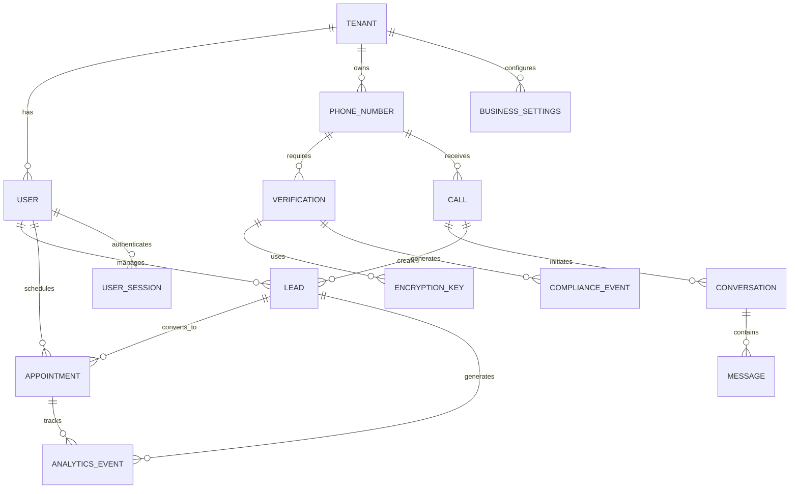

# Database Architecture Documentation

## Overview
NeverMissCall Phase 1 utilizes a simplified database architecture with PostgreSQL as the primary database using a shared library approach. This document provides comprehensive coverage of actual implemented database schemas, relationships, migration strategies, and data governance based on the current codebase implementation.

## Global Database Schema Overview

### **Single Database Architecture** 
- **Database Name**: `nevermisscall`
- **Total Tables**: 26 persistent tables across 8 services
- **Stateless Services**: Twilio-Server (webhook processing only)
- **Non-Persistent Services**: AS-Connection-Service (in-memory), AS-Infrastructure-Service (Redis)
- **Shared Access**: All services use shared database connection pool
- **Multi-Tenant**: All tables include `tenant_id` for data isolation

### **Complete Table Inventory**
| Service | Tables | Count | Purpose |
|---------|--------|-------|---------|
| **Core Identity** | `tenants`, `users`, `user_sessions` | 3 | Authentication & tenant management |
| **TS-Tenant-Service** | `tenants` (extended) | 1 | Business registration & onboarding |
| **TS-User-Service** | `user_profiles`, `user_preferences`, `user_status` | 3 | User management & preferences |
| **TS-Config-Service** | `business_settings` | 1 | Business configuration |
| **PNS-Provisioning** | `phone_numbers` | 1 | Phone number management |
| **AS-Call-Service** | `calls`, `conversations`, `call_participants`, `call_metadata`, `conversation_events` | 5 | Call & conversation processing |
| **AS-Analytics** | `analytics_metrics`, `call_analytics`, `conversation_analytics`, `kpi_snapshots`, `analytics_processing_jobs`, `analytics_reports` | 6 | Analytics & reporting |
| **AS-Alerts** | `alert_rules`, `alerts`, `alert_history`, `notifications`, `escalation_contacts`, `alert_metrics_cache` | 6 | Alert management |
| **TOTAL** | | **26** | Complete NeverMissCall database |

### **Stateless Services (No Database Tables)**
| Service | Port | Purpose | Data Storage |
|---------|------|---------|--------------|
| **Twilio-Server** | 3701 | Webhook processing, call forwarding, SMS auto-response | None (stateless processing) |
| **Dispatch-Bot-AI** | 3801 | AI conversation processing, OpenAI integration, appointment scheduling | None (stateless AI processing) |
| **AS-Connection-Service** | 3105 | WebSocket connections, real-time events | In-memory connection state |
| **AS-Infrastructure-Service** | 3106 | Health monitoring, metrics collection | Redis cache only |

## Current Implementation Status
**Phase 1 Architecture**: Single PostgreSQL database `nevermisscall` with shared database library for all microservices
**Services Implemented**: 10+ microservices using shared database access patterns
**Migration System**: File-based migrations via shared library (`node migrate.js`)
**Authentication**: Service-to-service API key authentication pattern

## Database Technology Stack

### Core Database Systems
- **PostgreSQL 15+**: Single primary database for all microservices
- **Shared Database Library**: Simple connection pooling and query interface
- **File-based Migrations**: Direct SQL migration files managed by shared library
- **In-Memory Caching**: Simple application-level caching (no Redis required for Phase 1)

### Data Access Patterns
- **Shared Database Connection**: All services use `/shared/database` connection pooling
- **Repository Pattern**: Services extend shared `BaseRepository<T>` for consistent data access
- **Direct SQL Queries**: Raw SQL for complex analytics and performance-critical operations
- **Simple Query Interface**: `database.query()` for direct database access

## Service Database Mapping

### Current Phase 1 Implementation
```yaml
# Single Database Architecture
nevermisscall_database:
  database: "nevermisscall"
  port: 5432
  connection_method: "shared/database library"
  
  # All services use shared database connection
  services:
    # Identity & Onboarding Services (Group 1)
    - ts-auth-service: "Users, authentication, JWT sessions"
    - ts-tenant-service: "Tenants, business onboarding"
    - ts-user-service: "User profiles, preferences, status"
    - ts-config-service: "Configuration, business settings"
    
    # Phone & Communication Services (Group 2)  
    - pns-provisioning-service: "Phone numbers, Twilio integration"
    - twilio-server: "Twilio webhooks (stateless - no database tables)"
    
    # Core Business Logic (Group 3)
    - as-call-service: "Calls, conversations, call processing"
    - dispatch-bot-ai: "AI conversation processing (stateless - no database tables)"
    
    # Analytics & Data Services (Group 4)
    - as-analytics-core-service: "Metrics, KPIs, analytics data"
    - as-alerts-service: "Alert rules, alerts, notifications"
    
    # Infrastructure Services (Group 5)
    - as-connection-service: "WebSocket connections, real-time state"
    - as-infrastructure-service: "Health monitoring, system metrics"
    
    # Frontend (Group 6)
    - web-ui: "Session data, UI state (minimal database usage)"
    - universal-calendar: "Calendar integrations, appointments"

# Shared Database Access Pattern
shared_library_usage:
  connection_pooling: "/shared/database connection pool"
  base_repository: "BaseRepository<T> pattern for CRUD operations"
  direct_queries: "database.query() for complex operations"
  migrations: "File-based SQL migrations via node migrate.js"
```

## Detailed Database Schemas

### 1. AS-Alerts-Service Schema (Actual Implementation)

#### Alert Management Tables
```sql
-- Alert Rules: Define conditions for triggering alerts
CREATE TABLE alert_rules (
    id UUID PRIMARY KEY DEFAULT gen_random_uuid(),
    tenant_id UUID NOT NULL,
    name VARCHAR(255) NOT NULL,
    description TEXT,
    metric VARCHAR(100) NOT NULL, -- metric name to monitor
    operator VARCHAR(20) NOT NULL CHECK (operator IN ('greater_than', 'less_than', 'equals', 'not_equals')),
    threshold DECIMAL(10,2) NOT NULL,
    severity VARCHAR(20) NOT NULL CHECK (severity IN ('low', 'medium', 'high', 'critical')),
    is_enabled BOOLEAN DEFAULT true,
    notification_channels TEXT[] DEFAULT '{}', -- ['email', 'sms', 'webhook', 'dashboard']
    escalation_enabled BOOLEAN DEFAULT false,
    escalation_delay_minutes INTEGER DEFAULT 30,
    created_at TIMESTAMP DEFAULT NOW(),
    updated_at TIMESTAMP DEFAULT NOW(),
    
    CONSTRAINT idx_alert_rules_tenant_metric UNIQUE (tenant_id, metric, name)
);

-- Alerts: Individual alert instances triggered by rules
CREATE TABLE alerts (
    id UUID PRIMARY KEY DEFAULT gen_random_uuid(),
    tenant_id UUID NOT NULL,
    rule_id UUID NOT NULL,
    rule_name VARCHAR(255) NOT NULL,
    metric VARCHAR(100) NOT NULL,
    metric_value DECIMAL(10,2) NOT NULL,
    threshold DECIMAL(10,2) NOT NULL,
    operator VARCHAR(20) NOT NULL,
    severity VARCHAR(20) NOT NULL,
    status VARCHAR(20) DEFAULT 'triggered' CHECK (status IN ('triggered', 'acknowledged', 'escalated', 'resolved', 'snoozed')),
    message TEXT NOT NULL,
    notification_sent BOOLEAN DEFAULT false,
    
    -- Acknowledgment tracking
    acknowledged_at TIMESTAMP,
    acknowledged_by UUID, -- user ID who acknowledged
    acknowledgment_note TEXT,
    
    -- Escalation tracking  
    escalated_at TIMESTAMP,
    escalation_level INTEGER DEFAULT 0,
    
    -- Resolution tracking
    resolved_at TIMESTAMP,
    resolved_by UUID, -- user ID who resolved
    resolution_note TEXT,
    auto_resolved BOOLEAN DEFAULT false,
    
    -- Snooze functionality
    snoozed_at TIMESTAMP,
    snoozed_by UUID, -- user ID who snoozed
    snoozed_until TIMESTAMP,
    snooze_note TEXT,
    
    created_at TIMESTAMP DEFAULT NOW(),
    updated_at TIMESTAMP DEFAULT NOW(),
    
    CONSTRAINT fk_alerts_rule FOREIGN KEY (rule_id) REFERENCES alert_rules(id) ON DELETE CASCADE
);

-- Alert History: Audit trail of alert state changes
CREATE TABLE alert_history (
    id UUID PRIMARY KEY DEFAULT gen_random_uuid(),
    alert_id UUID NOT NULL,
    tenant_id UUID NOT NULL,
    event_type VARCHAR(50) NOT NULL CHECK (event_type IN ('triggered', 'acknowledged', 'escalated', 'resolved', 'snoozed', 'unsnoozed', 'notification_sent', 'notification_failed')),
    old_status VARCHAR(20),
    new_status VARCHAR(20),
    user_id UUID, -- user who triggered the event
    details JSONB, -- additional event context
    created_at TIMESTAMP DEFAULT NOW(),
    
    CONSTRAINT fk_alert_history_alert FOREIGN KEY (alert_id) REFERENCES alerts(id) ON DELETE CASCADE
);

-- Notifications: Track delivery of alert notifications
CREATE TABLE notifications (
    id UUID PRIMARY KEY DEFAULT gen_random_uuid(),
    alert_id UUID NOT NULL,
    tenant_id UUID NOT NULL,
    channel VARCHAR(20) NOT NULL CHECK (channel IN ('email', 'sms', 'webhook', 'dashboard')),
    recipient VARCHAR(255) NOT NULL, -- email address, phone number, or webhook URL
    status VARCHAR(20) DEFAULT 'pending' CHECK (status IN ('pending', 'delivered', 'failed', 'retrying')),
    attempts INTEGER DEFAULT 0,
    max_attempts INTEGER DEFAULT 3,
    
    -- Delivery tracking
    delivered_at TIMESTAMP,
    failed_at TIMESTAMP,
    error_message TEXT,
    
    -- Webhook specific fields
    webhook_response_code INTEGER,
    webhook_response_body TEXT,
    
    -- Message content
    template_used VARCHAR(100),
    message_content TEXT,
    
    created_at TIMESTAMP DEFAULT NOW(),
    updated_at TIMESTAMP DEFAULT NOW(),
    
    CONSTRAINT fk_notifications_alert FOREIGN KEY (alert_id) REFERENCES alerts(id) ON DELETE CASCADE
);

-- Escalation Contacts: Define escalation paths for alerts
CREATE TABLE escalation_contacts (
    id UUID PRIMARY KEY DEFAULT gen_random_uuid(),
    tenant_id UUID NOT NULL,
    rule_id UUID, -- NULL for global escalation contacts
    escalation_level INTEGER NOT NULL DEFAULT 1,
    contact_type VARCHAR(20) NOT NULL CHECK (contact_type IN ('user', 'email', 'phone', 'webhook')),
    contact_value VARCHAR(255) NOT NULL, -- user ID, email, phone, or webhook URL
    is_active BOOLEAN DEFAULT true,
    created_at TIMESTAMP DEFAULT NOW(),
    
    CONSTRAINT fk_escalation_contacts_rule FOREIGN KEY (rule_id) REFERENCES alert_rules(id) ON DELETE CASCADE,
    CONSTRAINT idx_escalation_contacts_unique UNIQUE (tenant_id, rule_id, escalation_level, contact_type, contact_value)
);

-- Metrics Cache: Store recent metric values for alert evaluation
CREATE TABLE alert_metrics_cache (
    id UUID PRIMARY KEY DEFAULT gen_random_uuid(),
    tenant_id UUID NOT NULL,
    metric_name VARCHAR(100) NOT NULL,
    metric_value DECIMAL(10,2) NOT NULL,
    measurement_time TIMESTAMP NOT NULL,
    created_at TIMESTAMP DEFAULT NOW(),
    
    CONSTRAINT idx_metrics_cache_unique UNIQUE (tenant_id, metric_name, measurement_time)
);
```

#### Alert Service Indexes
```sql
-- Performance indexes for alert queries
CREATE INDEX idx_alert_rules_tenant_enabled ON alert_rules (tenant_id, is_enabled);
CREATE INDEX idx_alerts_tenant_status ON alerts (tenant_id, status);
CREATE INDEX idx_alerts_rule_status ON alerts (rule_id, status);
CREATE INDEX idx_alerts_created_at ON alerts (created_at DESC);
CREATE INDEX idx_alert_history_alert_event ON alert_history (alert_id, event_type);
CREATE INDEX idx_notifications_alert_channel ON notifications (alert_id, channel);
CREATE INDEX idx_notifications_status_attempts ON notifications (status, attempts);
CREATE INDEX idx_metrics_cache_tenant_metric_time ON alert_metrics_cache (tenant_id, metric_name, measurement_time DESC);

-- Partial indexes for active data
CREATE INDEX idx_alerts_active ON alerts (tenant_id, created_at DESC) WHERE status IN ('triggered', 'acknowledged', 'escalated');
CREATE INDEX idx_notifications_pending ON notifications (created_at) WHERE status IN ('pending', 'retrying');
```

### 2. AS-Analytics-Core-Service Schema (Actual Implementation)

#### Analytics and Metrics Tables
```sql
-- Analytics Metrics: Store individual metric data points with dimensions
CREATE TABLE analytics_metrics (
    id UUID PRIMARY KEY DEFAULT gen_random_uuid(),
    tenant_id UUID NOT NULL,
    metric_type VARCHAR(100) NOT NULL, -- call, conversation, revenue, performance
    metric_name VARCHAR(100) NOT NULL, -- specific metric identifier
    metric_value DECIMAL(15,4) NOT NULL,
    dimensions JSONB DEFAULT '{}', -- additional metadata and categorization
    aggregation_level VARCHAR(20) DEFAULT 'raw' CHECK (aggregation_level IN ('raw', 'hourly', 'daily', 'weekly', 'monthly')),
    timestamp TIMESTAMP DEFAULT NOW(),
    period_start TIMESTAMP,
    period_end TIMESTAMP,
    created_at TIMESTAMP DEFAULT NOW(),
    updated_at TIMESTAMP DEFAULT NOW(),
    
    CONSTRAINT idx_metrics_tenant_type_name UNIQUE (tenant_id, metric_type, metric_name, timestamp, aggregation_level)
);

-- Call Analytics: Processed call data for business intelligence
CREATE TABLE call_analytics (
    id UUID PRIMARY KEY DEFAULT gen_random_uuid(),
    tenant_id UUID NOT NULL,
    call_id UUID, -- reference to calls table
    conversation_id UUID, -- reference to conversations table
    phone_number VARCHAR(20),
    call_type VARCHAR(50),
    call_status VARCHAR(50), -- answered, missed, completed, failed
    call_duration INTEGER, -- duration in seconds
    ai_takeover_count INTEGER DEFAULT 0,
    customer_satisfaction DECIMAL(3,2), -- rating 1.00-5.00
    conversion_status VARCHAR(50), -- converted, qualified, lost, pending
    revenue_impact DECIMAL(10,2), -- attributed revenue
    cost_per_call DECIMAL(10,2),
    tags TEXT,
    metadata JSONB DEFAULT '{}',
    call_date TIMESTAMP NOT NULL,
    processed_at TIMESTAMP DEFAULT NOW(),
    created_at TIMESTAMP DEFAULT NOW(),
    updated_at TIMESTAMP DEFAULT NOW()
);

-- Conversation Analytics: Message and conversation performance data
CREATE TABLE conversation_analytics (
    id UUID PRIMARY KEY DEFAULT gen_random_uuid(),
    tenant_id UUID NOT NULL,
    conversation_id UUID NOT NULL,
    call_id UUID,
    message_count INTEGER DEFAULT 0,
    ai_message_count INTEGER DEFAULT 0,
    human_message_count INTEGER DEFAULT 0,
    conversation_duration INTEGER, -- duration in seconds
    sentiment_score DECIMAL(3,2), -- -1.00 to 1.00
    intent_detection JSONB DEFAULT '{}',
    resolution_status VARCHAR(50), -- resolved, escalated, abandoned, in_progress
    escalation_count INTEGER DEFAULT 0,
    satisfaction_rating DECIMAL(3,2), -- 1.00-5.00
    conversation_date TIMESTAMP NOT NULL,
    processed_at TIMESTAMP DEFAULT NOW(),
    created_at TIMESTAMP DEFAULT NOW(),
    updated_at TIMESTAMP DEFAULT NOW()
);

-- KPI Snapshots: Point-in-time key performance indicator measurements
CREATE TABLE kpi_snapshots (
    id UUID PRIMARY KEY DEFAULT gen_random_uuid(),
    tenant_id UUID NOT NULL,
    kpi_name VARCHAR(100) NOT NULL,
    kpi_value DECIMAL(15,4) NOT NULL,
    kpi_target DECIMAL(15,4),
    variance_percentage DECIMAL(5,2), -- percentage variance from target
    trend_direction VARCHAR(20) CHECK (trend_direction IN ('up', 'down', 'stable', 'improving', 'declining')),
    period_type VARCHAR(20) NOT NULL CHECK (period_type IN ('hourly', 'daily', 'weekly', 'monthly')),
    snapshot_date TIMESTAMP NOT NULL,
    created_at TIMESTAMP DEFAULT NOW(),
    
    CONSTRAINT idx_kpi_snapshots_unique UNIQUE (tenant_id, kpi_name, period_type, snapshot_date)
);

-- Processing Jobs: Track analytics processing tasks
CREATE TABLE analytics_processing_jobs (
    id UUID PRIMARY KEY DEFAULT gen_random_uuid(),
    tenant_id UUID NOT NULL,
    job_type VARCHAR(50) NOT NULL CHECK (job_type IN ('aggregation', 'kpi_calculation', 'trend_analysis', 'report_generation')),
    status VARCHAR(20) DEFAULT 'pending' CHECK (status IN ('pending', 'processing', 'completed', 'failed')),
    parameters JSONB NOT NULL,
    result JSONB,
    error_message TEXT,
    created_at TIMESTAMP DEFAULT NOW(),
    updated_at TIMESTAMP DEFAULT NOW(),
    completed_at TIMESTAMP
);

-- Generated Reports: Store analytics reports for caching
CREATE TABLE analytics_reports (
    id UUID PRIMARY KEY DEFAULT gen_random_uuid(),
    tenant_id UUID NOT NULL,
    report_type VARCHAR(100) NOT NULL,
    period_start TIMESTAMP NOT NULL,
    period_end TIMESTAMP NOT NULL,
    sections JSONB NOT NULL, -- report content sections
    format VARCHAR(20) DEFAULT 'json' CHECK (format IN ('json', 'csv', 'pdf')),
    generated_at TIMESTAMP DEFAULT NOW(),
    expires_at TIMESTAMP,
    created_at TIMESTAMP DEFAULT NOW()
);
```

#### Analytics Service Indexes
```sql
-- Performance indexes for analytics queries
CREATE INDEX idx_analytics_metrics_tenant_type ON analytics_metrics (tenant_id, metric_type);
CREATE INDEX idx_analytics_metrics_timestamp ON analytics_metrics (timestamp DESC);
CREATE INDEX idx_analytics_metrics_aggregation ON analytics_metrics (tenant_id, aggregation_level, timestamp);
CREATE INDEX idx_analytics_metrics_dimensions ON analytics_metrics USING GIN (dimensions);

CREATE INDEX idx_call_analytics_tenant_date ON call_analytics (tenant_id, call_date DESC);
CREATE INDEX idx_call_analytics_call_id ON call_analytics (call_id);
CREATE INDEX idx_call_analytics_status ON call_analytics (tenant_id, call_status);
CREATE INDEX idx_call_analytics_conversion ON call_analytics (tenant_id, conversion_status);

CREATE INDEX idx_conversation_analytics_tenant_date ON conversation_analytics (tenant_id, conversation_date DESC);
CREATE INDEX idx_conversation_analytics_conversation_id ON conversation_analytics (conversation_id);
CREATE INDEX idx_conversation_analytics_resolution ON conversation_analytics (tenant_id, resolution_status);

CREATE INDEX idx_kpi_snapshots_tenant_period ON kpi_snapshots (tenant_id, period_type, snapshot_date DESC);
CREATE INDEX idx_kpi_snapshots_name ON kpi_snapshots (tenant_id, kpi_name, snapshot_date DESC);

CREATE INDEX idx_processing_jobs_status ON analytics_processing_jobs (status, created_at);
CREATE INDEX idx_processing_jobs_tenant_type ON analytics_processing_jobs (tenant_id, job_type);

CREATE INDEX idx_reports_tenant_type ON analytics_reports (tenant_id, report_type, generated_at DESC);

-- Partial indexes for active data
CREATE INDEX idx_call_analytics_recent ON call_analytics (tenant_id, call_date DESC) WHERE call_date > NOW() - INTERVAL '30 days';
CREATE INDEX idx_processing_jobs_active ON analytics_processing_jobs (created_at) WHERE status IN ('pending', 'processing');
```

### 3. AS-Call-Service Schema (Actual Implementation)

#### Call and Conversation Management Tables
```sql
-- Calls: Core call records with Twilio integration
CREATE TABLE calls (
    id UUID PRIMARY KEY DEFAULT gen_random_uuid(),
    tenant_id UUID NOT NULL,
    conversation_id UUID, -- links to conversations table
    caller_phone VARCHAR(20) NOT NULL,
    called_phone VARCHAR(20) NOT NULL,
    call_direction VARCHAR(10) NOT NULL CHECK (call_direction IN ('inbound', 'outbound')),
    call_status VARCHAR(20) DEFAULT 'initiated' CHECK (call_status IN ('initiated', 'ringing', 'in-progress', 'completed', 'busy', 'no-answer', 'failed', 'canceled')),
    call_type VARCHAR(20) DEFAULT 'voice' CHECK (call_type IN ('voice', 'conference', 'forwarded')),
    duration_seconds INTEGER,
    started_at TIMESTAMP,
    ended_at TIMESTAMP,
    recording_url TEXT,
    recording_duration_seconds INTEGER,
    twilio_call_sid VARCHAR(100) UNIQUE, -- Twilio call identifier
    caller_name VARCHAR(255),
    caller_city VARCHAR(100),
    caller_state VARCHAR(50),
    caller_country VARCHAR(3) DEFAULT 'US',
    disconnect_reason VARCHAR(100),
    price DECIMAL(10,4),
    price_unit VARCHAR(10) DEFAULT 'USD',
    answered_by VARCHAR(100),
    forwarded_from VARCHAR(20),
    created_at TIMESTAMP DEFAULT NOW(),
    updated_at TIMESTAMP DEFAULT NOW(),
    
    CONSTRAINT fk_calls_conversation FOREIGN KEY (conversation_id) REFERENCES conversations(id)
);

-- Conversations: Customer conversation threads linking multiple calls
CREATE TABLE conversations (
    id UUID PRIMARY KEY DEFAULT gen_random_uuid(),
    tenant_id UUID NOT NULL,
    customer_phone VARCHAR(20) NOT NULL,
    status VARCHAR(20) DEFAULT 'active' CHECK (status IN ('active', 'waiting', 'resolved', 'closed')),
    subject TEXT,
    priority VARCHAR(10) DEFAULT 'normal' CHECK (priority IN ('low', 'normal', 'high', 'urgent')),
    channel VARCHAR(10) DEFAULT 'phone' CHECK (channel IN ('phone', 'sms', 'email', 'web')),
    assigned_to UUID, -- user ID of assigned agent
    first_call_id UUID, -- first call that created this conversation
    last_call_id UUID,  -- most recent call in conversation
    total_calls INTEGER DEFAULT 0,
    total_duration_seconds INTEGER DEFAULT 0,
    customer_name VARCHAR(255),
    customer_email VARCHAR(255),
    customer_address TEXT,
    notes TEXT,
    tags TEXT[] DEFAULT '{}', -- array of string tags
    created_at TIMESTAMP DEFAULT NOW(),
    updated_at TIMESTAMP DEFAULT NOW(),
    closed_at TIMESTAMP,
    
    CONSTRAINT fk_conversations_first_call FOREIGN KEY (first_call_id) REFERENCES calls(id),
    CONSTRAINT fk_conversations_last_call FOREIGN KEY (last_call_id) REFERENCES calls(id)
);

-- Call Participants: Track all participants in calls (callers, agents, AI)
CREATE TABLE call_participants (
    id UUID PRIMARY KEY DEFAULT gen_random_uuid(),
    call_id UUID NOT NULL,
    phone_number VARCHAR(20) NOT NULL,
    participant_type VARCHAR(20) NOT NULL CHECK (participant_type IN ('caller', 'callee', 'agent', 'ai-assistant')),
    joined_at TIMESTAMP DEFAULT NOW(),
    left_at TIMESTAMP,
    muted BOOLEAN DEFAULT false,
    on_hold BOOLEAN DEFAULT false,
    created_at TIMESTAMP DEFAULT NOW(),
    updated_at TIMESTAMP DEFAULT NOW(),
    
    CONSTRAINT fk_call_participants_call FOREIGN KEY (call_id) REFERENCES calls(id) ON DELETE CASCADE
);

-- Call Metadata: Flexible key-value storage for additional call information
CREATE TABLE call_metadata (
    id UUID PRIMARY KEY DEFAULT gen_random_uuid(),
    call_id UUID NOT NULL,
    metadata_key VARCHAR(100) NOT NULL,
    metadata_value TEXT NOT NULL,
    metadata_type VARCHAR(20) DEFAULT 'string' CHECK (metadata_type IN ('string', 'number', 'boolean', 'json')),
    created_at TIMESTAMP DEFAULT NOW(),
    updated_at TIMESTAMP DEFAULT NOW(),
    
    CONSTRAINT fk_call_metadata_call FOREIGN KEY (call_id) REFERENCES calls(id) ON DELETE CASCADE,
    CONSTRAINT idx_call_metadata_unique UNIQUE (call_id, metadata_key)
);

-- Conversation Events: Audit trail and activity log for conversations
CREATE TABLE conversation_events (
    id UUID PRIMARY KEY DEFAULT gen_random_uuid(),
    conversation_id UUID NOT NULL,
    call_id UUID, -- optional reference to specific call that triggered event
    event_type VARCHAR(50) NOT NULL CHECK (event_type IN ('call_started', 'call_ended', 'note_added', 'status_changed', 'priority_changed', 'assigned', 'unassigned', 'tag_added', 'tag_removed', 'customer_info_updated')),
    event_data JSONB DEFAULT '{}', -- structured event data
    created_by UUID, -- user ID who triggered the event
    created_at TIMESTAMP DEFAULT NOW(),
    
    CONSTRAINT fk_conversation_events_conversation FOREIGN KEY (conversation_id) REFERENCES conversations(id) ON DELETE CASCADE,
    CONSTRAINT fk_conversation_events_call FOREIGN KEY (call_id) REFERENCES calls(id) ON DELETE SET NULL
);
```

#### Call Service Indexes
```sql
-- Performance indexes for call queries
CREATE INDEX idx_calls_tenant_status ON calls (tenant_id, call_status);
CREATE INDEX idx_calls_tenant_created ON calls (tenant_id, created_at DESC);
CREATE INDEX idx_calls_twilio_sid ON calls (twilio_call_sid);
CREATE INDEX idx_calls_conversation_id ON calls (conversation_id);
CREATE INDEX idx_calls_caller_phone ON calls (caller_phone);
CREATE INDEX idx_calls_called_phone ON calls (called_phone);
CREATE INDEX idx_calls_direction_status ON calls (call_direction, call_status);

CREATE INDEX idx_conversations_tenant_status ON conversations (tenant_id, status);
CREATE INDEX idx_conversations_customer_phone ON conversations (customer_phone);
CREATE INDEX idx_conversations_assigned_to ON conversations (assigned_to);
CREATE INDEX idx_conversations_priority ON conversations (tenant_id, priority);
CREATE INDEX idx_conversations_channel ON conversations (tenant_id, channel);
CREATE INDEX idx_conversations_tags ON conversations USING GIN (tags);
CREATE INDEX idx_conversations_created ON conversations (created_at DESC);

CREATE INDEX idx_call_participants_call_id ON call_participants (call_id);
CREATE INDEX idx_call_participants_phone ON call_participants (phone_number);
CREATE INDEX idx_call_participants_type ON call_participants (participant_type);

CREATE INDEX idx_call_metadata_call_key ON call_metadata (call_id, metadata_key);
CREATE INDEX idx_call_metadata_key ON call_metadata (metadata_key);

CREATE INDEX idx_conversation_events_conversation ON conversation_events (conversation_id, created_at DESC);
CREATE INDEX idx_conversation_events_type ON conversation_events (event_type);
CREATE INDEX idx_conversation_events_call ON conversation_events (call_id);
CREATE INDEX idx_conversation_events_data ON conversation_events USING GIN (event_data);

-- Partial indexes for active data
CREATE INDEX idx_calls_active ON calls (tenant_id, created_at DESC) WHERE call_status IN ('initiated', 'ringing', 'in-progress');
CREATE INDEX idx_conversations_active ON conversations (tenant_id, updated_at DESC) WHERE status IN ('active', 'waiting');
CREATE INDEX idx_call_participants_active ON call_participants (call_id, joined_at) WHERE left_at IS NULL;
```

### 4. AS-Connection-Service Schema (Actual Implementation)

#### In-Memory Connection Management
```python
from abc import ABC, abstractmethod
from dataclasses import dataclass
from typing import Dict, Set
from datetime import datetime

# Connection State Management (In-Memory Storage)
@dataclass
class ConnectionData:
    socket: any  # Socket type
    user_id: str
    tenant_id: str
    connected_at: datetime

# Memory-Based Data Structures (No Persistent Database Tables)
class SimpleConnectionStore:
    def __init__(self):
        self.connections: Dict[str, ConnectionData] = {}           # socketId -> connection details
        self.tenant_connections: Dict[str, Set[str]] = {}          # tenantId -> set of socketIds  
        self.user_connections: Dict[str, Set[str]] = {}            # "tenantId:userId" -> set of socketIds
```

#### Connection Service Data Patterns
```sql
-- AS-Connection-Service uses in-memory storage for performance
-- No dedicated database tables required for connection state
-- Connection data is ephemeral and rebuilt on service restart

-- Optional: Persistent event logging (if implemented)
CREATE TABLE IF NOT EXISTS websocket_events (
    id UUID PRIMARY KEY DEFAULT gen_random_uuid(),
    tenant_id UUID NOT NULL,
    user_id UUID,
    socket_id VARCHAR(255) NOT NULL,
    event_type VARCHAR(50) NOT NULL CHECK (event_type IN ('connect', 'disconnect', 'join_room', 'leave_room', 'broadcast')),
    event_data JSONB DEFAULT '{}',
    ip_address INET,
    user_agent TEXT,
    created_at TIMESTAMP DEFAULT NOW(),
    
    -- Indexes for analytics queries
    INDEX idx_websocket_events_tenant_type (tenant_id, event_type),
    INDEX idx_websocket_events_created (created_at DESC)
);

-- Optional: Connection metrics (if persistent tracking is needed)
CREATE TABLE IF NOT EXISTS connection_metrics (
    id UUID PRIMARY KEY DEFAULT gen_random_uuid(),
    tenant_id UUID NOT NULL,
    metric_name VARCHAR(50) NOT NULL, -- 'concurrent_connections', 'connection_duration', 'events_sent'
    metric_value INTEGER NOT NULL,
    measurement_time TIMESTAMP DEFAULT NOW(),
    
    INDEX idx_connection_metrics_tenant_metric (tenant_id, metric_name, measurement_time DESC)
);
```

#### AS-Connection-Service Design Rationale
- **In-Memory Storage**: Optimized for real-time WebSocket performance with sub-millisecond connection lookups
- **No Database Persistence**: Connection state is ephemeral and rebuilt on service restart for Phase 1 simplicity
- **Tenant Isolation**: Connections are isolated by tenant in memory data structures
- **Event Broadcasting**: Room-based messaging using Socket.IO built-in room management
- **Cleanup Strategy**: Periodic cleanup of disconnected sockets via in-memory validation
- **Scalability**: Single-instance deployment suitable for Phase 1 small market requirements

### 5. AS-Infrastructure-Service Schema (Actual Implementation)

#### Redis-Based Monitoring Data
```python
from abc import ABC, abstractmethod
from dataclasses import dataclass
from typing import Dict, Literal
from datetime import datetime

# Health Monitoring Data (Redis Storage)
@dataclass
class ServiceHealthData:
    service_name: str
    status: Literal['healthy', 'degraded', 'unhealthy']
    last_check: datetime
    response_time: float
    error_count: int

# System Metrics (Redis Storage)  
@dataclass
class SystemMetrics:
    timestamp: datetime
    cpu_usage: float
    memory_usage: float
    disk_usage: float
    network_io: float
    service_counts: Dict[str, int]

# Alert States (Redis Storage)
@dataclass
class AlertData:
    alert_id: str
    tenant_id: str
    service_name: str
    severity: Literal['low', 'medium', 'high', 'critical']
    status: Literal['triggered', 'acknowledged', 'resolved']
    created_at: datetime
```

#### Infrastructure Service Redis Keys
```redis
# Service Health Status
service:health:{serviceName} -> ServiceHealthData (JSON)
service:health:history:{serviceName} -> Array<HealthCheckResult>

# System Metrics  
metrics:system:{timestamp} -> SystemMetrics (JSON)
metrics:service:{serviceName}:{timestamp} -> ServiceMetrics (JSON)

# Alert Management
alerts:active -> Set of alertId
alert:{alertId} -> AlertData (JSON)
alerts:service:{serviceName} -> Set of alertId

# Service Registry
registry:services -> Set of serviceName
service:{serviceName}:info -> ServiceRegistrationData (JSON)
service:{serviceName}:dependencies -> Set of dependencyName

# Circuit Breaker States
circuit:breaker:{serviceName} -> CircuitBreakerState (JSON)
```

#### Infrastructure Service Design Rationale  
- **Redis Storage**: Fast access to monitoring data and metrics with TTL-based expiration
- **No Persistent Database**: Monitoring data is temporary and regenerated through active checks
- **Service Discovery**: Maintains real-time service registry through heartbeat mechanism
- **Alert Management**: Stateful alert tracking with acknowledgment and resolution workflows
- **Circuit Breaker**: Failure isolation patterns to prevent cascade failures
- **Metrics Collection**: System and service-level metrics aggregation for observability
- **Health Orchestration**: Centralized health monitoring for entire NeverMissCall platform

### 6. Identity & Onboarding Services Database Schemas

#### TS-Auth-Service Tables (Actual Implementation)
```sql
-- Users: Core user authentication and profile data
CREATE TABLE users (
    id UUID PRIMARY KEY DEFAULT gen_random_uuid(),
    tenant_id UUID NOT NULL REFERENCES tenants(id) ON DELETE CASCADE,
    email VARCHAR(255) UNIQUE NOT NULL,
    password_hash VARCHAR(255) NOT NULL, -- bcrypt with 10 rounds
    first_name VARCHAR(100),
    last_name VARCHAR(100),
    role VARCHAR(50) DEFAULT 'user' CHECK (role IN ('owner', 'admin', 'operator', 'user', 'viewer')),
    is_active BOOLEAN DEFAULT true,
    email_verified BOOLEAN DEFAULT true, -- Auto-verified in Phase 1 for simplicity
    verification_token VARCHAR(255), -- Not used in simple implementation
    failed_login_attempts INTEGER DEFAULT 0,
    locked_until TIMESTAMP,
    last_login_at TIMESTAMP,
    created_at TIMESTAMP DEFAULT CURRENT_TIMESTAMP,
    updated_at TIMESTAMP DEFAULT CURRENT_TIMESTAMP ON UPDATE CURRENT_TIMESTAMP
);

-- User Sessions: JWT token and session management (Enterprise feature)
CREATE TABLE user_sessions (
    id UUID PRIMARY KEY DEFAULT gen_random_uuid(),
    user_id UUID NOT NULL REFERENCES users(id) ON DELETE CASCADE,
    refresh_token VARCHAR(255), -- For token refresh functionality
    refresh_token_hash VARCHAR(255), -- Hashed version for security
    expires_at TIMESTAMP NOT NULL,
    ip_address INET,
    user_agent TEXT,
    device_fingerprint VARCHAR(255),
    is_active BOOLEAN DEFAULT true,
    created_at TIMESTAMP DEFAULT CURRENT_TIMESTAMP,
    last_used_at TIMESTAMP DEFAULT CURRENT_TIMESTAMP ON UPDATE CURRENT_TIMESTAMP,
    
    INDEX idx_user_sessions_user_id (user_id),
    INDEX idx_user_sessions_refresh_token (refresh_token_hash),
    INDEX idx_user_sessions_active (user_id, is_active, expires_at)
);

-- Tenants: Referenced by users table (maintained by ts-tenant-service)
CREATE TABLE tenants (
    id UUID PRIMARY KEY DEFAULT gen_random_uuid(),
    name VARCHAR(255) NOT NULL,
    domain VARCHAR(255), -- Business domain/website
    phone_number VARCHAR(20),
    business_type VARCHAR(100),
    subscription_tier VARCHAR(50) DEFAULT 'basic',
    is_active BOOLEAN DEFAULT true,
    created_at TIMESTAMP DEFAULT CURRENT_TIMESTAMP,
    updated_at TIMESTAMP DEFAULT CURRENT_TIMESTAMP ON UPDATE CURRENT_TIMESTAMP
);
```

#### TS-Auth-Service Indexes
```sql
-- Performance indexes for authentication queries
CREATE UNIQUE INDEX idx_users_email ON users (email);
CREATE INDEX idx_users_tenant_id ON users (tenant_id);
CREATE INDEX idx_users_tenant_active ON users (tenant_id, is_active);
CREATE INDEX idx_users_role ON users (tenant_id, role);
CREATE INDEX idx_users_last_login ON users (last_login_at DESC);

-- Security indexes
CREATE INDEX idx_users_failed_attempts ON users (failed_login_attempts) WHERE failed_login_attempts > 0;
CREATE INDEX idx_users_locked_accounts ON users (locked_until) WHERE locked_until IS NOT NULL;

-- Session management indexes
CREATE INDEX idx_user_sessions_expires ON user_sessions (expires_at);
CREATE INDEX idx_user_sessions_user_active ON user_sessions (user_id, is_active);

-- Partial indexes for performance
CREATE INDEX idx_users_active_email ON users (email) WHERE is_active = true;
CREATE INDEX idx_user_sessions_active_tokens ON user_sessions (refresh_token_hash) WHERE is_active = true AND expires_at > NOW();
```

#### TS-Tenant-Service Tables (Actual Implementation)
```sql
-- Tenants: Business registration and configuration management
CREATE TABLE tenants (
    id UUID PRIMARY KEY DEFAULT gen_random_uuid(),
    business_name VARCHAR(255) NOT NULL,
    business_address TEXT,
    business_phone VARCHAR(20),
    business_type VARCHAR(100), -- 'plumbing', 'electrical', 'hvac', etc.
    industry VARCHAR(100),
    owner_id UUID, -- References users.id (created via ts-auth-service)
    status VARCHAR(50) DEFAULT 'active' CHECK (status IN ('active', 'inactive', 'suspended', 'pending')),
    
    -- Onboarding tracking for Phase 1 simplicity
    onboarding_step INTEGER DEFAULT 1,
    onboarding_completed BOOLEAN DEFAULT false,
    
    -- Business configuration (simplified for Phase 1)
    service_radius_miles INTEGER DEFAULT 25,
    estimated_job_min DECIMAL(10,2) DEFAULT 150.00,
    estimated_job_max DECIMAL(10,2) DEFAULT 300.00,
    business_hours_start TIME DEFAULT '07:00:00',
    business_hours_end TIME DEFAULT '18:00:00',
    timezone VARCHAR(50) DEFAULT 'America/Los_Angeles',
    
    created_at TIMESTAMP DEFAULT CURRENT_TIMESTAMP,
    updated_at TIMESTAMP DEFAULT CURRENT_TIMESTAMP ON UPDATE CURRENT_TIMESTAMP,
    
    CONSTRAINT unique_business_name UNIQUE (business_name),
    CONSTRAINT unique_business_phone UNIQUE (business_phone)
);
```

#### TS-Tenant-Service Indexes
```sql
-- Performance indexes for tenant queries
CREATE UNIQUE INDEX idx_tenants_business_name ON tenants (business_name);
CREATE UNIQUE INDEX idx_tenants_business_phone ON tenants (business_phone);
CREATE INDEX idx_tenants_owner_id ON tenants (owner_id);
CREATE INDEX idx_tenants_status ON tenants (status);
CREATE INDEX idx_tenants_business_type ON tenants (business_type);

-- Onboarding tracking indexes
CREATE INDEX idx_tenants_onboarding ON tenants (onboarding_step, onboarding_completed);
CREATE INDEX idx_tenants_active_incomplete ON tenants (status, onboarding_completed) 
    WHERE status = 'active' AND onboarding_completed = false;

-- Geographic and business operation indexes
CREATE INDEX idx_tenants_service_area ON tenants (service_radius_miles);
CREATE INDEX idx_tenants_pricing ON tenants (estimated_job_min, estimated_job_max);
```

#### TS-Tenant-Service Business Logic
- **Business Registration**: Creates tenant and coordinates with ts-auth-service for owner user creation
- **Onboarding Workflow**: Step-based onboarding (1-5 steps) with progress tracking
- **Service Integration**: Validates tenants for other services via internal API
- **Configuration Management**: Simple business settings and operational parameters
- **Schema Evolution**: Current implementation uses business-focused fields, will align with database migration schema

#### TS-User-Service Tables (Actual Implementation)
```sql
-- User Profiles: Extended user information and profile management
CREATE TABLE user_profiles (
    id UUID PRIMARY KEY DEFAULT gen_random_uuid(),
    user_id UUID NOT NULL UNIQUE, -- References users.id from ts-auth-service
    email VARCHAR(255) NOT NULL,
    first_name VARCHAR(100) NOT NULL,
    last_name VARCHAR(100) NOT NULL,
    display_name VARCHAR(200),
    phone_number VARCHAR(20),
    profile_photo_url TEXT, -- Local file storage path or URL
    timezone VARCHAR(50) DEFAULT 'America/Los_Angeles',
    role VARCHAR(50) DEFAULT 'owner' CHECK (role IN ('owner', 'admin', 'operator', 'user', 'viewer')),
    tenant_id UUID NOT NULL, -- Multi-tenant isolation
    is_active BOOLEAN DEFAULT true,
    created_at TIMESTAMP DEFAULT NOW(),
    updated_at TIMESTAMP DEFAULT NOW()
);

-- User Preferences: Notification and dashboard configuration
CREATE TABLE user_preferences (
    id UUID PRIMARY KEY DEFAULT gen_random_uuid(),
    user_id UUID NOT NULL UNIQUE REFERENCES user_profiles(user_id),
    
    -- Notification preferences
    sms_notifications_enabled BOOLEAN DEFAULT true,
    email_notifications_enabled BOOLEAN DEFAULT true,
    push_notifications_enabled BOOLEAN DEFAULT true,
    
    -- Dashboard preferences
    dashboard_sounds_enabled BOOLEAN DEFAULT true,
    dashboard_default_view VARCHAR(50) DEFAULT 'conversations' CHECK (dashboard_default_view IN ('conversations', 'calls', 'analytics', 'calendar')),
    dashboard_refresh_interval INTEGER DEFAULT 30, -- seconds
    show_tutorial BOOLEAN DEFAULT true,
    
    -- AI and automation preferences
    auto_response_enabled BOOLEAN DEFAULT true,
    ai_takeover_notifications BOOLEAN DEFAULT true,
    customer_response_timeout INTEGER DEFAULT 60, -- seconds
    
    created_at TIMESTAMP DEFAULT NOW(),
    updated_at TIMESTAMP DEFAULT NOW()
);

-- User Status: Online/offline tracking and availability
CREATE TABLE user_status (
    id UUID PRIMARY KEY DEFAULT gen_random_uuid(),
    user_id UUID NOT NULL UNIQUE REFERENCES user_profiles(user_id),
    is_active BOOLEAN DEFAULT true,
    is_online BOOLEAN DEFAULT false,
    last_seen_at TIMESTAMP DEFAULT NOW(),
    current_status VARCHAR(20) DEFAULT 'available' CHECK (current_status IN ('available', 'busy', 'offline', 'away')),
    status_message TEXT, -- Custom status message
    updated_at TIMESTAMP DEFAULT NOW()
);
```

#### TS-User-Service Indexes
```sql
-- Performance indexes for user queries
CREATE UNIQUE INDEX idx_user_profiles_user_id ON user_profiles (user_id);
CREATE UNIQUE INDEX idx_user_profiles_email ON user_profiles (email);
CREATE INDEX idx_user_profiles_tenant_id ON user_profiles (tenant_id);
CREATE INDEX idx_user_profiles_tenant_active ON user_profiles (tenant_id, is_active);
CREATE INDEX idx_user_profiles_role ON user_profiles (tenant_id, role);

-- User preferences indexes
CREATE UNIQUE INDEX idx_user_preferences_user_id ON user_preferences (user_id);
CREATE INDEX idx_user_preferences_notifications ON user_preferences (sms_notifications_enabled, email_notifications_enabled, push_notifications_enabled);

-- User status indexes
CREATE UNIQUE INDEX idx_user_status_user_id ON user_status (user_id);
CREATE INDEX idx_user_status_online ON user_status (is_online, current_status);
CREATE INDEX idx_user_status_last_seen ON user_status (last_seen_at DESC);

-- Partial indexes for active users
CREATE INDEX idx_user_profiles_active ON user_profiles (tenant_id, updated_at DESC) WHERE is_active = true;
CREATE INDEX idx_user_status_online_users ON user_status (user_id, last_seen_at DESC) WHERE is_online = true;
```

#### TS-User-Service Business Logic
- **Profile Management**: Comprehensive user profile with photo uploads (5MB max, stored locally)
- **Preferences System**: Granular notification and dashboard preferences with defaults
- **Status Tracking**: Real-time online/offline status with custom status messages
- **Multi-tenant Support**: All operations respect tenant boundaries via tenant_id
- **File Storage**: Profile photos stored in `./uploads/profiles/` directory
- **Service Integration**: Validates users via ts-tenant-service, provides user data to other services

#### TS-Config-Service Tables (Actual Implementation)
```sql
-- Business Settings: Configuration and operational parameters per tenant
CREATE TABLE business_settings (
    id UUID PRIMARY KEY DEFAULT gen_random_uuid(),
    tenant_id UUID NOT NULL REFERENCES tenants(id) ON DELETE CASCADE,
    
    -- AI and greeting configuration
    greeting_template TEXT NOT NULL DEFAULT 'Hello! Thanks for calling {{business_name}}. How can we help you today?',
    ai_takeover_delay_seconds INTEGER NOT NULL DEFAULT 300,
    
    -- Job estimation settings
    basic_job_estimate_min INTEGER NOT NULL DEFAULT 75,
    basic_job_estimate_max INTEGER NOT NULL DEFAULT 150,
    
    -- Timestamps
    created_at TIMESTAMP WITH TIME ZONE DEFAULT NOW(),
    updated_at TIMESTAMP WITH TIME ZONE DEFAULT NOW(),
    
    -- Constraints for data validation
    CONSTRAINT check_ai_takeover_delay 
        CHECK (ai_takeover_delay_seconds >= 60 AND ai_takeover_delay_seconds <= 1800),
    CONSTRAINT check_job_estimate_min_range 
        CHECK (basic_job_estimate_min >= 25 AND basic_job_estimate_min <= 10000),
    CONSTRAINT check_job_estimate_max_range 
        CHECK (basic_job_estimate_max >= 25 AND basic_job_estimate_max <= 10000),
    CONSTRAINT check_job_estimates_order 
        CHECK (basic_job_estimate_min < basic_job_estimate_max),
    CONSTRAINT check_greeting_template_length 
        CHECK (char_length(greeting_template) >= 10 AND char_length(greeting_template) <= 500),
    CONSTRAINT check_greeting_template_placeholder 
        CHECK (greeting_template LIKE '%{{business_name}}%'),
    CONSTRAINT unique_tenant_business_settings 
        UNIQUE (tenant_id)
);
```

#### TS-Config-Service Indexes
```sql
-- Performance indexes for configuration queries
CREATE UNIQUE INDEX idx_business_settings_tenant_id ON business_settings (tenant_id);
CREATE INDEX idx_business_settings_updated_at ON business_settings (updated_at DESC);

-- Functional indexes for specific queries
CREATE INDEX idx_business_settings_ai_delay ON business_settings (ai_takeover_delay_seconds);
CREATE INDEX idx_business_settings_estimates ON business_settings (basic_job_estimate_min, basic_job_estimate_max);
```

#### TS-Config-Service Business Logic
- **Configuration Management**: Per-tenant business configuration with validation constraints
- **Template System**: Greeting templates with required placeholder validation ({{business_name}})
- **AI Settings**: Configurable AI takeover delay (1-30 minutes) for conversation handoff
- **Job Estimates**: Min/max pricing estimates with range validation ($25-$10,000)
- **Default Configuration**: Automatic defaults for new tenants with sensible business values
- **Service Integration**: Provides configuration data to AI services, call processing, and web UI

#### PNS-Provisioning-Service Tables (Actual Implementation)
```sql
-- Phone Numbers: Twilio phone number provisioning and management
CREATE TABLE phone_numbers (
    id UUID PRIMARY KEY DEFAULT gen_random_uuid(),
    tenant_id UUID NOT NULL REFERENCES tenants(id) ON DELETE CASCADE,
    phone_number VARCHAR(20) NOT NULL UNIQUE, -- E.164 format phone number
    twilio_phone_sid VARCHAR(100), -- Twilio phone number SID (nullable until provisioned)
    
    -- Phone number status and capabilities
    status VARCHAR(20) DEFAULT 'provisioning' CHECK (status IN ('active', 'inactive', 'provisioning', 'error', 'released')),
    capabilities JSONB DEFAULT '{"voice": true, "sms": true}', -- Voice and SMS capabilities
    
    -- Twilio webhook configuration
    webhook_urls JSONB DEFAULT '{}', -- Voice, SMS, and status callback URLs
    
    -- Phone number metadata
    area_code VARCHAR(5),
    locality VARCHAR(100), -- City/region
    region VARCHAR(50), -- State/province
    country VARCHAR(3) DEFAULT 'US',
    number_type VARCHAR(20) DEFAULT 'local' CHECK (number_type IN ('local', 'toll-free', 'mobile')),
    
    -- Provisioning tracking
    provisioned_at TIMESTAMP,
    released_at TIMESTAMP,
    monthly_cost_cents INTEGER DEFAULT 100, -- Cost in cents
    setup_cost_cents INTEGER DEFAULT 100,
    currency VARCHAR(3) DEFAULT 'USD',
    
    -- Timestamps
    created_at TIMESTAMP DEFAULT NOW(),
    updated_at TIMESTAMP DEFAULT NOW(),
    
    -- Constraints
    CONSTRAINT unique_phone_number UNIQUE (phone_number),
    CONSTRAINT unique_twilio_sid UNIQUE (twilio_phone_sid),
    CONSTRAINT unique_tenant_phone UNIQUE (tenant_id, phone_number)
);
```

#### PNS-Provisioning-Service Indexes
```sql
-- Performance indexes for phone number queries
CREATE UNIQUE INDEX idx_phone_numbers_phone_number ON phone_numbers (phone_number);
CREATE UNIQUE INDEX idx_phone_numbers_twilio_sid ON phone_numbers (twilio_phone_sid) WHERE twilio_phone_sid IS NOT NULL;
CREATE INDEX idx_phone_numbers_tenant_id ON phone_numbers (tenant_id);
CREATE INDEX idx_phone_numbers_tenant_status ON phone_numbers (tenant_id, status);

-- Geographic and search indexes
CREATE INDEX idx_phone_numbers_area_code ON phone_numbers (area_code);
CREATE INDEX idx_phone_numbers_region ON phone_numbers (region, locality);
CREATE INDEX idx_phone_numbers_type ON phone_numbers (number_type);

-- Status and operational indexes
CREATE INDEX idx_phone_numbers_status ON phone_numbers (status);
CREATE INDEX idx_phone_numbers_provisioned ON phone_numbers (provisioned_at DESC);

-- Cost tracking indexes
CREATE INDEX idx_phone_numbers_monthly_cost ON phone_numbers (monthly_cost_cents);

-- Partial indexes for active numbers
CREATE INDEX idx_phone_numbers_active ON phone_numbers (tenant_id, created_at DESC) WHERE status = 'active';
CREATE INDEX idx_phone_numbers_provisioning ON phone_numbers (created_at) WHERE status = 'provisioning';
```

#### PNS-Provisioning-Service Business Logic
- **Phone Number Provisioning**: Complete lifecycle from search to provisioning via Twilio API
- **Tenant Isolation**: All phone numbers scoped to specific tenant with unique constraints
- **Role-Based Access**: Owner/admin roles required for provisioning and configuration changes
- **Twilio Integration**: Direct API integration for search, purchase, configuration, and release
- **Webhook Processing**: Handle Twilio status callbacks for real-time number status updates
- **Transaction Safety**: Database transactions ensure consistent state during provisioning
- **Cost Tracking**: Monthly and setup costs tracked for billing and reporting
- **Multi-Format Support**: Local, toll-free, and mobile number types with geographic metadata

## Complete Global Database Schema

### **NeverMissCall Phase 1 - Complete Database Creation Script**

```sql
-- =============================================================================
-- NeverMissCall Phase 1 Global Database Schema
-- Single PostgreSQL database with all 26 tables for complete system
-- 
-- STATELESS SERVICES (No Database Tables Required):
-- - twilio-server (Port 3701): Webhook processing service
--   * Environment Variables Required: TWILIO_ACCOUNT_SID, TWILIO_AUTH_TOKEN, 
--     TWILIO_PHONE_NUMBER, USER_PHONE_NUMBER
--   * External Dependencies: Twilio API integration
--   * Data Flow: Receives webhooks → Processes calls → Sends SMS responses
--   * Integration: Uses shared library for logging and responses
-- - dispatch-bot-ai (Port 3801): AI conversation processing service
--   * Environment Variables Required: OPENAI_API_KEY, GOOGLE_MAPS_API_KEY,
--     LOGGING_LEVEL, API_DEBUG
--   * External Dependencies: OpenAI GPT-4, Google Maps Geocoding API
--   * Data Flow: Receives conversation → AI analysis → Response + next action
--   * Integration: FastAPI service with comprehensive business logic
-- - as-connection-service (Port 3105): In-memory WebSocket connections
-- - as-infrastructure-service (Port 3106): Redis-based metrics only
-- =============================================================================

-- Enable UUID extension
CREATE EXTENSION IF NOT EXISTS "uuid-ossp";

-- =============================================================================
-- CORE IDENTITY TABLES (Foundation)
-- =============================================================================

-- Tenants: Business organizations (Core table - referenced by ALL services)
CREATE TABLE tenants (
    id UUID PRIMARY KEY DEFAULT gen_random_uuid(),
    -- Basic business information
    business_name VARCHAR(255) NOT NULL,
    business_address TEXT,
    business_phone VARCHAR(20),
    business_type VARCHAR(100), -- 'plumbing', 'electrical', 'hvac', etc.
    industry VARCHAR(100),
    
    -- Account management
    owner_id UUID, -- References users.id (circular reference handled by application)
    status VARCHAR(50) DEFAULT 'active' CHECK (status IN ('active', 'inactive', 'suspended', 'pending')),
    subscription_tier VARCHAR(50) DEFAULT 'basic',
    is_active BOOLEAN DEFAULT true,
    
    -- Onboarding workflow
    onboarding_step INTEGER DEFAULT 1,
    onboarding_completed BOOLEAN DEFAULT false,
    
    -- Business operations (simplified for Phase 1)
    service_radius_miles INTEGER DEFAULT 25,
    estimated_job_min DECIMAL(10,2) DEFAULT 150.00,
    estimated_job_max DECIMAL(10,2) DEFAULT 300.00,
    business_hours_start TIME DEFAULT '07:00:00',
    business_hours_end TIME DEFAULT '18:00:00',
    timezone VARCHAR(50) DEFAULT 'America/Los_Angeles',
    
    created_at TIMESTAMP DEFAULT CURRENT_TIMESTAMP,
    updated_at TIMESTAMP DEFAULT CURRENT_TIMESTAMP ON UPDATE CURRENT_TIMESTAMP,
    
    CONSTRAINT unique_business_name UNIQUE (business_name),
    CONSTRAINT unique_business_phone UNIQUE (business_phone)
);

-- Users: Core authentication (TS-Auth-Service)
CREATE TABLE users (
    id UUID PRIMARY KEY DEFAULT gen_random_uuid(),
    tenant_id UUID NOT NULL REFERENCES tenants(id) ON DELETE CASCADE,
    email VARCHAR(255) UNIQUE NOT NULL,
    password_hash VARCHAR(255) NOT NULL, -- bcrypt with 10 rounds
    first_name VARCHAR(100),
    last_name VARCHAR(100),
    role VARCHAR(50) DEFAULT 'user' CHECK (role IN ('owner', 'admin', 'operator', 'user', 'viewer')),
    is_active BOOLEAN DEFAULT true,
    email_verified BOOLEAN DEFAULT true, -- Auto-verified in Phase 1
    verification_token VARCHAR(255),
    failed_login_attempts INTEGER DEFAULT 0,
    locked_until TIMESTAMP,
    last_login_at TIMESTAMP,
    created_at TIMESTAMP DEFAULT CURRENT_TIMESTAMP,
    updated_at TIMESTAMP DEFAULT CURRENT_TIMESTAMP ON UPDATE CURRENT_TIMESTAMP
);

-- User Sessions: JWT and session management (TS-Auth-Service)
CREATE TABLE user_sessions (
    id UUID PRIMARY KEY DEFAULT gen_random_uuid(),
    user_id UUID NOT NULL REFERENCES users(id) ON DELETE CASCADE,
    refresh_token VARCHAR(255),
    refresh_token_hash VARCHAR(255),
    expires_at TIMESTAMP NOT NULL,
    ip_address INET,
    user_agent TEXT,
    device_fingerprint VARCHAR(255),
    is_active BOOLEAN DEFAULT true,
    created_at TIMESTAMP DEFAULT CURRENT_TIMESTAMP,
    last_used_at TIMESTAMP DEFAULT CURRENT_TIMESTAMP ON UPDATE CURRENT_TIMESTAMP
);

-- =============================================================================
-- USER MANAGEMENT TABLES (TS-User-Service)
-- =============================================================================

-- User Profiles: Extended user information
CREATE TABLE user_profiles (
    id UUID PRIMARY KEY DEFAULT gen_random_uuid(),
    user_id UUID NOT NULL UNIQUE REFERENCES users(id) ON DELETE CASCADE,
    email VARCHAR(255) NOT NULL,
    first_name VARCHAR(100) NOT NULL,
    last_name VARCHAR(100) NOT NULL,
    display_name VARCHAR(200),
    phone_number VARCHAR(20),
    profile_photo_url TEXT,
    timezone VARCHAR(50) DEFAULT 'America/Los_Angeles',
    role VARCHAR(50) DEFAULT 'owner',
    tenant_id UUID NOT NULL REFERENCES tenants(id) ON DELETE CASCADE,
    is_active BOOLEAN DEFAULT true,
    created_at TIMESTAMP DEFAULT NOW(),
    updated_at TIMESTAMP DEFAULT NOW()
);

-- User Preferences: Notification and dashboard settings
CREATE TABLE user_preferences (
    id UUID PRIMARY KEY DEFAULT gen_random_uuid(),
    user_id UUID NOT NULL UNIQUE REFERENCES user_profiles(user_id) ON DELETE CASCADE,
    sms_notifications_enabled BOOLEAN DEFAULT true,
    email_notifications_enabled BOOLEAN DEFAULT true,
    push_notifications_enabled BOOLEAN DEFAULT true,
    dashboard_sounds_enabled BOOLEAN DEFAULT true,
    dashboard_default_view VARCHAR(50) DEFAULT 'conversations',
    dashboard_refresh_interval INTEGER DEFAULT 30,
    show_tutorial BOOLEAN DEFAULT true,
    auto_response_enabled BOOLEAN DEFAULT true,
    ai_takeover_notifications BOOLEAN DEFAULT true,
    customer_response_timeout INTEGER DEFAULT 60,
    created_at TIMESTAMP DEFAULT NOW(),
    updated_at TIMESTAMP DEFAULT NOW()
);

-- User Status: Online/offline tracking
CREATE TABLE user_status (
    id UUID PRIMARY KEY DEFAULT gen_random_uuid(),
    user_id UUID NOT NULL UNIQUE REFERENCES user_profiles(user_id) ON DELETE CASCADE,
    is_active BOOLEAN DEFAULT true,
    is_online BOOLEAN DEFAULT false,
    last_seen_at TIMESTAMP DEFAULT NOW(),
    current_status VARCHAR(20) DEFAULT 'available',
    status_message TEXT,
    updated_at TIMESTAMP DEFAULT NOW()
);

-- =============================================================================
-- BUSINESS CONFIGURATION (TS-Config-Service)
-- =============================================================================

-- Business Settings: Configuration per tenant
CREATE TABLE business_settings (
    id UUID PRIMARY KEY DEFAULT gen_random_uuid(),
    tenant_id UUID NOT NULL REFERENCES tenants(id) ON DELETE CASCADE,
    greeting_template TEXT NOT NULL DEFAULT 'Hello! Thanks for calling {{business_name}}. How can we help you today?',
    ai_takeover_delay_seconds INTEGER NOT NULL DEFAULT 300,
    basic_job_estimate_min INTEGER NOT NULL DEFAULT 75,
    basic_job_estimate_max INTEGER NOT NULL DEFAULT 150,
    created_at TIMESTAMP WITH TIME ZONE DEFAULT NOW(),
    updated_at TIMESTAMP WITH TIME ZONE DEFAULT NOW(),
    
    CONSTRAINT check_ai_takeover_delay CHECK (ai_takeover_delay_seconds >= 60 AND ai_takeover_delay_seconds <= 1800),
    CONSTRAINT check_job_estimate_min_range CHECK (basic_job_estimate_min >= 25 AND basic_job_estimate_min <= 10000),
    CONSTRAINT check_job_estimate_max_range CHECK (basic_job_estimate_max >= 25 AND basic_job_estimate_max <= 10000),
    CONSTRAINT check_job_estimates_order CHECK (basic_job_estimate_min < basic_job_estimate_max),
    CONSTRAINT check_greeting_template_length CHECK (char_length(greeting_template) >= 10 AND char_length(greeting_template) <= 500),
    CONSTRAINT check_greeting_template_placeholder CHECK (greeting_template LIKE '%{{business_name}}%'),
    CONSTRAINT unique_tenant_business_settings UNIQUE (tenant_id)
);

-- =============================================================================
-- PHONE NUMBER MANAGEMENT (PNS-Provisioning-Service)
-- =============================================================================

-- Phone Numbers: Twilio integration and provisioning
CREATE TABLE phone_numbers (
    id UUID PRIMARY KEY DEFAULT gen_random_uuid(),
    tenant_id UUID NOT NULL REFERENCES tenants(id) ON DELETE CASCADE,
    phone_number VARCHAR(20) NOT NULL UNIQUE,
    twilio_phone_sid VARCHAR(100),
    status VARCHAR(20) DEFAULT 'provisioning' CHECK (status IN ('active', 'inactive', 'provisioning', 'error', 'released')),
    capabilities JSONB DEFAULT '{"voice": true, "sms": true}',
    webhook_urls JSONB DEFAULT '{}',
    area_code VARCHAR(5),
    locality VARCHAR(100),
    region VARCHAR(50),
    country VARCHAR(3) DEFAULT 'US',
    number_type VARCHAR(20) DEFAULT 'local',
    provisioned_at TIMESTAMP,
    released_at TIMESTAMP,
    monthly_cost_cents INTEGER DEFAULT 100,
    setup_cost_cents INTEGER DEFAULT 100,
    currency VARCHAR(3) DEFAULT 'USD',
    created_at TIMESTAMP DEFAULT NOW(),
    updated_at TIMESTAMP DEFAULT NOW(),
    
    CONSTRAINT unique_phone_number UNIQUE (phone_number),
    CONSTRAINT unique_twilio_sid UNIQUE (twilio_phone_sid),
    CONSTRAINT unique_tenant_phone UNIQUE (tenant_id, phone_number)
);

-- =============================================================================
-- CALL AND CONVERSATION MANAGEMENT (AS-Call-Service)
-- =============================================================================

-- Conversations: Customer conversation threads
CREATE TABLE conversations (
    id UUID PRIMARY KEY DEFAULT gen_random_uuid(),
    tenant_id UUID NOT NULL REFERENCES tenants(id) ON DELETE CASCADE,
    customer_phone VARCHAR(20) NOT NULL,
    status VARCHAR(20) DEFAULT 'active' CHECK (status IN ('active', 'waiting', 'resolved', 'closed')),
    subject TEXT,
    priority VARCHAR(10) DEFAULT 'normal' CHECK (priority IN ('low', 'normal', 'high', 'urgent')),
    channel VARCHAR(10) DEFAULT 'phone' CHECK (channel IN ('phone', 'sms', 'email', 'web')),
    assigned_to UUID REFERENCES users(id),
    first_call_id UUID, -- Will reference calls(id)
    last_call_id UUID,  -- Will reference calls(id)
    total_calls INTEGER DEFAULT 0,
    total_duration_seconds INTEGER DEFAULT 0,
    customer_name VARCHAR(255),
    customer_email VARCHAR(255),
    customer_address TEXT,
    notes TEXT,
    tags TEXT[] DEFAULT '{}',
    created_at TIMESTAMP DEFAULT NOW(),
    updated_at TIMESTAMP DEFAULT NOW(),
    closed_at TIMESTAMP
);

-- Calls: Individual call records
CREATE TABLE calls (
    id UUID PRIMARY KEY DEFAULT gen_random_uuid(),
    tenant_id UUID NOT NULL REFERENCES tenants(id) ON DELETE CASCADE,
    conversation_id UUID REFERENCES conversations(id),
    caller_phone VARCHAR(20) NOT NULL,
    called_phone VARCHAR(20) NOT NULL,
    call_direction VARCHAR(10) NOT NULL CHECK (call_direction IN ('inbound', 'outbound')),
    call_status VARCHAR(20) DEFAULT 'initiated',
    call_type VARCHAR(20) DEFAULT 'voice',
    duration_seconds INTEGER,
    started_at TIMESTAMP,
    ended_at TIMESTAMP,
    recording_url TEXT,
    recording_duration_seconds INTEGER,
    twilio_call_sid VARCHAR(100) UNIQUE,
    caller_name VARCHAR(255),
    caller_city VARCHAR(100),
    caller_state VARCHAR(50),
    caller_country VARCHAR(3) DEFAULT 'US',
    disconnect_reason VARCHAR(100),
    price DECIMAL(10,4),
    price_unit VARCHAR(10) DEFAULT 'USD',
    answered_by VARCHAR(100),
    forwarded_from VARCHAR(20),
    created_at TIMESTAMP DEFAULT NOW(),
    updated_at TIMESTAMP DEFAULT NOW()
);

-- Add foreign key constraints after both tables exist
ALTER TABLE conversations ADD CONSTRAINT fk_conversations_first_call 
    FOREIGN KEY (first_call_id) REFERENCES calls(id);
ALTER TABLE conversations ADD CONSTRAINT fk_conversations_last_call 
    FOREIGN KEY (last_call_id) REFERENCES calls(id);

-- Call Participants: Track all call participants
CREATE TABLE call_participants (
    id UUID PRIMARY KEY DEFAULT gen_random_uuid(),
    call_id UUID NOT NULL REFERENCES calls(id) ON DELETE CASCADE,
    phone_number VARCHAR(20) NOT NULL,
    participant_type VARCHAR(20) NOT NULL CHECK (participant_type IN ('caller', 'callee', 'agent', 'ai-assistant')),
    joined_at TIMESTAMP DEFAULT NOW(),
    left_at TIMESTAMP,
    muted BOOLEAN DEFAULT false,
    on_hold BOOLEAN DEFAULT false,
    created_at TIMESTAMP DEFAULT NOW(),
    updated_at TIMESTAMP DEFAULT NOW()
);

-- Call Metadata: Flexible key-value storage
CREATE TABLE call_metadata (
    id UUID PRIMARY KEY DEFAULT gen_random_uuid(),
    call_id UUID NOT NULL REFERENCES calls(id) ON DELETE CASCADE,
    metadata_key VARCHAR(100) NOT NULL,
    metadata_value TEXT NOT NULL,
    metadata_type VARCHAR(20) DEFAULT 'string',
    created_at TIMESTAMP DEFAULT NOW(),
    updated_at TIMESTAMP DEFAULT NOW(),
    
    CONSTRAINT unique_call_metadata UNIQUE (call_id, metadata_key)
);

-- Conversation Events: Activity log
CREATE TABLE conversation_events (
    id UUID PRIMARY KEY DEFAULT gen_random_uuid(),
    conversation_id UUID NOT NULL REFERENCES conversations(id) ON DELETE CASCADE,
    call_id UUID REFERENCES calls(id) ON DELETE SET NULL,
    event_type VARCHAR(50) NOT NULL,
    event_data JSONB DEFAULT '{}',
    created_by UUID REFERENCES users(id),
    created_at TIMESTAMP DEFAULT NOW()
);

-- =============================================================================
-- ANALYTICS TABLES (AS-Analytics-Core-Service)
-- =============================================================================

-- Analytics Metrics: Core metrics storage
CREATE TABLE analytics_metrics (
    id UUID PRIMARY KEY DEFAULT gen_random_uuid(),
    tenant_id UUID NOT NULL REFERENCES tenants(id) ON DELETE CASCADE,
    metric_type VARCHAR(100) NOT NULL,
    metric_name VARCHAR(100) NOT NULL,
    metric_value DECIMAL(15,4) NOT NULL,
    dimensions JSONB DEFAULT '{}',
    aggregation_level VARCHAR(20) DEFAULT 'raw',
    timestamp TIMESTAMP DEFAULT NOW(),
    period_start TIMESTAMP,
    period_end TIMESTAMP,
    created_at TIMESTAMP DEFAULT NOW(),
    updated_at TIMESTAMP DEFAULT NOW()
);

-- Call Analytics: Processed call data
CREATE TABLE call_analytics (
    id UUID PRIMARY KEY DEFAULT gen_random_uuid(),
    tenant_id UUID NOT NULL REFERENCES tenants(id) ON DELETE CASCADE,
    call_id UUID REFERENCES calls(id),
    conversation_id UUID REFERENCES conversations(id),
    phone_number VARCHAR(20),
    call_type VARCHAR(50),
    call_status VARCHAR(50),
    call_duration INTEGER,
    ai_takeover_count INTEGER DEFAULT 0,
    customer_satisfaction DECIMAL(3,2),
    conversion_status VARCHAR(50),
    revenue_impact DECIMAL(10,2),
    cost_per_call DECIMAL(10,2),
    tags TEXT,
    metadata JSONB DEFAULT '{}',
    call_date TIMESTAMP NOT NULL,
    processed_at TIMESTAMP DEFAULT NOW(),
    created_at TIMESTAMP DEFAULT NOW(),
    updated_at TIMESTAMP DEFAULT NOW()
);

-- Conversation Analytics: Message performance data
CREATE TABLE conversation_analytics (
    id UUID PRIMARY KEY DEFAULT gen_random_uuid(),
    tenant_id UUID NOT NULL REFERENCES tenants(id) ON DELETE CASCADE,
    conversation_id UUID NOT NULL REFERENCES conversations(id),
    call_id UUID REFERENCES calls(id),
    message_count INTEGER DEFAULT 0,
    ai_message_count INTEGER DEFAULT 0,
    human_message_count INTEGER DEFAULT 0,
    conversation_duration INTEGER,
    sentiment_score DECIMAL(3,2),
    intent_detection JSONB DEFAULT '{}',
    resolution_status VARCHAR(50),
    escalation_count INTEGER DEFAULT 0,
    satisfaction_rating DECIMAL(3,2),
    conversation_date TIMESTAMP NOT NULL,
    processed_at TIMESTAMP DEFAULT NOW(),
    created_at TIMESTAMP DEFAULT NOW(),
    updated_at TIMESTAMP DEFAULT NOW()
);

-- KPI Snapshots: Point-in-time measurements
CREATE TABLE kpi_snapshots (
    id UUID PRIMARY KEY DEFAULT gen_random_uuid(),
    tenant_id UUID NOT NULL REFERENCES tenants(id) ON DELETE CASCADE,
    kpi_name VARCHAR(100) NOT NULL,
    kpi_value DECIMAL(15,4) NOT NULL,
    kpi_target DECIMAL(15,4),
    variance_percentage DECIMAL(5,2),
    trend_direction VARCHAR(20),
    period_type VARCHAR(20) NOT NULL,
    snapshot_date TIMESTAMP NOT NULL,
    created_at TIMESTAMP DEFAULT NOW(),
    
    CONSTRAINT unique_kpi_snapshot UNIQUE (tenant_id, kpi_name, period_type, snapshot_date)
);

-- Analytics Processing Jobs: Track processing tasks
CREATE TABLE analytics_processing_jobs (
    id UUID PRIMARY KEY DEFAULT gen_random_uuid(),
    tenant_id UUID NOT NULL REFERENCES tenants(id) ON DELETE CASCADE,
    job_type VARCHAR(50) NOT NULL,
    status VARCHAR(20) DEFAULT 'pending',
    parameters JSONB NOT NULL,
    result JSONB,
    error_message TEXT,
    created_at TIMESTAMP DEFAULT NOW(),
    updated_at TIMESTAMP DEFAULT NOW(),
    completed_at TIMESTAMP
);

-- Analytics Reports: Generated reports
CREATE TABLE analytics_reports (
    id UUID PRIMARY KEY DEFAULT gen_random_uuid(),
    tenant_id UUID NOT NULL REFERENCES tenants(id) ON DELETE CASCADE,
    report_type VARCHAR(100) NOT NULL,
    period_start TIMESTAMP NOT NULL,
    period_end TIMESTAMP NOT NULL,
    sections JSONB NOT NULL,
    format VARCHAR(20) DEFAULT 'json',
    generated_at TIMESTAMP DEFAULT NOW(),
    expires_at TIMESTAMP,
    created_at TIMESTAMP DEFAULT NOW()
);

-- =============================================================================
-- ALERT MANAGEMENT TABLES (AS-Alerts-Service)
-- =============================================================================

-- Alert Rules: Define conditions for triggering alerts
CREATE TABLE alert_rules (
    id UUID PRIMARY KEY DEFAULT gen_random_uuid(),
    tenant_id UUID NOT NULL REFERENCES tenants(id) ON DELETE CASCADE,
    name VARCHAR(255) NOT NULL,
    description TEXT,
    metric VARCHAR(100) NOT NULL,
    operator VARCHAR(20) NOT NULL CHECK (operator IN ('greater_than', 'less_than', 'equals', 'not_equals')),
    threshold DECIMAL(10,2) NOT NULL,
    severity VARCHAR(20) NOT NULL CHECK (severity IN ('low', 'medium', 'high', 'critical')),
    is_enabled BOOLEAN DEFAULT true,
    notification_channels TEXT[] DEFAULT '{}',
    escalation_enabled BOOLEAN DEFAULT false,
    escalation_delay_minutes INTEGER DEFAULT 30,
    created_at TIMESTAMP DEFAULT NOW(),
    updated_at TIMESTAMP DEFAULT NOW(),
    
    CONSTRAINT unique_alert_rule UNIQUE (tenant_id, metric, name)
);

-- Alerts: Individual alert instances
CREATE TABLE alerts (
    id UUID PRIMARY KEY DEFAULT gen_random_uuid(),
    tenant_id UUID NOT NULL REFERENCES tenants(id) ON DELETE CASCADE,
    rule_id UUID NOT NULL REFERENCES alert_rules(id) ON DELETE CASCADE,
    rule_name VARCHAR(255) NOT NULL,
    metric VARCHAR(100) NOT NULL,
    metric_value DECIMAL(10,2) NOT NULL,
    threshold DECIMAL(10,2) NOT NULL,
    operator VARCHAR(20) NOT NULL,
    severity VARCHAR(20) NOT NULL,
    status VARCHAR(20) DEFAULT 'triggered',
    message TEXT NOT NULL,
    notification_sent BOOLEAN DEFAULT false,
    acknowledged_at TIMESTAMP,
    acknowledged_by UUID REFERENCES users(id),
    acknowledgment_note TEXT,
    escalated_at TIMESTAMP,
    escalation_level INTEGER DEFAULT 0,
    resolved_at TIMESTAMP,
    resolved_by UUID REFERENCES users(id),
    resolution_note TEXT,
    auto_resolved BOOLEAN DEFAULT false,
    snoozed_at TIMESTAMP,
    snoozed_by UUID REFERENCES users(id),
    snoozed_until TIMESTAMP,
    snooze_note TEXT,
    created_at TIMESTAMP DEFAULT NOW(),
    updated_at TIMESTAMP DEFAULT NOW()
);

-- Alert History: Audit trail of alert state changes
CREATE TABLE alert_history (
    id UUID PRIMARY KEY DEFAULT gen_random_uuid(),
    alert_id UUID NOT NULL REFERENCES alerts(id) ON DELETE CASCADE,
    tenant_id UUID NOT NULL REFERENCES tenants(id) ON DELETE CASCADE,
    event_type VARCHAR(50) NOT NULL,
    old_status VARCHAR(20),
    new_status VARCHAR(20),
    user_id UUID REFERENCES users(id),
    details JSONB,
    created_at TIMESTAMP DEFAULT NOW()
);

-- Notifications: Track delivery of alert notifications
CREATE TABLE notifications (
    id UUID PRIMARY KEY DEFAULT gen_random_uuid(),
    alert_id UUID NOT NULL REFERENCES alerts(id) ON DELETE CASCADE,
    tenant_id UUID NOT NULL REFERENCES tenants(id) ON DELETE CASCADE,
    channel VARCHAR(20) NOT NULL,
    recipient VARCHAR(255) NOT NULL,
    status VARCHAR(20) DEFAULT 'pending',
    attempts INTEGER DEFAULT 0,
    max_attempts INTEGER DEFAULT 3,
    delivered_at TIMESTAMP,
    failed_at TIMESTAMP,
    error_message TEXT,
    webhook_response_code INTEGER,
    webhook_response_body TEXT,
    template_used VARCHAR(100),
    message_content TEXT,
    created_at TIMESTAMP DEFAULT NOW(),
    updated_at TIMESTAMP DEFAULT NOW()
);

-- Escalation Contacts: Define escalation paths
CREATE TABLE escalation_contacts (
    id UUID PRIMARY KEY DEFAULT gen_random_uuid(),
    tenant_id UUID NOT NULL REFERENCES tenants(id) ON DELETE CASCADE,
    rule_id UUID REFERENCES alert_rules(id) ON DELETE CASCADE,
    escalation_level INTEGER NOT NULL DEFAULT 1,
    contact_type VARCHAR(20) NOT NULL,
    contact_value VARCHAR(255) NOT NULL,
    is_active BOOLEAN DEFAULT true,
    created_at TIMESTAMP DEFAULT NOW(),
    
    CONSTRAINT unique_escalation_contact UNIQUE (tenant_id, rule_id, escalation_level, contact_type, contact_value)
);

-- Alert Metrics Cache: Store recent metric values
CREATE TABLE alert_metrics_cache (
    id UUID PRIMARY KEY DEFAULT gen_random_uuid(),
    tenant_id UUID NOT NULL REFERENCES tenants(id) ON DELETE CASCADE,
    metric_name VARCHAR(100) NOT NULL,
    metric_value DECIMAL(10,2) NOT NULL,
    measurement_time TIMESTAMP NOT NULL,
    created_at TIMESTAMP DEFAULT NOW(),
    
    CONSTRAINT unique_metrics_cache UNIQUE (tenant_id, metric_name, measurement_time)
);
```

### 7. Shared Database Tables (Common Across Services)

#### Core Identity Tables
```sql
-- Tenants: Business organizations using the platform
CREATE TABLE users (
    id UUID PRIMARY KEY DEFAULT gen_random_uuid(),
    tenant_id UUID NOT NULL,
    email VARCHAR(255) UNIQUE NOT NULL,
    name VARCHAR(255) NOT NULL,
    business_name VARCHAR(255) NOT NULL,
    phone_number VARCHAR(20),
    service_area_center POINT, -- PostGIS geographic point
    service_radius_miles INTEGER DEFAULT 25,
    trade_type VARCHAR(50) NOT NULL, -- plumbing, electrical, hvac, etc.
    subscription_tier VARCHAR(20) DEFAULT 'basic',
    status VARCHAR(20) DEFAULT 'active',
    created_at TIMESTAMP DEFAULT NOW(),
    updated_at TIMESTAMP DEFAULT NOW(),
    
    CONSTRAINT fk_users_tenant FOREIGN KEY (tenant_id) REFERENCES tenants(id)
);

-- Business Settings and AI Configuration
CREATE TABLE settings (
    id UUID PRIMARY KEY DEFAULT gen_random_uuid(),
    user_id UUID NOT NULL UNIQUE,
    tenant_id UUID NOT NULL,
    
    -- AI Service Configuration
    ai_enabled BOOLEAN DEFAULT true,
    ai_takeover_delay_seconds INTEGER DEFAULT 60,
    ai_greeting_template TEXT,
    ai_personality VARCHAR(50) DEFAULT 'professional',
    
    -- Emergency Service Configuration
    emergency_service_enabled BOOLEAN DEFAULT false,
    emergency_after_hours BOOLEAN DEFAULT false,
    emergency_multiplier_evening DECIMAL(3,2) DEFAULT 2.25,
    emergency_multiplier_night DECIMAL(3,2) DEFAULT 2.75,
    emergency_multiplier_weekend DECIMAL(3,2) DEFAULT 2.00,
    
    -- Business Operations
    max_jobs_per_day INTEGER DEFAULT 20,
    max_concurrent_jobs INTEGER DEFAULT 3,
    booking_advance_days INTEGER DEFAULT 30,
    cancellation_window_hours INTEGER DEFAULT 24,
    
    -- Pricing Configuration
    base_hourly_rate DECIMAL(10,2) DEFAULT 85.00,
    minimum_charge DECIMAL(10,2) DEFAULT 150.00,
    travel_fee_enabled BOOLEAN DEFAULT true,
    travel_fee_per_mile DECIMAL(5,2) DEFAULT 2.50,
    diagnostic_fee DECIMAL(10,2) DEFAULT 75.00,
    
    -- Notification Preferences
    sms_notifications_enabled BOOLEAN DEFAULT true,
    email_notifications_enabled BOOLEAN DEFAULT true,
    push_notifications_enabled BOOLEAN DEFAULT true,
    
    created_at TIMESTAMP DEFAULT NOW(),
    updated_at TIMESTAMP DEFAULT NOW(),
    
    CONSTRAINT fk_settings_user FOREIGN KEY (user_id) REFERENCES users(id),
    CONSTRAINT fk_settings_tenant FOREIGN KEY (tenant_id) REFERENCES tenants(id)
);

-- Customer Leads and Opportunities
CREATE TABLE leads (
    id UUID PRIMARY KEY DEFAULT gen_random_uuid(),
    user_id UUID NOT NULL,
    tenant_id UUID NOT NULL,
    
    -- Customer Information
    customer_phone VARCHAR(20) NOT NULL,
    customer_name VARCHAR(255),
    customer_email VARCHAR(255),
    customer_address TEXT,
    customer_location POINT, -- PostGIS
    
    -- Lead Details
    lead_source VARCHAR(50) DEFAULT 'missed_call',
    lead_status VARCHAR(50) DEFAULT 'new',
    problem_description TEXT,
    urgency_level VARCHAR(20) DEFAULT 'normal',
    estimated_value DECIMAL(10,2),
    
    -- Call Information
    call_sid VARCHAR(100),
    call_duration_seconds INTEGER,
    missed_call_time TIMESTAMP,
    
    -- AI Processing
    ai_analysis JSONB,
    ai_confidence_score DECIMAL(3,2),
    ai_recommended_actions JSONB,
    
    -- Lead Outcomes
    outcome VARCHAR(50), -- scheduled, quoted, converted, lost
    outcome_notes TEXT,
    conversion_value DECIMAL(10,2),
    
    created_at TIMESTAMP DEFAULT NOW(),
    updated_at TIMESTAMP DEFAULT NOW(),
    
    CONSTRAINT fk_leads_user FOREIGN KEY (user_id) REFERENCES users(id),
    CONSTRAINT fk_leads_tenant FOREIGN KEY (tenant_id) REFERENCES tenants(id)
);

-- Appointment Scheduling
CREATE TABLE appointments (
    id UUID PRIMARY KEY DEFAULT gen_random_uuid(),
    user_id UUID NOT NULL,
    tenant_id UUID NOT NULL,
    lead_id UUID,
    
    -- Appointment Details
    customer_phone VARCHAR(20) NOT NULL,
    customer_name VARCHAR(255),
    customer_address TEXT,
    
    -- Scheduling
    scheduled_start TIMESTAMP NOT NULL,
    scheduled_end TIMESTAMP NOT NULL,
    actual_start TIMESTAMP,
    actual_end TIMESTAMP,
    timezone VARCHAR(50) DEFAULT 'America/Los_Angeles',
    
    -- Service Details
    service_type VARCHAR(100),
    problem_description TEXT,
    estimated_duration_minutes INTEGER DEFAULT 120,
    estimated_cost DECIMAL(10,2),
    
    -- Status and Outcomes
    appointment_status VARCHAR(50) DEFAULT 'scheduled',
    completion_status VARCHAR(50),
    actual_cost DECIMAL(10,2),
    customer_satisfaction INTEGER, -- 1-5 rating
    
    -- Integration Data
    google_event_id VARCHAR(255),
    outlook_event_id VARCHAR(255),
    calendar_provider VARCHAR(50),
    
    created_at TIMESTAMP DEFAULT NOW(),
    updated_at TIMESTAMP DEFAULT NOW(),
    
    CONSTRAINT fk_appointments_user FOREIGN KEY (user_id) REFERENCES users(id),
    CONSTRAINT fk_appointments_tenant FOREIGN KEY (tenant_id) REFERENCES tenants(id),
    CONSTRAINT fk_appointments_lead FOREIGN KEY (lead_id) REFERENCES leads(id)
);

-- Analytics and Performance Tracking
CREATE TABLE analytics_events (
    id UUID PRIMARY KEY DEFAULT gen_random_uuid(),
    user_id UUID NOT NULL,
    tenant_id UUID NOT NULL,
    
    -- Event Classification
    event_type VARCHAR(100) NOT NULL,
    event_category VARCHAR(50) NOT NULL,
    event_name VARCHAR(100) NOT NULL,
    
    -- Event Data
    event_data JSONB NOT NULL,
    event_timestamp TIMESTAMP DEFAULT NOW(),
    
    -- Context Information
    session_id VARCHAR(255),
    user_agent TEXT,
    ip_address INET,
    
    -- Business Metrics
    revenue_impact DECIMAL(10,2),
    customer_impact INTEGER,
    
    created_at TIMESTAMP DEFAULT NOW(),
    
    CONSTRAINT fk_analytics_user FOREIGN KEY (user_id) REFERENCES users(id),
    CONSTRAINT fk_analytics_tenant FOREIGN KEY (tenant_id) REFERENCES tenants(id)
);
```

### 2. Tenant Management Database (`nevermisscall_tenants`)

#### Authentication and Identity Tables
```sql
-- Tenant Organizations
CREATE TABLE tenants (
    id UUID PRIMARY KEY DEFAULT gen_random_uuid(),
    business_name VARCHAR(255) NOT NULL,
    business_type VARCHAR(100),
    
    -- Service Area Configuration
    service_area_center POINT NOT NULL, -- PostGIS
    service_area_radius_miles INTEGER DEFAULT 25,
    allowed_zip_prefixes TEXT[], -- Array of allowed ZIP code prefixes
    
    -- Business Details
    business_phone VARCHAR(20),
    business_email VARCHAR(255),
    business_address TEXT,
    business_website VARCHAR(255),
    
    -- Account Status
    account_status VARCHAR(50) DEFAULT 'active',
    subscription_plan VARCHAR(50) DEFAULT 'basic',
    billing_status VARCHAR(50) DEFAULT 'current',
    
    -- Compliance and Legal
    business_license_number VARCHAR(100),
    tax_id VARCHAR(50),
    insurance_policy_number VARCHAR(100),
    
    -- Metadata
    onboarding_completed BOOLEAN DEFAULT false,
    onboarding_completed_at TIMESTAMP,
    trial_ends_at TIMESTAMP,
    
    created_at TIMESTAMP DEFAULT NOW(),
    updated_at TIMESTAMP DEFAULT NOW()
);

-- User Accounts and RBAC
CREATE TABLE users (
    id UUID PRIMARY KEY DEFAULT gen_random_uuid(),
    tenant_id UUID NOT NULL,
    
    -- Identity
    email VARCHAR(255) UNIQUE NOT NULL,
    password_hash VARCHAR(255) NOT NULL,
    first_name VARCHAR(100),
    last_name VARCHAR(100),
    display_name VARCHAR(200),
    
    -- Authentication
    email_verified BOOLEAN DEFAULT false,
    email_verification_token VARCHAR(255),
    email_verified_at TIMESTAMP,
    
    -- Role-Based Access Control
    role VARCHAR(50) DEFAULT 'viewer', -- owner, operator, viewer
    permissions JSONB DEFAULT '[]',
    
    -- Account Security
    two_factor_enabled BOOLEAN DEFAULT false,
    two_factor_secret VARCHAR(255),
    backup_codes TEXT[],
    last_login_at TIMESTAMP,
    login_attempts INTEGER DEFAULT 0,
    locked_until TIMESTAMP,
    
    -- Profile
    phone_number VARCHAR(20),
    timezone VARCHAR(50) DEFAULT 'America/Los_Angeles',
    profile_photo_url TEXT,
    
    -- Status
    status VARCHAR(50) DEFAULT 'active',
    invited_by UUID,
    invitation_accepted_at TIMESTAMP,
    
    created_at TIMESTAMP DEFAULT NOW(),
    updated_at TIMESTAMP DEFAULT NOW(),
    
    CONSTRAINT fk_users_tenant FOREIGN KEY (tenant_id) REFERENCES tenants(id),
    CONSTRAINT fk_users_invited_by FOREIGN KEY (invited_by) REFERENCES users(id)
);

-- User Sessions and JWT Management
CREATE TABLE user_sessions (
    id UUID PRIMARY KEY DEFAULT gen_random_uuid(),
    user_id UUID NOT NULL,
    tenant_id UUID NOT NULL,
    
    -- Session Details
    session_token VARCHAR(255) UNIQUE NOT NULL,
    refresh_token VARCHAR(255) UNIQUE,
    session_data JSONB,
    
    -- Security Context
    ip_address INET,
    user_agent TEXT,
    device_fingerprint VARCHAR(255),
    
    -- Session Lifecycle
    expires_at TIMESTAMP NOT NULL,
    last_activity_at TIMESTAMP DEFAULT NOW(),
    is_active BOOLEAN DEFAULT true,
    
    created_at TIMESTAMP DEFAULT NOW(),
    
    CONSTRAINT fk_sessions_user FOREIGN KEY (user_id) REFERENCES users(id),
    CONSTRAINT fk_sessions_tenant FOREIGN KEY (tenant_id) REFERENCES tenants(id)
);

-- Business Configuration Management
CREATE TABLE business_settings (
    id UUID PRIMARY KEY DEFAULT gen_random_uuid(),
    tenant_id UUID NOT NULL UNIQUE,
    
    -- Operational Hours (JSONB for flexibility)
    business_hours JSONB DEFAULT '{}',
    holidays JSONB DEFAULT '[]',
    
    -- Service Configuration
    services_offered TEXT[],
    service_areas JSONB,
    pricing_tiers JSONB,
    
    -- Customer Communication
    auto_response_enabled BOOLEAN DEFAULT true,
    ai_takeover_delay_seconds INTEGER DEFAULT 60,
    emergency_response_enabled BOOLEAN DEFAULT false,
    
    -- Integration Settings
    google_calendar_enabled BOOLEAN DEFAULT false,
    outlook_calendar_enabled BOOLEAN DEFAULT false,
    servicem8_enabled BOOLEAN DEFAULT false,
    
    -- Notification Preferences
    notification_settings JSONB DEFAULT '{}',
    
    created_at TIMESTAMP DEFAULT NOW(),
    updated_at TIMESTAMP DEFAULT NOW(),
    
    CONSTRAINT fk_business_settings_tenant FOREIGN KEY (tenant_id) REFERENCES tenants(id)
);
```

### 3. Phone Number Services Database (`nevermisscall_phone_numbers`)

#### Phone Number Management and Compliance
```sql
-- Phone Number Inventory and Lifecycle
CREATE TABLE phone_numbers (
    id UUID PRIMARY KEY DEFAULT gen_random_uuid(),
    tenant_id UUID NOT NULL UNIQUE, -- Single number per tenant
    
    -- Phone Number Details
    phone_number VARCHAR(20) NOT NULL UNIQUE,
    phone_number_sid VARCHAR(100) UNIQUE NOT NULL, -- Twilio SID
    friendly_name VARCHAR(255),
    
    -- Provisioning Details
    country_code VARCHAR(3) DEFAULT 'US',
    number_type VARCHAR(20), -- local, toll-free
    area_code VARCHAR(5),
    region VARCHAR(100),
    
    -- Twilio Configuration
    messaging_service_sid VARCHAR(100),
    voice_webhook_url TEXT,
    sms_webhook_url TEXT,
    status_callback_url TEXT,
    
    -- Provisioning Status
    provisioning_status VARCHAR(50) DEFAULT 'provisioned',
    date_provisioned TIMESTAMP DEFAULT NOW(),
    date_released TIMESTAMP,
    
    -- Cost Tracking
    monthly_cost_cents INTEGER,
    setup_cost_cents INTEGER DEFAULT 100,
    currency VARCHAR(3) DEFAULT 'USD',
    
    -- Compliance Status
    verification_required BOOLEAN DEFAULT true,
    tfv_status VARCHAR(50), -- not_started, in_progress, approved, rejected
    ten_dlc_brand_status VARCHAR(50),
    ten_dlc_campaign_status VARCHAR(50),
    
    created_at TIMESTAMP DEFAULT NOW(),
    updated_at TIMESTAMP DEFAULT NOW()
);

-- TFV and 10DLC Verification Profiles (ENCRYPTED)
CREATE TABLE verifications (
    id UUID PRIMARY KEY DEFAULT gen_random_uuid(),
    tenant_id UUID NOT NULL,
    phone_number_id UUID NOT NULL,
    
    -- Verification Type
    verification_type VARCHAR(20) NOT NULL, -- tfv, 10dlc_brand, 10dlc_campaign
    
    -- Encrypted Profile Data (AES-256-GCM)
    encrypted_profile_data TEXT NOT NULL, -- Base64 encoded ciphertext
    encryption_key_id VARCHAR(255) NOT NULL, -- AWS KMS DEK identifier
    initialization_vector VARCHAR(255) NOT NULL, -- Base64 encoded IV
    auth_tag VARCHAR(255) NOT NULL, -- Base64 encoded auth tag
    
    -- Verification Status
    submission_status VARCHAR(50) DEFAULT 'draft',
    verification_status VARCHAR(50),
    external_verification_id VARCHAR(255),
    
    -- Status History
    submitted_at TIMESTAMP,
    approved_at TIMESTAMP,
    rejected_at TIMESTAMP,
    rejection_reason TEXT,
    
    -- Auto-erase Configuration
    auto_erase_after_approval_hours INTEGER DEFAULT 1,
    auto_erase_after_rejection_days INTEGER DEFAULT 7,
    scheduled_for_erase_at TIMESTAMP,
    erased_at TIMESTAMP,
    
    created_at TIMESTAMP DEFAULT NOW(),
    updated_at TIMESTAMP DEFAULT NOW(),
    
    CONSTRAINT fk_verifications_tenant FOREIGN KEY (tenant_id) REFERENCES tenants(id),
    CONSTRAINT fk_verifications_phone_number FOREIGN KEY (phone_number_id) REFERENCES phone_numbers(id)
);

-- Encryption Key Management (DEK Ciphers)
CREATE TABLE encryption_keys (
    id UUID PRIMARY KEY DEFAULT gen_random_uuid(),
    tenant_id UUID NOT NULL,
    
    -- Key Identification
    key_id VARCHAR(255) UNIQUE NOT NULL,
    key_alias VARCHAR(255),
    
    -- Encrypted DEK (Data Encryption Key)
    encrypted_dek TEXT NOT NULL, -- KMS-encrypted DEK
    kms_key_id VARCHAR(255) NOT NULL, -- AWS KMS CMK identifier
    
    -- Key Metadata
    key_purpose VARCHAR(100) NOT NULL, -- verification_profile, phone_data, etc.
    encryption_algorithm VARCHAR(50) DEFAULT 'AES-256-GCM',
    
    -- Key Lifecycle
    key_status VARCHAR(50) DEFAULT 'active', -- active, deprecated, revoked
    created_at TIMESTAMP DEFAULT NOW(),
    rotated_at TIMESTAMP,
    deprecated_at TIMESTAMP,
    
    -- Usage Tracking
    usage_count BIGINT DEFAULT 0,
    last_used_at TIMESTAMP,
    
    CONSTRAINT fk_encryption_keys_tenant FOREIGN KEY (tenant_id) REFERENCES tenants(id)
);

-- Compliance Event Audit Trail
CREATE TABLE compliance_events (
    id UUID PRIMARY KEY DEFAULT gen_random_uuid(),
    tenant_id UUID NOT NULL,
    verification_id UUID,
    
    -- Event Details
    event_type VARCHAR(100) NOT NULL,
    event_name VARCHAR(255) NOT NULL,
    event_description TEXT,
    
    -- Event Data
    event_data JSONB,
    event_timestamp TIMESTAMP DEFAULT NOW(),
    
    -- External References
    external_event_id VARCHAR(255),
    webhook_id VARCHAR(255),
    
    -- Compliance Context
    compliance_requirement VARCHAR(100),
    regulatory_framework VARCHAR(50), -- FCC, CTIA, etc.
    
    created_at TIMESTAMP DEFAULT NOW(),
    
    CONSTRAINT fk_compliance_events_tenant FOREIGN KEY (tenant_id) REFERENCES tenants(id),
    CONSTRAINT fk_compliance_events_verification FOREIGN KEY (verification_id) REFERENCES verifications(id)
);
```

### 4. Communication Services Database (`nevermisscall_communications`)

#### Real-time Communication and WebSocket State
```sql
-- Call Records and Processing
CREATE TABLE calls (
    id UUID PRIMARY KEY DEFAULT gen_random_uuid(),
    tenant_id UUID NOT NULL,
    
    -- Call Identification
    call_sid VARCHAR(100) UNIQUE NOT NULL,
    parent_call_sid VARCHAR(100),
    
    -- Call Participants
    from_number VARCHAR(20) NOT NULL,
    to_number VARCHAR(20) NOT NULL,
    customer_phone VARCHAR(20),
    
    -- Call Timeline
    call_start_time TIMESTAMP,
    call_end_time TIMESTAMP,
    call_duration_seconds INTEGER,
    
    -- Call Status and Outcomes
    call_status VARCHAR(50), -- initiated, ringing, in-progress, completed, failed, no-answer
    call_direction VARCHAR(20) DEFAULT 'inbound',
    answered BOOLEAN DEFAULT false,
    missed_call BOOLEAN DEFAULT true,
    
    -- Geographic Information
    caller_city VARCHAR(100),
    caller_state VARCHAR(50),
    caller_zip VARCHAR(10),
    caller_country VARCHAR(3) DEFAULT 'US',
    
    -- Processing Status
    processing_status VARCHAR(50) DEFAULT 'pending',
    sms_sent BOOLEAN DEFAULT false,
    ai_processed BOOLEAN DEFAULT false,
    lead_created BOOLEAN DEFAULT false,
    
    -- Integration References
    conversation_id UUID,
    lead_id UUID,
    
    created_at TIMESTAMP DEFAULT NOW(),
    updated_at TIMESTAMP DEFAULT NOW()
);

-- SMS Conversations and Threading
CREATE TABLE conversations (
    id UUID PRIMARY KEY DEFAULT gen_random_uuid(),
    tenant_id UUID NOT NULL,
    call_id UUID,
    
    -- Conversation Participants
    customer_phone VARCHAR(20) NOT NULL,
    business_phone VARCHAR(20) NOT NULL,
    
    -- Conversation State
    conversation_status VARCHAR(50) DEFAULT 'active',
    conversation_type VARCHAR(50) DEFAULT 'sms',
    
    -- AI Integration
    ai_active BOOLEAN DEFAULT false,
    ai_handoff_time TIMESTAMP,
    human_takeover_time TIMESTAMP,
    last_human_response_time TIMESTAMP,
    
    -- Conversation Outcomes
    outcome VARCHAR(50), -- appointment_scheduled, quote_provided, resolved, abandoned
    outcome_data JSONB,
    appointment_scheduled BOOLEAN DEFAULT false,
    
    -- Metadata
    last_message_time TIMESTAMP,
    message_count INTEGER DEFAULT 0,
    
    created_at TIMESTAMP DEFAULT NOW(),
    updated_at TIMESTAMP DEFAULT NOW(),
    
    CONSTRAINT fk_conversations_call FOREIGN KEY (call_id) REFERENCES calls(id)
);

-- Individual SMS Messages
CREATE TABLE messages (
    id UUID PRIMARY KEY DEFAULT gen_random_uuid(),
    conversation_id UUID NOT NULL,
    tenant_id UUID NOT NULL,
    
    -- Message Details
    message_sid VARCHAR(100) UNIQUE,
    message_body TEXT NOT NULL,
    message_direction VARCHAR(20) NOT NULL, -- inbound, outbound
    
    -- Sender/Recipient
    from_number VARCHAR(20) NOT NULL,
    to_number VARCHAR(20) NOT NULL,
    
    -- Message Status
    message_status VARCHAR(50), -- sent, delivered, failed, undelivered
    delivery_status VARCHAR(50),
    error_code INTEGER,
    error_message TEXT,
    
    -- AI Processing
    ai_processed BOOLEAN DEFAULT false,
    ai_generated BOOLEAN DEFAULT false,
    ai_confidence DECIMAL(3,2),
    intent_classification VARCHAR(100),
    
    -- Timing
    sent_at TIMESTAMP DEFAULT NOW(),
    delivered_at TIMESTAMP,
    
    created_at TIMESTAMP DEFAULT NOW(),
    
    CONSTRAINT fk_messages_conversation FOREIGN KEY (conversation_id) REFERENCES conversations(id)
);

-- WebSocket Connection State (Redis-backed)
CREATE TABLE websocket_connections (
    id UUID PRIMARY KEY DEFAULT gen_random_uuid(),
    connection_id VARCHAR(255) UNIQUE NOT NULL,
    
    -- User Context
    user_id UUID,
    tenant_id UUID,
    session_id UUID,
    
    -- Connection Details
    socket_id VARCHAR(255),
    connection_status VARCHAR(50) DEFAULT 'connected',
    
    -- Connection Metadata
    ip_address INET,
    user_agent TEXT,
    origin VARCHAR(255),
    
    -- Connection Lifecycle
    connected_at TIMESTAMP DEFAULT NOW(),
    last_ping_at TIMESTAMP DEFAULT NOW(),
    disconnected_at TIMESTAMP,
    
    -- Event Subscriptions
    subscribed_events JSONB DEFAULT '[]',
    
    created_at TIMESTAMP DEFAULT NOW(),
    updated_at TIMESTAMP DEFAULT NOW()
);
```

## Data Relationships and Foreign Keys

### Cross-Service Data Relationships


### API-Based Data Relationships
```yaml
# Service-to-Service Data Access Patterns
cross_service_relationships:
  
  # Authentication Flow
  as-auth-service -> ts-auth-service:
    relationship: "JWT validation"
    data_flow: "token validation requests"
    
  # Call Processing Flow  
  twilio-server -> as-call-service:
    relationship: "call event processing"
    data_flow: "call events, conversation updates"
    
  # Dashboard Data Flow
  as-dashboard-service -> as-analytics-core-service:
    relationship: "widget data retrieval"
    data_flow: "aggregated metrics, KPI data"
    
  # Phone Number Provisioning Flow
  as-call-service -> pns-provisioning-service:
    relationship: "phone number validation"
    data_flow: "number status checks, provisioning requests"
    
  # AI Integration Flow
  twilio-server -> nmc-ai:
    relationship: "AI conversation processing"
    data_flow: "message content, conversation context"
    
  # Calendar Integration Flow
  nmc-ai -> universal-calendar:
    relationship: "appointment scheduling"
    data_flow: "availability queries, event creation"
```

## Database Performance and Optimization

### Indexing Strategy
```sql
-- High-Performance Indexes for Critical Queries

-- Tenant Isolation (Most Critical)
CREATE INDEX idx_users_tenant_id ON users (tenant_id);
CREATE INDEX idx_leads_tenant_id ON leads (tenant_id);
CREATE INDEX idx_calls_tenant_id ON calls (tenant_id);
CREATE INDEX idx_conversations_tenant_id ON conversations (tenant_id);

-- Time-Based Queries (Analytics)
CREATE INDEX idx_calls_start_time_tenant ON calls (call_start_time, tenant_id);
CREATE INDEX idx_analytics_events_timestamp_tenant ON analytics_events (event_timestamp, tenant_id);
CREATE INDEX idx_messages_sent_at_conversation ON messages (sent_at, conversation_id);

-- Status-Based Filtering
CREATE INDEX idx_leads_status_tenant ON leads (lead_status, tenant_id);
CREATE INDEX idx_appointments_status_tenant ON appointments (appointment_status, tenant_id);
CREATE INDEX idx_calls_processing_status ON calls (processing_status) WHERE processing_status != 'completed';

-- Geographic Queries (PostGIS)
CREATE INDEX idx_users_service_area ON users USING GIST (service_area_center);
CREATE INDEX idx_leads_location ON leads USING GIST (customer_location);

-- Full-Text Search
CREATE INDEX idx_leads_description_fts ON leads USING GIN (to_tsvector('english', problem_description));
CREATE INDEX idx_messages_body_fts ON messages USING GIN (to_tsvector('english', message_body));

-- JSONB Optimizations
CREATE INDEX idx_settings_ai_config ON settings USING GIN ((ai_configuration));
CREATE INDEX idx_analytics_events_data ON analytics_events USING GIN (event_data);

-- Composite Indexes for Complex Queries
CREATE INDEX idx_conversations_customer_status ON conversations (customer_phone, conversation_status, tenant_id);
CREATE INDEX idx_appointments_schedule_tenant ON appointments (scheduled_start, tenant_id, appointment_status);
```

### Query Performance Benchmarks
```yaml
performance_targets:
  
  # Authentication Queries
  user_login_validation: "<50ms"
  jwt_token_validation: "<25ms"
  session_lookup: "<30ms"
  
  # Call Processing
  incoming_call_processing: "<200ms"
  conversation_creation: "<100ms"
  message_storage: "<50ms"
  
  # Dashboard Queries
  widget_data_retrieval: "<500ms"
  analytics_aggregation: "<1000ms"
  real_time_metrics: "<200ms"
  
  # Phone Number Operations
  number_provisioning: "<5000ms"
  compliance_status_check: "<300ms"
  encryption_operations: "<100ms"
  
  # Calendar Integration
  availability_check: "<2000ms"
  appointment_creation: "<1500ms"
  calendar_sync: "<3000ms"
```

## Data Migration and Versioning Strategy

### Migration Framework
```yaml
migration_strategy:
  
  # Migration Tools by Service
  app_server: "Prisma Migrate"
  tenant_services: "TypeORM Migrations"
  notification_service: "Knex Migrations"
  phone_number_services: "Custom SQL Migrations with KMS"
  
  # Version Control
  schema_versioning: "Semantic Versioning (MAJOR.MINOR.PATCH)"
  migration_naming: "YYYYMMDD_HHMMSS_descriptive_name.sql"
  rollback_strategy: "Automatic rollback on failure"
  
  # Deployment Process
  pre_deployment_validation: true
  zero_downtime_migrations: true
  data_migration_verification: true
  post_migration_testing: true
```

### Migration Types and Procedures
```sql
-- Example Migration Templates

-- 1. Schema Evolution (Backward Compatible)
-- migration: 20241201_120000_add_customer_satisfaction_tracking.sql
BEGIN;

ALTER TABLE appointments 
ADD COLUMN customer_satisfaction_score INTEGER CHECK (customer_satisfaction_score >= 1 AND customer_satisfaction_score <= 5),
ADD COLUMN satisfaction_feedback TEXT,
ADD COLUMN satisfaction_collected_at TIMESTAMP;

CREATE INDEX idx_appointments_satisfaction ON appointments (customer_satisfaction_score, tenant_id);

COMMIT;

-- 2. Data Migration (Requires Careful Planning)
-- migration: 20241201_130000_migrate_legacy_phone_format.sql
BEGIN;

-- Add temporary column
ALTER TABLE phone_numbers ADD COLUMN phone_number_e164 VARCHAR(20);

-- Migrate data with validation
UPDATE phone_numbers 
SET phone_number_e164 = CASE 
    WHEN phone_number LIKE '+%' THEN phone_number
    WHEN LENGTH(phone_number) = 10 THEN '+1' || phone_number
    ELSE '+1' || RIGHT(phone_number, 10)
END
WHERE phone_number_e164 IS NULL;

-- Validate migration
DO $$
BEGIN
    IF (SELECT COUNT(*) FROM phone_numbers WHERE phone_number_e164 IS NULL) > 0 THEN
        RAISE EXCEPTION 'Migration validation failed: NULL values in phone_number_e164';
    END IF;
END $$;

-- Replace old column
ALTER TABLE phone_numbers DROP COLUMN phone_number CASCADE;
ALTER TABLE phone_numbers RENAME COLUMN phone_number_e164 TO phone_number;
ALTER TABLE phone_numbers ALTER COLUMN phone_number SET NOT NULL;

COMMIT;

-- 3. Breaking Changes (Major Version)
-- migration: 20241201_140000_restructure_tenant_billing.sql
BEGIN;

-- Create new structure
CREATE TABLE tenant_subscriptions (
    id UUID PRIMARY KEY DEFAULT gen_random_uuid(),
    tenant_id UUID NOT NULL UNIQUE,
    subscription_plan VARCHAR(50) NOT NULL,
    billing_cycle VARCHAR(20) DEFAULT 'monthly',
    current_period_start DATE NOT NULL,
    current_period_end DATE NOT NULL,
    status VARCHAR(50) DEFAULT 'active',
    created_at TIMESTAMP DEFAULT NOW(),
    
    CONSTRAINT fk_subscriptions_tenant FOREIGN KEY (tenant_id) REFERENCES tenants(id)
);

-- Migrate existing data
INSERT INTO tenant_subscriptions (tenant_id, subscription_plan, current_period_start, current_period_end)
SELECT id, subscription_plan, DATE_TRUNC('month', CURRENT_DATE), DATE_TRUNC('month', CURRENT_DATE) + INTERVAL '1 month' - INTERVAL '1 day'
FROM tenants 
WHERE subscription_plan IS NOT NULL;

-- Remove old columns after verification
ALTER TABLE tenants DROP COLUMN subscription_plan, DROP COLUMN billing_status;

COMMIT;
```

## Backup and Recovery Procedures

### Backup Strategy
```yaml
backup_configuration:
  
  # Full Database Backups
  schedule: "Daily at 2:00 AM UTC"
  retention: "30 days full, 90 days compressed"
  encryption: "AES-256 with customer-managed keys"
  compression: "gzip level 6"
  
  # Transaction Log Backups
  frequency: "Every 15 minutes"
  retention: "7 days"
  
  # Geographic Replication
  primary_region: "us-east-1"
  backup_regions: ["us-west-2", "eu-west-1"]
  replication_lag_target: "<30 seconds"
  
  # Compliance Backups
  long_term_retention: "7 years (compliance requirement)"
  immutable_backups: true
  legal_hold_capability: true
```

### Recovery Procedures
```bash
#!/bin/bash
# Database Recovery Procedures

# 1. Point-in-Time Recovery (PITR)
recover_database_pitr() {
    local target_time="$1"
    local database_name="$2"
    
    echo "Starting PITR recovery for $database_name to $target_time"
    
    # Stop application services
    kubectl scale deployment --replicas=0 -l app.kubernetes.io/component=app
    
    # Create recovery database
    createdb "${database_name}_recovery"
    
    # Restore from base backup
    pg_restore --host=recovery-server \
               --port=5432 \
               --dbname="${database_name}_recovery" \
               --verbose \
               /backups/full/latest.dump
    
    # Apply transaction logs up to target time
    pg_receivewal --host=primary-server \
                  --port=5432 \
                  --directory=/recovery/wal \
                  --until="$target_time"
    
    # Verify data integrity
    psql -d "${database_name}_recovery" -c "SELECT COUNT(*) FROM tenants;"
    
    echo "Recovery completed. Manual validation required before switching."
}

# 2. Cross-Region Failover
initiate_failover() {
    local target_region="$1"
    
    echo "Initiating failover to $target_region"
    
    # Update DNS to point to failover region
    aws route53 change-resource-record-sets \
        --hosted-zone-id Z123456789 \
        --change-batch "$(cat failover-dns-config.json)"
    
    # Activate standby database
    aws rds promote-read-replica \
        --db-instance-identifier "nevermisscall-${target_region}-standby"
    
    # Update application configuration
    kubectl create configmap database-config \
        --from-literal=DATABASE_URL="postgresql://user:pass@${target_region}-primary:5432/nevermisscall" \
        --dry-run=client -o yaml | kubectl apply -f -
    
    # Restart services in new region
    kubectl rollout restart deployment -l app.kubernetes.io/component=app
    
    echo "Failover completed. Monitor application health."
}

# 3. Data Validation After Recovery
validate_recovery() {
    local database_name="$1"
    
    echo "Validating database integrity after recovery"
    
    # Check row counts match expected ranges
    psql -d "$database_name" -c "
        SELECT 
            'tenants' as table_name, COUNT(*) as row_count 
        FROM tenants
        UNION ALL
        SELECT 'users', COUNT(*) FROM users
        UNION ALL  
        SELECT 'phone_numbers', COUNT(*) FROM phone_numbers
        UNION ALL
        SELECT 'calls', COUNT(*) FROM calls WHERE call_start_time > NOW() - INTERVAL '7 days';
    "
    
    # Verify critical constraints
    psql -d "$database_name" -c "
        SELECT conname, conrelid::regclass 
        FROM pg_constraint 
        WHERE confrelid IS NOT NULL;
    "
    
    # Test critical queries
    psql -d "$database_name" -c "
        EXPLAIN ANALYZE 
        SELECT t.business_name, COUNT(c.id) as call_count
        FROM tenants t
        LEFT JOIN calls c ON t.id = c.tenant_id 
        WHERE c.call_start_time > NOW() - INTERVAL '24 hours'
        GROUP BY t.id, t.business_name
        LIMIT 10;
    "
    
    echo "Validation completed. Review results before production use."
}
```

## Data Governance and Security

### Encryption and Security
```yaml
encryption_strategy:
  
  # Database-Level Encryption
  at_rest_encryption: "AWS RDS Encryption with customer-managed keys"
  in_transit_encryption: "TLS 1.3 for all database connections"
  
  # Application-Level Encryption  
  sensitive_fields:
    - verification_profile_data: "AES-256-GCM with AWS KMS"
    - customer_phone_numbers: "Format-preserving encryption"
    - oauth_tokens: "AES-256-GCM with key rotation"
    - payment_information: "PCI-compliant tokenization"
  
  # Key Management
  key_rotation_schedule: "Annual for KMS keys, quarterly for DEKs"
  key_escrow: "Secure key backup for business continuity"
  zero_knowledge_architecture: "Customer data encrypted before transmission"
```

### Compliance and Auditing
```yaml
compliance_framework:
  
  # Regulatory Compliance
  gdpr_compliance: 
    - right_to_access: "API endpoints for data export"
    - right_to_rectification: "Update APIs with audit trail"
    - right_to_erasure: "Automated deletion workflows"
    - data_portability: "Standardized export formats"
  
  ccpa_compliance:
    - consumer_rights: "Self-service privacy portal"
    - data_transparency: "Data usage documentation"
    - opt_out_mechanisms: "One-click data processing opt-out"
  
  sox_compliance:
    - financial_data_controls: "Segregated financial databases"
    - audit_trails: "Immutable financial transaction logs"
    - access_controls: "Role-based financial data access"
  
  # Audit Requirements
  audit_logging:
    data_access: "All PII access logged with user attribution"
    data_modifications: "Before/after values for sensitive fields"
    administrative_actions: "Schema changes, user management, permissions"
    security_events: "Failed logins, privilege escalations, suspicious queries"
  
  audit_retention: "7 years minimum, immutable storage"
  audit_accessibility: "Searchable audit logs with sub-second query response"
```

This comprehensive database architecture documentation provides the foundation for managing the complex data requirements of the NeverMissCall microservices platform while ensuring security, compliance, and performance at scale.