# Use Case Flows and Sequence Diagrams

## Overview
This document provides detailed sequence diagrams for the key user scenarios in NeverMissCall. Each flow shows the step-by-step interaction between services, external APIs, and users.

## Core Use Cases

### 1. Missed Call to SMS Conversion Flow

**Primary Actor**: Customer calling business
**Scenario**: Customer calls business, call goes unanswered, SMS is automatically sent

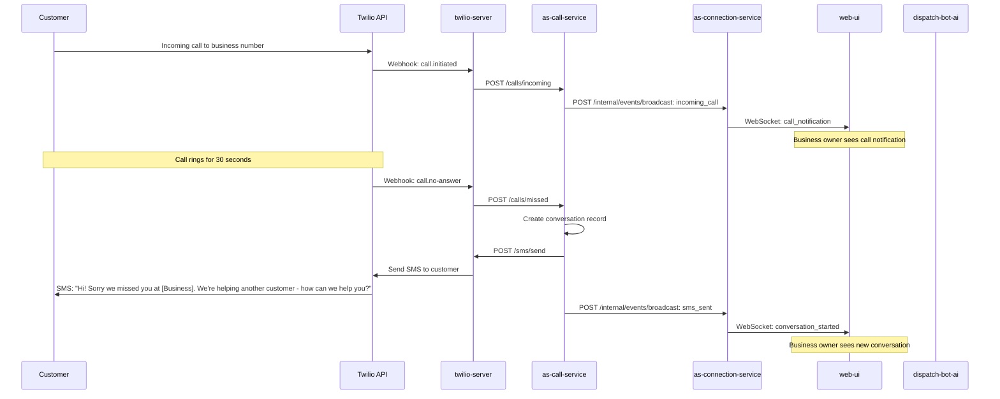

### 2. Customer SMS Response and AI Handoff

**Primary Actor**: Customer responding to initial SMS
**Scenario**: Customer replies via SMS, AI takes over after 60 seconds if no human response

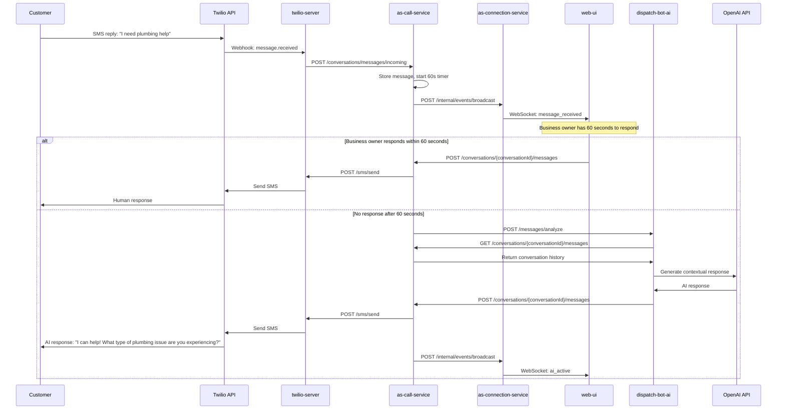

### 3. AI Appointment Scheduling Flow

**Primary Actor**: Customer requesting appointment through AI
**Scenario**: AI collects information and schedules appointment using calendar integration

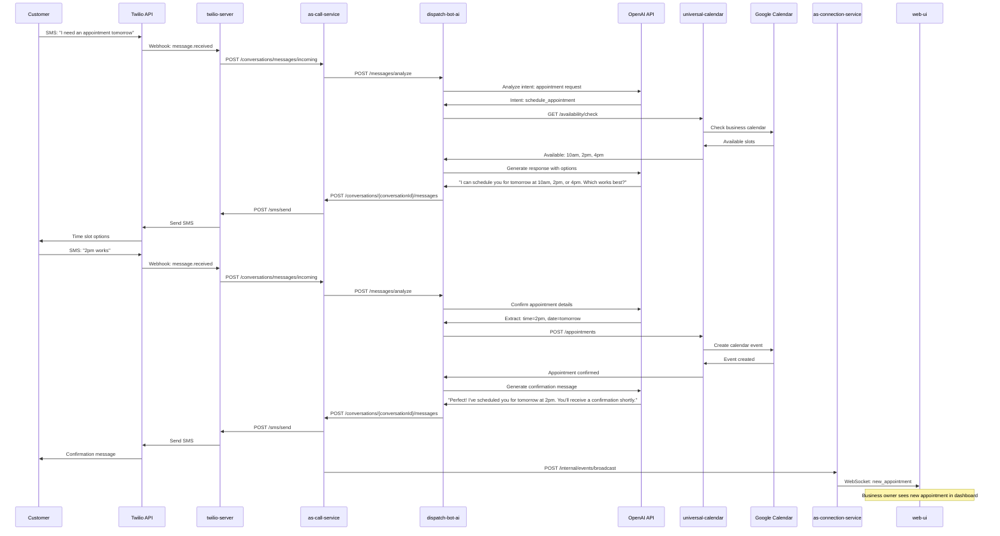

### 4. Business Owner Dashboard Login Flow

**Primary Actor**: Business Owner
**Scenario**: Owner logs into dashboard to view conversations and analytics

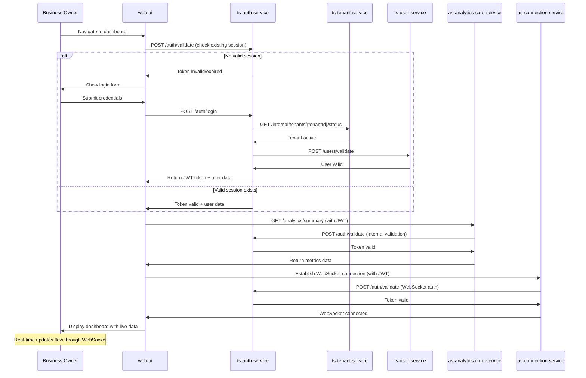

### 5. Phone Number Provisioning Flow

**Primary Actor**: Business Owner setting up new number
**Scenario**: Owner provisions new phone number with 10DLC compliance

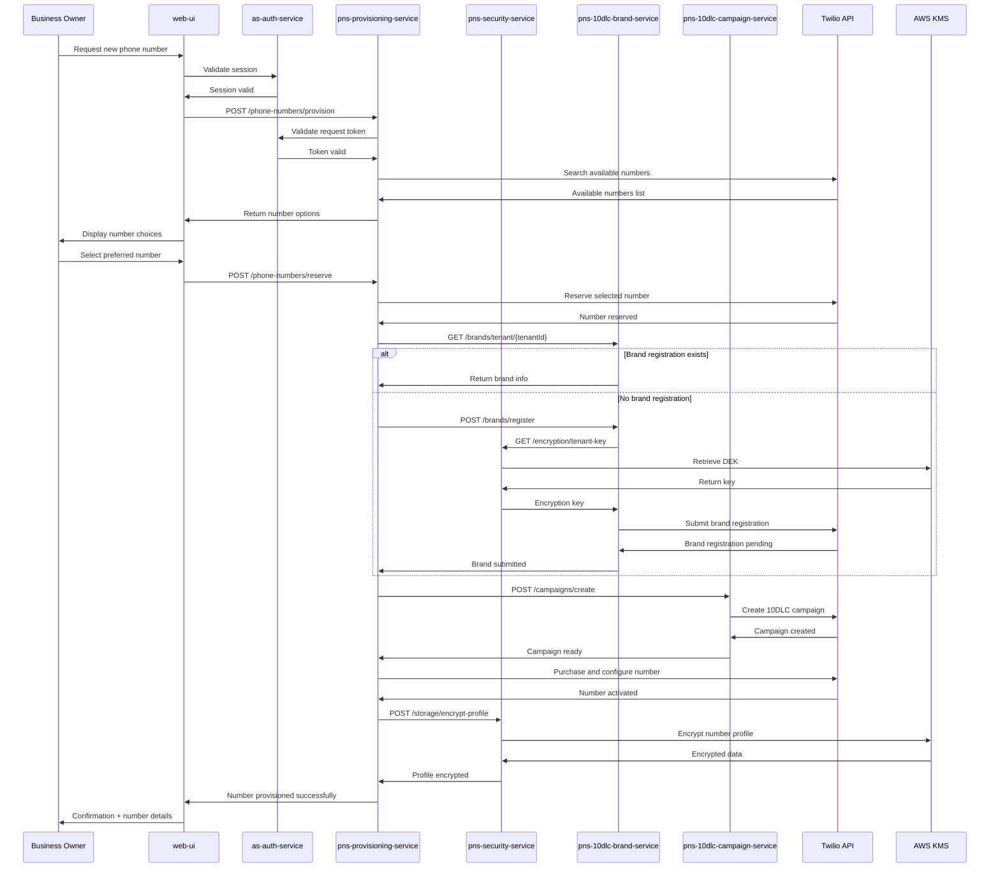

### 6. Real-time Conversation Monitoring

**Primary Actor**: Business Owner monitoring active conversations
**Scenario**: Owner watches live conversations and can take over from AI

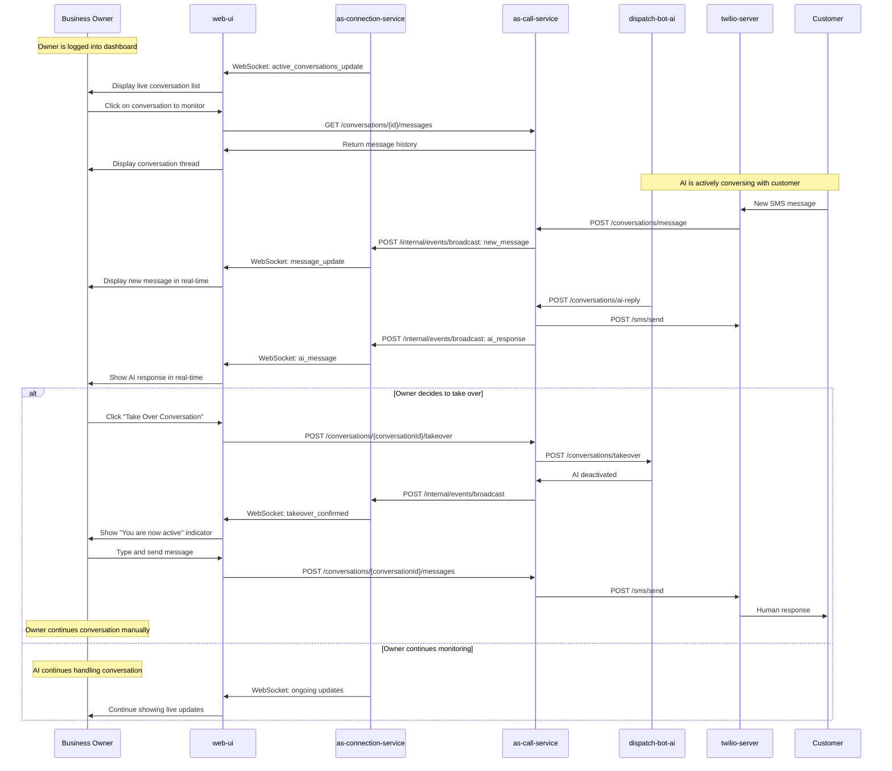

### 7. Analytics and Reporting Dashboard

**Primary Actor**: Business Owner reviewing performance
**Scenario**: Owner views analytics dashboard with real-time metrics

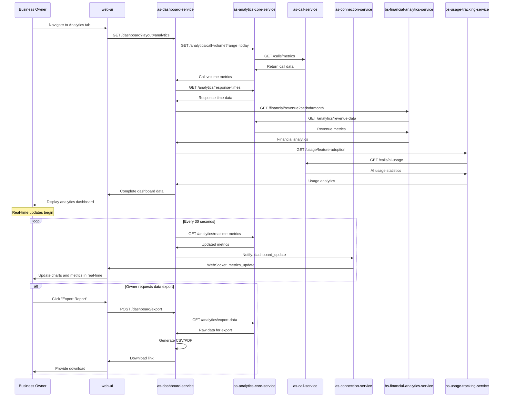

## Error Handling Flows

### 1. Service Unavailable Fallback

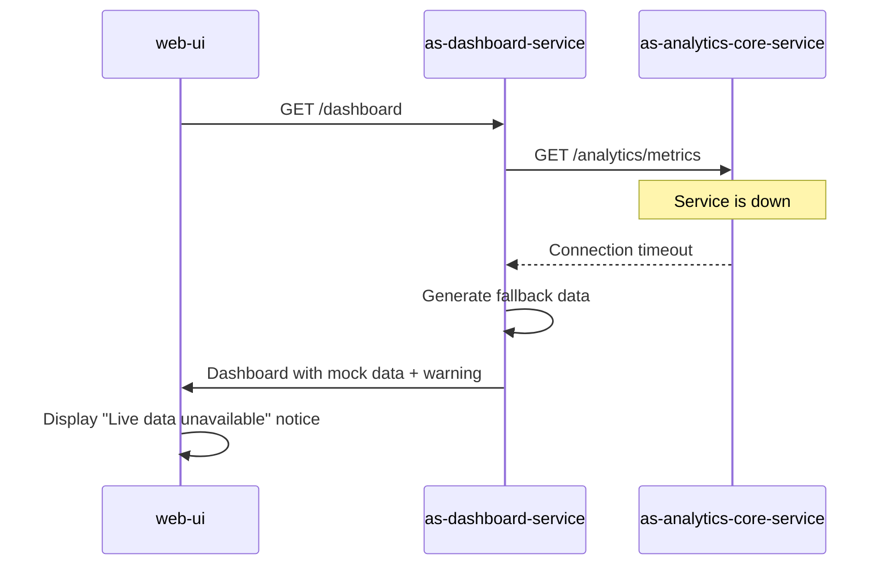

### 2. External API Failure Handling

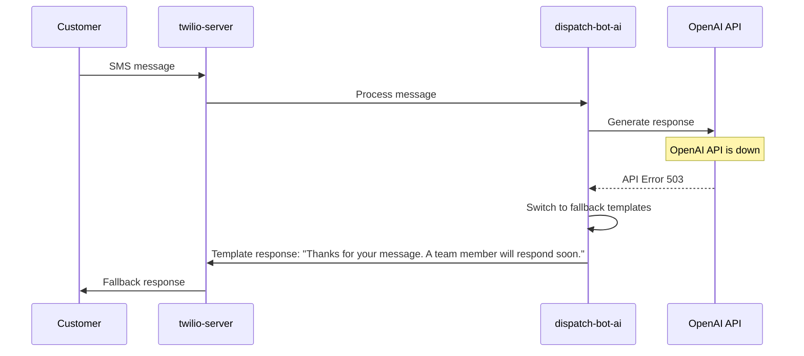

## Performance Optimization Patterns

### 1. Caching Strategy Flow

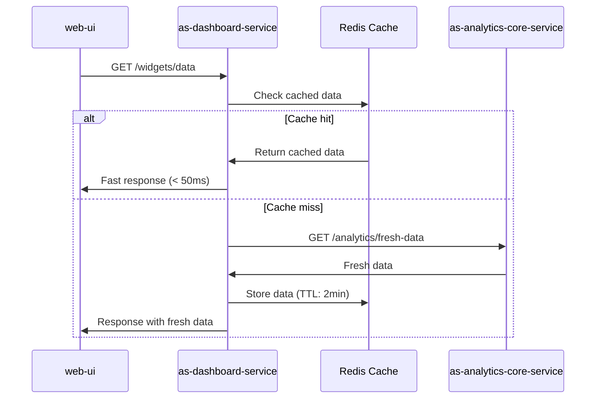

### 2. WebSocket Connection Management

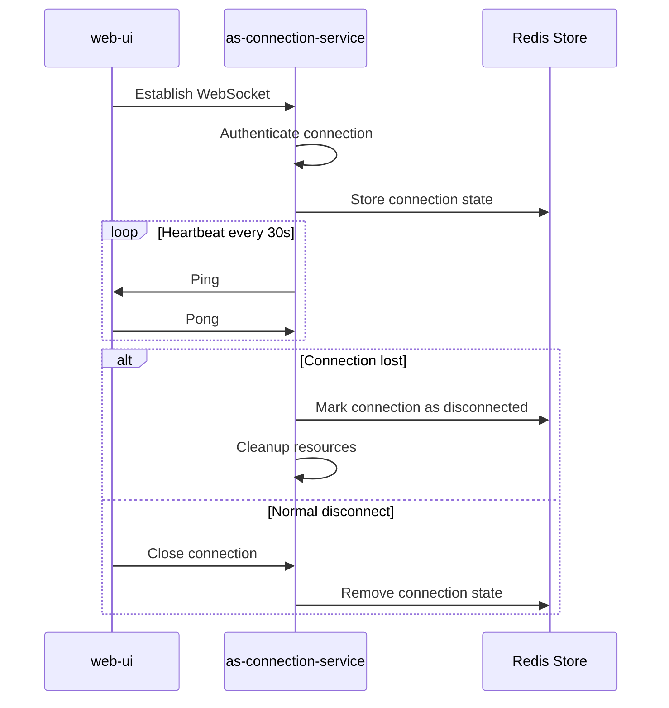

These use case flows provide a comprehensive view of how all the NeverMissCall services interact to deliver the core functionality of converting missed calls into SMS conversations with AI assistance and human handoff capabilities.