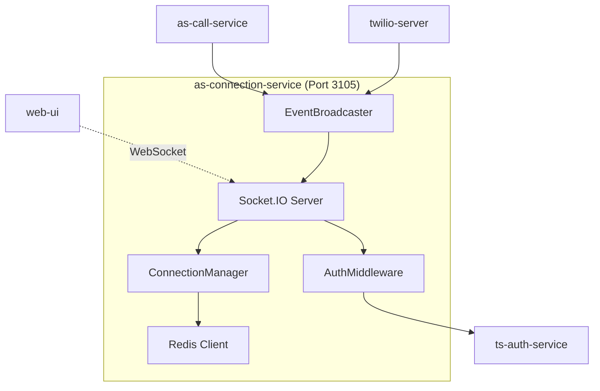

# as-connection-service Design Document

## Service Overview

**Service Name**: as-connection-service  
**Port**: 3105  
**Phase**: 1 - Dashboard & Monitoring  
**Purpose**: WebSocket management for real-time dashboard updates and live communication  

## Business Requirements

### Primary Functions
- Manage WebSocket connections for real-time dashboard updates
- Broadcast call and message events to connected clients
- Handle connection authentication and tenant isolation
- Provide real-time status of conversations and calls
- Support manual takeover notifications and actions

### Success Criteria
- Dashboard updates appear within 1 second of events
- WebSocket connections are stable and auto-reconnect
- Multiple dashboard sessions supported per business
- Connection authentication prevents unauthorized access
- Real-time events are delivered reliably

## Technical Specification

### Technology Stack
- **Runtime**: Node.js 18+ with TypeScript 5+
- **Framework**: Express.js + Socket.IO 4+
- **Authentication**: JWT token validation
- **Caching**: Redis for connection state and message queuing
- **Event Broadcasting**: Socket.IO rooms for tenant isolation

### Service Architecture



## WebSocket Events

### Connection Events

#### `connect`
**Purpose**: Client establishes WebSocket connection  
**Client Sends**:
```json
{
  "auth": {
    "token": "jwt-token"
  }
}
```
**Server Responds**:
```json
{
  "event": "authenticated",
  "data": {
    "userId": "user-uuid",
    "tenantId": "tenant-uuid",
    "connectionId": "conn-uuid",
    "serverTime": "2024-01-01T10:00:00Z"
  }
}
```

#### `disconnect`
**Purpose**: Client disconnects from WebSocket  
**Server Action**: Clean up connection state and Redis entries

### Real-time Updates

#### `call_incoming`
**Purpose**: Notify dashboard of incoming call  
**Server Broadcasts**:
```json
{
  "event": "call_incoming",
  "data": {
    "callId": "call-uuid",
    "callSid": "CA1234567890abcdef",
    "customerPhone": "+12125551234",
    "timestamp": "2024-01-01T10:00:00Z",
    "status": "ringing"
  }
}
```

#### `call_missed`
**Purpose**: Notify dashboard of missed call  
**Server Broadcasts**:
```json
{
  "event": "call_missed",
  "data": {
    "callId": "call-uuid", 
    "customerPhone": "+12125551234",
    "conversationId": "conversation-uuid",
    "autoResponseSent": true,
    "timestamp": "2024-01-01T10:00:30Z"
  }
}
```

#### `message_received`
**Purpose**: Notify dashboard of incoming SMS  
**Server Broadcasts**:
```json
{
  "event": "message_received",
  "data": {
    "conversationId": "conversation-uuid",
    "messageId": "message-uuid",
    "customerPhone": "+12125551234",
    "body": "I need help with a leaky faucet at 123 Main St",
    "timestamp": "2024-01-01T10:01:00Z",
    "aiResponsePending": true,
    "humanResponseWindow": 60
  }
}
```

#### `message_sent`
**Purpose**: Notify dashboard of outgoing SMS  
**Server Broadcasts**:
```json
{
  "event": "message_sent",
  "data": {
    "conversationId": "conversation-uuid",
    "messageId": "message-uuid",
    "body": "I can help with that faucet repair! I'm available tomorrow...",
    "sender": "ai",
    "timestamp": "2024-01-01T10:01:15Z",
    "messageSid": "SM1234567890abcdef"
  }
}
```

#### `ai_activated`
**Purpose**: Notify that AI has taken over conversation  
**Server Broadcasts**:
```json
{
  "event": "ai_activated",
  "data": {
    "conversationId": "conversation-uuid",
    "customerPhone": "+12125551234",
    "activatedAt": "2024-01-01T10:01:30Z",
    "reason": "human_response_timeout"
  }
}
```

### User Actions

#### `takeover_conversation`
**Purpose**: Human takes over from AI  
**Client Sends**:
```json
{
  "event": "takeover_conversation",
  "data": {
    "conversationId": "conversation-uuid",
    "message": "Thanks for reaching out! I can help with that faucet."
  }
}
```
**Server Responds**:
```json
{
  "event": "takeover_confirmed",
  "data": {
    "conversationId": "conversation-uuid",
    "aiDeactivated": true,
    "messageId": "message-uuid",
    "sentAt": "2024-01-01T10:02:00Z"
  }
}
```

#### `send_message`
**Purpose**: Send manual message to customer  
**Client Sends**:
```json
{
  "event": "send_message",
  "data": {
    "conversationId": "conversation-uuid",
    "message": "What time works best for you tomorrow?"
  }
}
```
**Server Responds**:
```json
{
  "event": "message_sent_confirmation",
  "data": {
    "conversationId": "conversation-uuid",
    "messageId": "message-uuid",
    "messageSid": "SM1234567890abcdef",
    "status": "sent"
  }
}
```

#### `update_lead_status`
**Purpose**: Update lead status from dashboard  
**Client Sends**:
```json
{
  "event": "update_lead_status",
  "data": {
    "leadId": "lead-uuid",
    "status": "appointment_scheduled",
    "notes": "Scheduled for tomorrow 10 AM"
  }
}
```
**Server Responds**:
```json
{
  "event": "lead_updated",
  "data": {
    "leadId": "lead-uuid",
    "status": "appointment_scheduled",
    "updatedAt": "2024-01-01T10:03:00Z"
  }
}
```

### Status Events

#### `dashboard_status`
**Purpose**: Periodic status update for dashboard  
**Server Broadcasts** (every 30 seconds):
```json
{
  "event": "dashboard_status",
  "data": {
    "activeConversations": 3,
    "aiActiveCount": 1,
    "humanActiveCount": 2,
    "totalCallsToday": 12,
    "totalLeadsToday": 8,
    "lastUpdated": "2024-01-01T10:05:00Z"
  }
}
```

## HTTP API Endpoints

### Connection Management

#### GET /connections/status
**Purpose**: Get connection service status  
**Headers**: `Authorization: Bearer jwt-token`  
**Response (200)**:
```json
{
  "status": "healthy",
  "activeConnections": {
    "total": 15,
    "byTenant": {
      "tenant-1": 2,
      "tenant-2": 1
    }
  },
  "serverTime": "2024-01-01T10:00:00Z"
}
```

#### POST /connections/broadcast
**Purpose**: Broadcast event to connected clients  
**Headers**: `X-Service-Key: internal-service-key`  
**Request Body**:
```json
{
  "tenantId": "tenant-uuid",
  "event": "new_conversation",
  "data": {
    "conversationId": "conversation-uuid",
    "customerPhone": "+12125551234",
    "lastMessage": "I need help with a leaky faucet"
  }
}
```
**Response (200)**:
```json
{
  "success": true,
  "broadcastSent": true,
  "activeConnections": 2,
  "sentAt": "2024-01-01T10:00:00Z"
}
```

#### GET /connections/tenant/:tenantId
**Purpose**: Get active connections for tenant  
**Headers**: `X-Service-Key: internal-service-key`  
**Response (200)**:
```json
{
  "connections": [
    {
      "connectionId": "conn-uuid-1",
      "userId": "user-uuid",
      "connectedAt": "2024-01-01T09:45:00Z",
      "lastActivity": "2024-01-01T09:59:30Z"
    }
  ],
  "totalConnections": 1
}
```

### Event Broadcasting

#### POST /broadcast/tenant/:tenantId
**Purpose**: Broadcast event to all tenant connections  
**Headers**: `X-Service-Key: internal-service-key`  
**Request Body**:
```json
{
  "event": "call_missed",
  "data": {
    "callId": "call-uuid",
    "customerPhone": "+12125551234",
    "timestamp": "2024-01-01T10:00:30Z"
  }
}
```
**Response (200)**:
```json
{
  "success": true,
  "broadcast": {
    "event": "call_missed",
    "tenantId": "tenant-uuid",
    "connectionsSent": 2,
    "timestamp": "2024-01-01T10:00:30Z"
  }
}
```

#### POST /broadcast/conversation/:conversationId
**Purpose**: Broadcast event to specific conversation watchers  
**Headers**: `X-Service-Key: internal-service-key`  
**Request Body**:
```json
{
  "event": "message_received",
  "data": {
    "messageId": "message-uuid",
    "body": "Customer response here",
    "timestamp": "2024-01-01T10:01:00Z"
  }
}
```
**Response (200)**:
```json
{
  "success": true,
  "broadcast": {
    "event": "message_received",
    "conversationId": "conversation-uuid",
    "connectionsSent": 1,
    "timestamp": "2024-01-01T10:01:00Z"
  }
}
```

## Data Models

### Connection State
```python
from dataclasses import dataclass
from typing import Optional, List
from datetime import datetime

@dataclass
class ConnectionState:
    connection_id: str
    socket_id: str
    user_id: str
    tenant_id: str
    
    # Connection details
    connected_at: datetime
    last_activity: datetime
    
    # Subscriptions
    subscribed_conversations: List[str]
    subscribed_events: List[str]
    
    # Status
    is_active: bool
    
    # Metadata stored in Redis
    redis_key: str
    ttl: int  # seconds
    
    # Optional fields
    user_agent: Optional[str] = None
    ip_address: Optional[str] = None
```

### Event Queue Item
```python
from dataclasses import dataclass
from typing import Optional, List, Any
from datetime import datetime

@dataclass
class EventQueueItem:
    id: str
    event: str
    tenant_id: str
    data: Any
    
    # Delivery
    target_connections: List[str]
    delivered_connections: List[str]
    failed_connections: List[str]
    
    # Timing
    created_at: datetime
    expires_at: datetime
    
    # Retry logic
    retry_count: int
    max_retries: int
    
    # Optional fields
    conversation_id: Optional[str] = None
```

## Redis Data Structure

### Connection Storage
```redis
# Connection state (expires in 1 hour)
connections:{tenantId}:{connectionId} -> {
  "userId": "user-uuid",
  "socketId": "socket-abc123",
  "connectedAt": "2024-01-01T10:00:00Z",
  "lastActivity": "2024-01-01T10:05:00Z",
  "subscribedConversations": ["conv-1", "conv-2"]
}

# Tenant connection index (expires in 1 hour)
tenant_connections:{tenantId} -> SET["conn-1", "conn-2", "conn-3"]

# Event queue (expires in 5 minutes)
event_queue:{eventId} -> {
  "event": "message_received",
  "tenantId": "tenant-uuid", 
  "data": {...},
  "targetConnections": ["conn-1", "conn-2"]
}
```

### Room Management
```python
# Socket.IO rooms for tenant isolation
def get_room_names():
    return {
        'tenant': lambda tenant_id: f'tenant:{tenant_id}',
        'conversation': lambda conversation_id: f'conversation:{conversation_id}',
        'user': lambda user_id: f'user:{user_id}'
    }
```

## Business Logic

### Connection Authentication Flow
1. **WebSocket Connect**: Client establishes connection with JWT token
2. **Token Validation**: Validate JWT with ts-auth-service
3. **Room Assignment**: Add socket to tenant-specific room
4. **State Storage**: Store connection state in Redis
5. **Send Confirmation**: Send authentication success event
6. **Start Heartbeat**: Begin periodic activity monitoring

### Event Broadcasting Logic
1. **Receive Event**: HTTP request from as-call-service or twilio-server
2. **Validate Request**: Verify service authentication and data format
3. **Determine Recipients**: Find all active connections for target tenant/conversation
4. **Queue Event**: Store event in Redis queue for reliability
5. **Broadcast**: Send event to all target Socket.IO rooms
6. **Track Delivery**: Monitor delivery success and retry failures
7. **Clean Up**: Remove expired events from queue

### Connection Management
- **Heartbeat Monitoring**: Ping connections every 30 seconds
- **Auto-Reconnect Support**: Handle client reconnection gracefully
- **Connection Cleanup**: Remove stale connections from Redis
- **Load Balancing**: Distribute connections across multiple instances (future)

### Tenant Isolation
- **Room-Based Separation**: Each tenant has isolated Socket.IO room
- **Connection Validation**: Verify user belongs to target tenant
- **Event Filtering**: Ensure events only reach authorized connections
- **State Isolation**: Redis keys include tenant ID for separation

## Security Considerations

### Authentication & Authorization
- JWT token validation for all WebSocket connections
- Service-to-service authentication for HTTP endpoints
- Tenant-scoped access control for all events
- Connection state validation on each message

### Data Protection
- No sensitive data stored in connection state
- Event data includes only necessary information
- IP address logging for security monitoring
- Automatic connection cleanup on token expiration

### Rate Limiting
- Connection limits per tenant (10 simultaneous connections)
- Event broadcasting rate limits (100 events/minute/tenant)
- Message sending limits from dashboard (30/minute/user)
- WebSocket message size limits (64KB max)

### Attack Prevention
- WebSocket origin validation
- Connection flooding protection
- Event payload validation
- Redis key expiration prevents memory leaks

## Error Handling

### WebSocket Error Events
```json
{
  "event": "error",
  "data": {
    "code": "AUTHENTICATION_FAILED",
    "message": "Invalid or expired token",
    "timestamp": "2024-01-01T10:00:00Z"
  }
}
```

### Common Error Codes
- `AUTHENTICATION_FAILED`: Invalid JWT token
- `UNAUTHORIZED_TENANT_ACCESS`: User accessing wrong tenant data
- `CONNECTION_LIMIT_EXCEEDED`: Too many connections for tenant
- `INVALID_EVENT_FORMAT`: Malformed event data
- `BROADCAST_DELIVERY_FAILED`: Event delivery failure
- `RATE_LIMIT_EXCEEDED`: Too many requests

### Connection Recovery
- **Automatic Reconnection**: Client-side retry with exponential backoff
- **State Recovery**: Restore subscription state on reconnection
- **Missed Events**: Replay events from queue on reconnection
- **Connection Validation**: Verify connection health periodically

## Testing Strategy

### Unit Tests
- Connection authentication and authorization
- Event broadcasting logic and tenant isolation
- Redis state management and cleanup
- WebSocket event handling and validation

### Integration Tests
- Full WebSocket connection and event flow
- Service-to-service HTTP API integration
- Redis state persistence and retrieval
- Authentication service integration

### Load Testing
- 100+ simultaneous WebSocket connections per tenant
- High-frequency event broadcasting (1000+ events/minute)
- Connection stability under network interruptions
- Memory usage with large number of connections

### Real-time Testing
- Event delivery latency measurement
- Connection recovery time testing
- Cross-browser WebSocket compatibility
- Mobile device connection stability

## Performance Requirements

- **Connection Establishment**: < 500ms for authentication
- **Event Delivery**: < 100ms from receipt to broadcast
- **Concurrent Connections**: 1000+ simultaneous connections
- **Event Throughput**: 10,000+ events/minute across all tenants
- **Memory Usage**: < 10MB per 100 connections

## Configuration

### Environment Variables
```bash
# Redis Configuration
REDIS_URL=redis://localhost:6379
CONNECTION_REDIS_DB=1
EVENT_QUEUE_REDIS_DB=2
CONNECTION_TTL_SECONDS=3600

# Socket.IO Configuration  
SOCKETIO_CORS_ORIGIN=http://localhost:3000
SOCKETIO_TRANSPORTS=websocket,polling
HEARTBEAT_INTERVAL_MS=30000
HEARTBEAT_TIMEOUT_MS=60000

# Rate Limiting
MAX_CONNECTIONS_PER_TENANT=10
MAX_EVENTS_PER_MINUTE_PER_TENANT=100
MAX_MESSAGES_PER_MINUTE_PER_USER=30

# Service Dependencies
TS_AUTH_SERVICE_URL=http://localhost:3301
AS_CALL_SERVICE_URL=http://localhost:3103
TS_TENANT_SERVICE_URL=http://localhost:3302

# Service Authentication
INTERNAL_SERVICE_KEY=shared-secret-key-for-phase-1

# Service Configuration
PORT=3105
SERVICE_NAME=as-connection-service
```

### Socket.IO Configuration
```python
import os
from socketio import Server

io = Server(cors_allowed_origins=os.environ.get('SOCKETIO_CORS_ORIGIN', '*'))
io.set_cors_options({
    'cors_allowed_origins': os.environ.get('SOCKETIO_CORS_ORIGIN', '*'),
    'cors_allowed_methods': ['GET', 'POST']
})

# Socket.IO configuration options
socketio_config = {
    'transports': ['websocket', 'polling'],
    'ping_timeout': 60000,
    'ping_interval': 30000,
    'max_http_buffer_size': 64 * 1024,  # 64KB
    'allow_eio3': True
}
```

## Dependencies

### Core Dependencies
- Socket.IO for WebSocket management
- Redis client for state storage
- Express.js for HTTP endpoints
- Winston for structured logging

### External Services
- **ts-auth-service**: JWT token validation
- **as-call-service**: Conversation and call events
- **twilio-server**: SMS and call status updates
- **Redis**: Connection state and event queue storage

This connection service provides the real-time communication backbone for Phase 1, enabling immediate dashboard updates and seamless user interactions with the conversation management system.