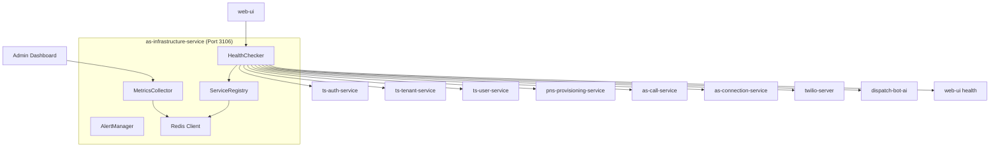

# as-infrastructure-service Design Document

## Service Overview

**Service Name**: as-infrastructure-service  
**Port**: 3106  
**Phase**: 1 - Dashboard & Monitoring  
**Purpose**: Health monitoring, service discovery, and basic infrastructure management  

## Business Requirements

### Primary Functions
- Monitor health status of all Phase 1 services
- Provide service discovery and status endpoints
- Basic uptime monitoring and alerting
- System health dashboard for administrators
- Service dependency validation
- Basic performance metrics collection

### Success Criteria
- All service health statuses are accurate and updated frequently
- Service outages are detected within 30 seconds
- Health check endpoints respond within 2 seconds
- Service dependency issues are identified quickly
- Basic performance metrics are collected and accessible

## Technical Specification

### Technology Stack
- **Runtime**: Node.js 18+ with TypeScript 5+
- **Framework**: Express.js 4+
- **Monitoring**: Custom health checks with HTTP requests
- **Storage**: Redis for metrics caching and service state
- **Logging**: Winston with structured logging

### Service Architecture



## API Endpoints

### Health Monitoring

#### GET /health
**Purpose**: Overall infrastructure health status  
**Response (200)**:
```json
{
  "status": "healthy",
  "timestamp": "2024-01-01T10:00:00Z",
  "version": "1.0.0",
  "uptime": 86400,
  "environment": "production",
  "services": {
    "total": 9,
    "healthy": 9,
    "unhealthy": 0,
    "unknown": 0
  }
}
```

#### GET /health/services
**Purpose**: Detailed health status of all services  
**Response (200)**:
```json
{
  "services": [
    {
      "name": "ts-auth-service",
      "url": "http://localhost:3301/health",
      "status": "healthy",
      "responseTime": 45,
      "lastChecked": "2024-01-01T10:00:00Z",
      "uptime": 99.95,
      "version": "1.0.0"
    },
    {
      "name": "ts-tenant-service", 
      "url": "http://localhost:3302/health",
      "status": "healthy",
      "responseTime": 32,
      "lastChecked": "2024-01-01T10:00:00Z",
      "uptime": 99.99,
      "version": "1.0.0"
    },
    {
      "name": "as-call-service",
      "url": "http://localhost:3103/health", 
      "status": "degraded",
      "responseTime": 1250,
      "lastChecked": "2024-01-01T10:00:00Z",
      "uptime": 98.50,
      "version": "1.0.0",
      "issues": ["High response time", "Database connection slow"]
    }
  ],
  "summary": {
    "healthy": 8,
    "degraded": 1,
    "unhealthy": 0,
    "lastUpdated": "2024-01-01T10:00:00Z"
  }
}
```

#### GET /health/service/:serviceName
**Purpose**: Detailed health information for specific service  
**Response (200)**:
```json
{
  "service": {
    "name": "as-call-service",
    "status": "healthy",
    "url": "http://localhost:3103/health",
    "port": 3103,
    "responseTime": 156,
    "lastChecked": "2024-01-01T10:00:00Z",
    "consecutiveFailures": 0,
    "uptimePercentage": 99.85,
    "healthHistory": [
      {
        "timestamp": "2024-01-01T10:00:00Z",
        "status": "healthy",
        "responseTime": 156
      },
      {
        "timestamp": "2024-01-01T09:59:00Z", 
        "status": "healthy",
        "responseTime": 142
      }
    ]
  }
}
```

### Service Discovery

#### GET /services
**Purpose**: List all registered services and their endpoints  
**Response (200)**:
```json
{
  "services": {
    "identity": {
      "ts-auth-service": {
        "url": "http://localhost:3301",
        "healthEndpoint": "/health",
        "status": "healthy",
        "version": "1.0.0"
      },
      "ts-tenant-service": {
        "url": "http://localhost:3302",
        "healthEndpoint": "/health", 
        "status": "healthy",
        "version": "1.0.0"
      },
      "ts-user-service": {
        "url": "http://localhost:3303",
        "healthEndpoint": "/health",
        "status": "healthy",
        "version": "1.0.0"
      }
    },
    "core": {
      "as-call-service": {
        "url": "http://localhost:3103",
        "healthEndpoint": "/health",
        "status": "healthy",
        "version": "1.0.0"
      },
      "as-connection-service": {
        "url": "http://localhost:3105", 
        "healthEndpoint": "/health",
        "status": "healthy",
        "version": "1.0.0"
      }
    },
    "external": {
      "twilio-server": {
        "url": "http://localhost:3701",
        "healthEndpoint": "/health",
        "status": "healthy",
        "version": "1.0.0"
      },
      "dispatch-bot-ai": {
        "url": "http://localhost:3801",
        "healthEndpoint": "/health", 
        "status": "healthy",
        "version": "1.0.0"
      }
    }
  },
  "lastUpdated": "2024-01-01T10:00:00Z"
}
```

#### GET /services/dependencies
**Purpose**: Service dependency graph and validation  
**Response (200)**:
```json
{
  "dependencies": {
    "as-call-service": {
      "dependsOn": ["ts-auth-service", "ts-tenant-service", "twilio-server", "dispatch-bot-ai"],
      "dependencyStatus": "healthy",
      "criticalPath": true
    },
    "web-ui": {
      "dependsOn": ["ts-auth-service", "as-call-service", "as-connection-service"],
      "dependencyStatus": "healthy", 
      "criticalPath": true
    },
    "ts-tenant-service": {
      "dependsOn": ["pns-provisioning-service"],
      "dependencyStatus": "healthy",
      "criticalPath": false
    }
  },
  "criticalPath": [
    "twilio-server",
    "as-call-service", 
    "as-connection-service",
    "web-ui"
  ],
  "healthyDependencies": 15,
  "brokenDependencies": 0
}
```

### Metrics and Monitoring

#### GET /metrics
**Purpose**: Basic system and service metrics  
**Response (200)**:
```json
{
  "system": {
    "timestamp": "2024-01-01T10:00:00Z",
    "uptime": 86400,
    "totalServices": 9,
    "healthyServices": 9,
    "averageResponseTime": 145,
    "totalRequests": 15420,
    "errorRate": 0.02
  },
  "services": {
    "as-call-service": {
      "responseTime": {
        "current": 156,
        "average": 142,
        "p95": 225,
        "p99": 350
      },
      "requests": {
        "total": 2340,
        "perMinute": 45,
        "errorCount": 3,
        "errorRate": 0.001
      }
    },
    "ts-auth-service": {
      "responseTime": {
        "current": 45,
        "average": 52,
        "p95": 85,
        "p99": 120
      },
      "requests": {
        "total": 890,
        "perMinute": 12,
        "errorCount": 0,
        "errorRate": 0.0
      }
    }
  }
}
```

#### GET /metrics/service/:serviceName
**Purpose**: Detailed metrics for specific service  
**Response (200)**:
```json
{
  "service": "as-call-service",
  "metrics": {
    "responseTime": {
      "current": 156,
      "last5Min": [145, 152, 148, 161, 156],
      "average1Hour": 142,
      "average24Hour": 138,
      "p50": 140,
      "p95": 225,
      "p99": 350
    },
    "availability": {
      "uptime": 99.85,
      "downtimeMinutes": 12.6,
      "lastOutage": "2024-01-01T08:30:00Z",
      "mtbf": 2880, // minutes
      "mttr": 4.2   // minutes
    },
    "requests": {
      "total": 2340,
      "successful": 2337,
      "failed": 3,
      "perMinute": 45,
      "perHour": 2700,
      "errorRate": 0.001
    },
    "health": {
      "consecutiveSuccesses": 120,
      "consecutiveFailures": 0,
      "lastHealthCheck": "2024-01-01T10:00:00Z",
      "healthHistory": "healthy for 45 minutes"
    }
  }
}
```

### System Status

#### GET /status/critical
**Purpose**: Critical system status for alerts  
**Response (200)**:
```json
{
  "critical": {
    "status": "operational", // operational | degraded | outage
    "issueCount": 0,
    "criticalServices": {
      "twilio-server": "healthy",
      "as-call-service": "healthy", 
      "dispatch-bot-ai": "healthy",
      "web-ui": "healthy"
    }
  },
  "alerts": [],
  "lastIncident": {
    "timestamp": "2024-01-01T06:15:00Z",
    "service": "as-call-service",
    "issue": "Database connection timeout", 
    "duration": 4.2,
    "resolved": true
  }
}
```

#### GET /status/dashboard
**Purpose**: Status dashboard data for web UI  
**Response (200)**:
```json
{
  "dashboard": {
    "overallStatus": "healthy",
    "systemUptime": 99.95,
    "activeAlerts": 0,
    "servicesSummary": {
      "total": 9,
      "healthy": 9,
      "degraded": 0,
      "down": 0
    },
    "recentEvents": [
      {
        "timestamp": "2024-01-01T09:45:00Z",
        "type": "service_healthy",
        "service": "pns-provisioning-service",
        "message": "Service recovered from degraded state"
      },
      {
        "timestamp": "2024-01-01T09:30:00Z",
        "type": "performance_alert",
        "service": "as-call-service", 
        "message": "Response time elevated (avg 250ms)"
      }
    ],
    "lastUpdated": "2024-01-01T10:00:00Z"
  }
}
```

## Data Models

### Service Health Status
```python
from dataclasses import dataclass
from typing import Optional, Literal, List
from datetime import datetime

@dataclass
class ServiceHealth:
    name: str
    url: str
    port: int
    health_endpoint: str
    
    # Current status
    status: Literal['healthy', 'degraded', 'unhealthy', 'unknown']
    response_time: int  # milliseconds
    last_checked: datetime
    
    # Reliability metrics
    uptime: float  # percentage
    consecutive_failures: int
    consecutive_successes: int
    
    # Historical data
    health_history: List['HealthCheckResult']
    downtime_events: List['DowntimeEvent']
    
    # Metadata
    environment: str
    dependencies: List[str]
    version: Optional[str] = None
```

### Health Check Result
```python
from dataclasses import dataclass
from typing import Optional, Literal
from datetime import datetime

@dataclass
class HealthCheckResult:
    timestamp: datetime
    status: Literal['healthy', 'degraded', 'unhealthy']
    response_time: int
    http_status: int
    
    # Optional fields
    error_message: Optional[str] = None
    service_version: Optional[str] = None
    database_connected: Optional[bool] = None
    external_services_ok: Optional[bool] = None
```

### System Metrics
```python
from dataclasses import dataclass
from datetime import datetime

@dataclass
class SystemMetrics:
    timestamp: datetime
    
    # Service metrics
    total_services: int
    healthy_services: int
    degraded_services: int
    unhealthy_services: int
    
    # Performance metrics
    average_response_time: float
    p95_response_time: float
    p99_response_time: float
    
    # Request metrics
    total_requests: int
    requests_per_minute: int
    error_rate: float
    
    # System metrics
    system_uptime: float
    alert_count: int
```

### Alert Definition
```python
from dataclasses import dataclass
from typing import Optional, Literal
from datetime import datetime

@dataclass
class Alert:
    id: str
    type: Literal['service_down', 'high_response_time', 'high_error_rate', 'dependency_failure']
    severity: Literal['low', 'medium', 'high', 'critical']
    service: str
    
    # Alert details
    message: str
    description: str
    threshold: float
    current_value: float
    
    # Timing
    triggered_at: datetime
    
    # State
    status: Literal['active', 'acknowledged', 'resolved']
    
    # Optional fields
    acknowledged_at: Optional[datetime] = None
    resolved_at: Optional[datetime] = None
    acknowledged_by: Optional[str] = None
```

## Configuration

### Service Registry
```python
SERVICE_REGISTRY = {
    'ts-auth-service': {
        'url': 'http://localhost:3301',
        'health_endpoint': '/health',
        'check_interval': 30000,  # 30 seconds
        'timeout': 5000,
        'critical': False
    },
    'ts-tenant-service': {
        'url': 'http://localhost:3302', 
        'health_endpoint': '/health',
        'check_interval': 30000,
        'timeout': 5000,
        'critical': False
    },
    'as-call-service': {
        'url': 'http://localhost:3103',
        'health_endpoint': '/health', 
        'check_interval': 15000,  # 15 seconds - critical service
        'timeout': 3000,
        'critical': True
    },
    'twilio-server': {
        'url': 'http://localhost:3701',
        'health_endpoint': '/health',
        'check_interval': 15000,
        'timeout': 3000,
        'critical': True
    },
    'dispatch-bot-ai': {
        'url': 'http://localhost:3801',
        'health_endpoint': '/health',
        'check_interval': 15000, 
        'timeout': 5000,
        'critical': True
    }
}
```

### Alert Thresholds
```python
ALERT_THRESHOLDS = {
    'response_time': {
        'warning': 1000,    # 1 second
        'critical': 3000    # 3 seconds  
    },
    'error_rate': {
        'warning': 0.01,    # 1%
        'critical': 0.05    # 5%
    },
    'consecutive_failures': {
        'warning': 2,
        'critical': 5
    },
    'uptime': {
        'warning': 99.0,    # 99%
        'critical': 95.0    # 95%
    }
}
```

## Business Logic

### Health Check Workflow
1. **Scheduled Check**: Timer triggers health check for service
2. **HTTP Request**: Send GET request to service health endpoint
3. **Response Analysis**: Parse response and measure timing
4. **Status Determination**: Classify as healthy/degraded/unhealthy
5. **Store Result**: Save result to Redis with timestamp
6. **Alert Evaluation**: Check if alert thresholds are crossed
7. **Update Metrics**: Update running averages and counters

### Service Status Classification
```python
def determine_service_status(result: HealthCheckResult) -> ServiceStatus:
    if not result.http_status or result.http_status >= 500:
        return 'unhealthy'
    
    if result.response_time > ALERT_THRESHOLDS['response_time']['critical']:
        return 'degraded'
    
    if (result.http_status >= 400 or 
        result.response_time > ALERT_THRESHOLDS['response_time']['warning']):
        return 'degraded'
    
    return 'healthy'
```

### Uptime Calculation
```python
import time
from typing import List

def calculate_uptime(health_history: List[HealthCheckResult], period_hours: int) -> float:
    cutoff_time = time.time() * 1000 - (period_hours * 60 * 60 * 1000)
    recent_results = [r for r in health_history if r.timestamp.timestamp() * 1000 > cutoff_time]
    
    healthy_count = len([r for r in recent_results if r.status == 'healthy'])
    total_count = len(recent_results)
    
    return (healthy_count / total_count) * 100 if total_count > 0 else 0
```

### Alert Management
- **Threshold Monitoring**: Continuously check metrics against thresholds
- **Alert Deduplication**: Prevent duplicate alerts for same issue
- **Alert Escalation**: Increase severity based on duration
- **Auto-Resolution**: Automatically resolve alerts when metrics improve

## Security Considerations

### Access Control
- Health endpoints are publicly accessible (no sensitive data)
- Admin endpoints require authentication
- Service registry endpoints use internal service authentication
- Metrics endpoints may contain sensitive performance data

### Data Protection
- No sensitive business data stored in health checks
- Service URLs and internal architecture protected
- Alert messages avoid exposing internal details
- Redis storage uses appropriate key expiration

## Error Handling

### Health Check Failures
- **Network Timeouts**: Classify as 'unknown' status
- **HTTP Errors**: Map to appropriate status based on code
- **Parsing Errors**: Log issue but continue monitoring
- **Service Unavailable**: Mark as 'unhealthy' with retry logic

### Common Error Scenarios
- Service temporarily unavailable during deployment
- Network connectivity issues between services
- Service overloaded and responding slowly
- Database connection issues affecting health endpoint

## Testing Strategy

### Unit Tests
- Health check logic and status determination
- Metrics calculation and aggregation
- Alert threshold evaluation
- Service registry management

### Integration Tests
- Actual health check requests to all services
- Redis storage and retrieval of metrics
- Alert generation and resolution workflow
- Service dependency validation

### End-to-End Tests
- Complete monitoring workflow from check to alert
- Service outage detection and recovery
- Dashboard data accuracy and timeliness

## Performance Requirements

- **Health Check Response**: < 100ms per service check
- **Dashboard Updates**: < 500ms for status page load
- **Alert Detection**: < 30 seconds for service outages
- **Metrics Collection**: < 1000ms for full system metrics
- **Concurrent Monitoring**: All 9 services checked simultaneously

## Configuration

### Environment Variables
```bash
# Redis Configuration
REDIS_URL=redis://localhost:6379
METRICS_REDIS_DB=3
HEALTH_DATA_TTL_SECONDS=86400

# Health Check Configuration
DEFAULT_CHECK_INTERVAL_MS=30000
CRITICAL_SERVICE_CHECK_INTERVAL_MS=15000
HEALTH_CHECK_TIMEOUT_MS=5000
MAX_CONSECUTIVE_FAILURES=5

# Alert Configuration
ALERT_CHECK_INTERVAL_MS=60000
ALERT_COOLDOWN_MINUTES=5
ENABLE_EMAIL_ALERTS=false
ENABLE_SLACK_ALERTS=false

# Service Configuration  
PORT=3106
SERVICE_NAME=as-infrastructure-service
LOG_LEVEL=info
```

## Dependencies

### Core Dependencies
- Express.js for HTTP API
- Axios for service health checks
- Redis client for metrics storage
- Winston for structured logging
- Node-cron for scheduled health checks

### External Dependencies
- **All Phase 1 Services**: Health check endpoints
- **Redis**: Metrics and state storage
- **Network Connectivity**: Service-to-service communication

This infrastructure service provides essential monitoring and health management for Phase 1, ensuring system reliability and providing visibility into service performance.