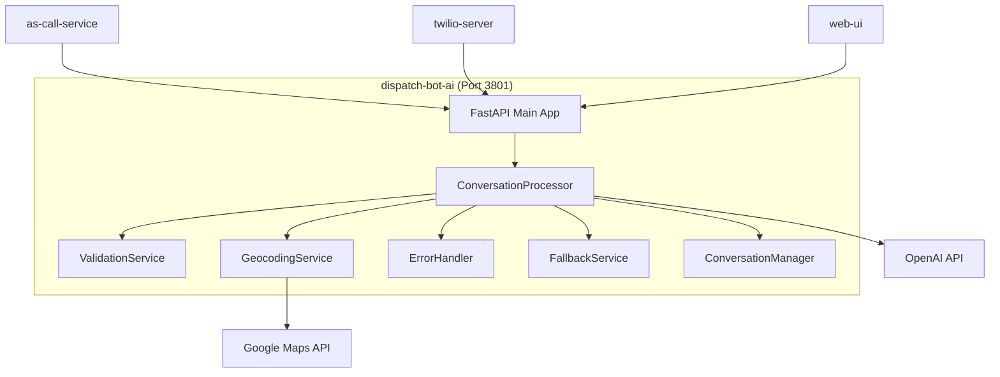

# dispatch-bot-ai Design Document

## Service Overview

**Service Name**: dispatch-bot-ai  
**Port**: 3801  
**Phase**: 1 - AI & Communication  
**Purpose**: AI-powered conversation processing and automated scheduling for field service businesses  

## Business Requirements

### Primary Functions
- Process customer SMS messages and extract intent
- Detect emergency situations across all trade types
- Validate service areas and business rules
- Generate appointment slots and confirmations
- Handle conversation flows and timeouts
- Provide intelligent responses based on customer messages

### Success Criteria
- Emergency detection accuracy > 90% across all trades
- API response time < 2 seconds (95th percentile)
- Conversation processing completes in < 1000ms
- Address validation works with 95% accuracy
- Graceful degradation when external services fail
- Support 100+ concurrent conversations

## Technical Specification

### Technology Stack
- **Runtime**: Python 3.9+ with FastAPI
- **Framework**: FastAPI with Pydantic validation
- **AI Integration**: OpenAI GPT-4 (planned)
- **Geocoding**: Google Maps Geocoding API (planned)
- **Validation**: Pydantic models with comprehensive validation
- **Testing**: pytest with TDD approach

### Service Architecture



## API Endpoints

### Health Check

#### GET /health
**Purpose**: Monitor API status and service health  
**Response (200)**:
```json
{
  "status": "healthy",
  "version": "1.0.0",
  "timestamp": "2024-01-01T10:00:00Z",
  "services": {
    "database": "healthy",
    "geocoding": "healthy",
    "llm": "healthy",
    "traffic": "healthy"
  },
  "uptime_seconds": 3600
}
```

### Conversation Processing

#### POST /dispatch/process
**Purpose**: Process customer conversation and determine next actions  
**Headers**: `X-Service-Key: internal-service-key`  
**Request Body**:
```json
{
  "callerPhone": "+12125551234",
  "calledNumber": "+15555551111",
  "conversationHistory": [
    {
      "timestamp": "2024-01-01T10:00:00Z",
      "sender": "customer",
      "message": "Water heater not working",
      "messageType": "sms"
    }
  ],
  "currentMessage": "Water heater burst in basement! 789 Sunset Blvd, 90210",
  "businessName": "Prime Plumbing",
  "tradeType": "plumbing",
  "businessHours": {
    "monday": {"start": "07:00", "end": "18:00"},
    "tuesday": {"start": "07:00", "end": "18:00"},
    "wednesday": {"start": "07:00", "end": "18:00"},
    "thursday": {"start": "07:00", "end": "18:00"},
    "friday": {"start": "07:00", "end": "18:00"},
    "saturday": {"start": "08:00", "end": "16:00"},
    "sunday": null
  },
  "phoneHours": {
    "alwaysAvailable": true
  },
  "businessAddress": {
    "streetAddress": "123 Main St",
    "city": "Los Angeles",
    "state": "CA",
    "postalCode": "90210",
    "latitude": 34.0522,
    "longitude": -118.2437
  },
  "jobEstimates": [
    {
      "jobType": "water_heater_repair",
      "description": "Water heater repair or replacement",
      "estimatedHours": 2.5,
      "estimatedCostMin": 200.00,
      "estimatedCostMax": 500.00,
      "requiresParts": true,
      "urgencyMultiplier": 1.5,
      "bufferMinutes": 45
    }
  ],
  "businessSettings": {
    "acceptEmergencies": true,
    "outOfOffice": false,
    "maxJobsPerDay": 8,
    "serviceRadiusMiles": 25,
    "emergencyMultiplier": 1.5,
    "emergencyServiceEnabled": true,
    "workHoursEmergencyMultiplier": 1.75,
    "eveningEmergencyMultiplier": 2.25,
    "nightEmergencyMultiplier": 2.75
  },
  "existingCalendar": [
    {
      "eventId": "evt-001",
      "startTime": "2024-01-01T14:00:00Z",
      "endTime": "2024-01-01T16:00:00Z",
      "locationAddress": "456 Oak St, Los Angeles, CA",
      "locationLatitude": 34.0622,
      "locationLongitude": -118.2537,
      "jobType": "faucet_repair",
      "bookingType": "confirmed",
      "customerPhone": "+13125551234"
    }
  ]
}
```

**Response (200)**:
```json
{
  "extractedInfo": {
    "jobType": "water_heater_repair",
    "jobConfidence": 0.95,
    "urgencyLevel": "emergency",
    "urgencyConfidence": 0.90,
    "customerAddress": "789 Sunset Blvd, 90210",
    "addressVerified": true,
    "addressLatitude": 34.0982,
    "addressLongitude": -118.4356,
    "preferredDate": "today",
    "customerConfirmed": false
  },
  "validation": {
    "serviceAreaValid": true,
    "tradeSupported": true,
    "jobTypeSupported": true,
    "withinBusinessHours": false,
    "capacityAvailable": true,
    "addressReachable": true,
    "validationErrors": []
  },
  "proposedSlot": {
    "slotId": "slot-emergency-001",
    "startTime": "2024-01-01T20:00:00Z",
    "endTime": "2024-01-01T23:00:00Z",
    "durationMinutes": 180,
    "priceMin": 350.00,
    "priceMax": 875.00,
    "bookingType": "tentative",
    "travelTimeMinutes": 25,
    "requiresConfirmation": true
  },
  "nextAction": {
    "actionType": "request_emergency_choice",
    "messageToCustomer": "🚨 Emergency water heater detected! We can come tonight for $350-$875 (emergency rate) or tomorrow morning 8 AM for $200-$500. Reply TONIGHT or TOMORROW.",
    "followUpNeeded": true,
    "followUpDelayMinutes": 5
  },
  "conversationStage": "confirming",
  "needsGeocoding": false,
  "geocodingQuery": null,
  "confidenceScores": {
    "jobTypeConfidence": 0.95,
    "urgencyConfidence": 0.90,
    "addressConfidence": 0.85,
    "overallConfidence": 0.90
  }
}
```

## Data Models

### Core Request Model
```python
class ProcessConversationRequest(BaseModel):
    """Main request model for conversation processing."""
    callerPhone: str
    calledNumber: str
    conversationHistory: List[ConversationMessage] = []
    currentMessage: str
    businessName: str
    tradeType: TradeType
    businessHours: BusinessHours
    phoneHours: PhoneHours
    businessAddress: BusinessAddress
    jobEstimates: List[JobEstimate]
    businessSettings: BusinessSettings
    existingCalendar: List[CalendarEvent] = []
    customerHistory: Optional[CustomerHistory] = None
    weatherConditions: Optional[str] = None
```

### Core Response Model
```python
class ProcessConversationResponse(BaseModel):
    """Main response model for conversation processing."""
    extractedInfo: ExtractedInfo
    validation: ValidationResult
    proposedSlot: Optional[AppointmentSlot] = None
    nextAction: NextAction
    conversationStage: ConversationStage
    needsGeocoding: bool = False
    geocodingQuery: Optional[str] = None
    confidenceScores: ConfidenceScores
```

### Trade Types and Urgency
```python
class TradeType(str, Enum):
    PLUMBING = "plumbing"
    ELECTRICAL = "electrical"
    HVAC = "hvac"
    LOCKSMITH = "locksmith"
    GARAGE_DOOR = "garage_door"

class UrgencyLevel(str, Enum):
    NORMAL = "normal"
    URGENT = "urgent"
    EMERGENCY = "emergency"

class ConversationStage(str, Enum):
    INITIAL = "initial"
    COLLECTING_INFO = "collecting_info"
    CONFIRMING = "confirming"
    BOOKING = "booking"
    COMPLETE = "complete"
    ESCALATED = "escalated"
    REJECTED = "rejected"
```

### Business Configuration Models
```python
class BusinessSettings(BaseModel):
    """Business operational settings."""
    acceptEmergencies: bool = True
    outOfOffice: bool = False
    maxJobsPerDay: int = 8
    minBufferBetweenJobs: int = 30
    serviceRadiusMiles: int = 25
    maxTravelTimeMinutes: int = 60
    emergencyMultiplier: float = 1.5
    workHoursEmergencyMultiplier: float = 1.75
    eveningEmergencyMultiplier: float = 2.25
    nightEmergencyMultiplier: float = 2.75
    emergencyServiceEnabled: bool = True

class JobEstimate(BaseModel):
    """Job type with pricing and duration estimates."""
    jobType: str
    description: str
    estimatedHours: float
    estimatedCostMin: float
    estimatedCostMax: float
    requiresParts: bool
    urgencyMultiplier: float = 1.0
    bufferMinutes: int = 30
```

## Business Logic

### Emergency Detection Algorithm
```python
EMERGENCY_KEYWORDS = {
    "plumbing": [
        "burst", "flooding", "no hot water", "sewage backup", 
        "no water", "frozen pipes", "gas leak"
    ],
    "electrical": [
        "sparks", "smoke", "power out", "exposed wires", 
        "burning smell", "no power", "electrical fire"
    ],
    "hvac": [
        "no heat", "no cooling", "gas smell", "carbon monoxide",
        "furnace not working", "ac not working"
    ],
    "locksmith": [
        "locked out", "break-in", "security breach", 
        "can't get in", "lost keys"
    ],
    "garage_door": [
        "won't close", "stuck open", "spring broken",
        "door won't open", "garage stuck"
    ]
}
```

### Conversation Flow Management
1. **Message Analysis**: Extract intent, urgency, and address
2. **Validation**: Check service area, business hours, capacity
3. **Emergency Assessment**: Detect emergency keywords and context
4. **Scheduling**: Generate appointment slots based on calendar
5. **Response Generation**: Create appropriate customer message
6. **Follow-up Tracking**: Handle conversation timeouts and follow-ups

### Pricing Calculation
- **Normal Hours (7 AM - 6 PM)**: Base rate (1.0x)
- **Evening Emergency (6 PM - 8 PM)**: 1.75x multiplier
- **Night Emergency (8 PM - 7 AM)**: 2.25x multiplier
- **Overnight Emergency**: 2.75x multiplier
- **Customer Choice**: Emergency tonight vs normal rate tomorrow

## Service Integration

### External Service Dependencies

#### Google Maps Geocoding API
```python
# Configuration
GOOGLE_MAPS_API_KEY=your-api-key
GEOCODING_BASE_URL=https://maps.googleapis.com/maps/api/geocode/json

# Usage
geocoding_service = GeocodingService(api_key)
result = await geocoding_service.geocode_address("123 Main St, Los Angeles, CA")
```

#### OpenAI GPT-4 Integration
```python
# Configuration
OPENAI_API_KEY=your-api-key
OPENAI_MODEL=gpt-4

# Usage
nlp_service = OpenAIService(api_key)
intent = await nlp_service.extract_intent(message, conversation_history)
```

### Internal Service Communication

#### with as-call-service
- Receives conversation processing requests
- Returns structured responses for SMS sending
- Provides conversation state tracking

#### with twilio-server
- Processes incoming SMS messages
- Handles conversation threading
- Manages customer communications

#### with web-ui
- Provides conversation monitoring
- Supports manual takeover scenarios
- Delivers real-time updates

## Error Handling and Fallback

### Graceful Degradation Strategy
```python
class ServiceHealthMonitor:
    """Monitor external service health and enable fallbacks."""
    
    def get_degradation_level(self) -> int:
        """
        Returns:
            0 = Full service (all APIs working)
            1 = Minor degradation (1 API down)
            2 = Major degradation (2+ APIs down)
            3 = Emergency mode (local processing only)
        """
```

### Fallback Responses
- **Google Maps Down**: Use basic address validation
- **OpenAI Down**: Use keyword-based intent detection
- **Multiple Services Down**: Provide basic scheduling with manual fallback

### Error Response Format
```json
{
  "code": "GEOCODING_FAILED",
  "message": "Unable to validate address",
  "details": {
    "field": "customer_address",
    "provided": "123 Fake St"
  }
}
```

## Testing Strategy

### Unit Tests (70% coverage)
- Emergency detection accuracy
- Address validation logic
- Pricing calculation algorithms
- Conversation flow management
- Error handling scenarios

### Integration Tests (20% coverage)
- Google Maps API integration
- OpenAI API integration
- End-to-end conversation flows
- Service health monitoring

### Performance Tests (10% coverage)
- API response time requirements
- Concurrent conversation handling
- External service timeout handling

## Configuration

### Environment Variables
```bash
# Application Settings
DISPATCH_BOT_ENVIRONMENT=development
DISPATCH_BOT_HOST=0.0.0.0
DISPATCH_BOT_PORT=3801
DISPATCH_BOT_RELOAD=false

# Logging Configuration
DISPATCH_BOT_LOGGING__LEVEL=INFO
DISPATCH_BOT_LOGGING__JSON_LOGS=true

# External Services
DISPATCH_BOT_EXTERNAL_SERVICES__GEOCODING_API_KEY=your-google-maps-key
DISPATCH_BOT_EXTERNAL_SERVICES__LLM_API_KEY=your-openai-key
DISPATCH_BOT_EXTERNAL_SERVICES__GEOCODING_BASE_URL=https://maps.googleapis.com/maps/api/geocode/json
DISPATCH_BOT_EXTERNAL_SERVICES__LLM_BASE_URL=https://api.openai.com/v1

# Security Settings
DISPATCH_BOT_SECURITY__CORS_ORIGINS=["http://localhost:3000"]
DISPATCH_BOT_SECURITY__API_KEY_HEADER=Authorization
```

### Phase 1 Configuration
```python
# Simplified Phase 1 settings
PHASE_1_SETTINGS = {
    "supported_trades": ["plumbing"],
    "business_hours_only": True,
    "emergency_detection": False,  # Enabled in Phase 2
    "basic_scheduling": True,
    "google_maps_integration": True,
    "openai_integration": True,
    "fallback_mode": True
}
```

## Performance Requirements

- **API Response Time**: < 2000ms (95th percentile)
- **Emergency Detection**: < 500ms processing time
- **Address Validation**: < 1500ms (including Google Maps API)
- **Concurrent Conversations**: Support 100+ simultaneous requests
- **Uptime**: 99.9% availability during business hours

## Security Considerations

### Data Protection
- Customer phone numbers and addresses encrypted at rest
- API request/response logging excludes sensitive data
- Conversation history stored with minimal retention
- External API keys secured in environment variables

### Input Validation
- Phone number format validation
- Message content sanitization
- Address string validation
- Business configuration validation

### Rate Limiting
- API endpoint rate limiting (100 requests/minute per IP)
- External service rate limiting and backoff
- Conversation timeout management (5 minutes default)

## Deployment Notes

### Phase 1 Deployment
- Single container deployment
- Environment-based configuration
- Health check endpoint monitoring
- Structured JSON logging

### Dependencies
```python
# Core Dependencies
fastapi>=0.104.1
pydantic>=2.5.0
uvicorn[standard]>=0.24.0
httpx>=0.25.2
pydantic-settings>=2.1.0

# Testing Dependencies
pytest>=7.4.3
pytest-asyncio>=0.21.1
pytest-cov>=4.1.0

# External Service Dependencies
openai>=1.3.0  # OpenAI GPT-4 integration
googlemaps>=4.10.0  # Google Maps integration (planned)
```

### Container Configuration
```dockerfile
FROM python:3.9-slim
WORKDIR /app
COPY requirements.txt .
RUN pip install -r requirements.txt
COPY src/ .
EXPOSE 3801
CMD ["uvicorn", "dispatch_bot.main:app", "--host", "0.0.0.0", "--port", "3801"]
```

This dispatch-bot-ai service provides the core AI intelligence for the NeverMissCall platform, handling conversation processing, emergency detection, and automated scheduling while maintaining high performance and reliability standards.