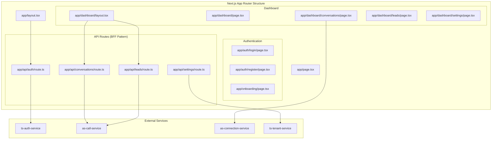

# web-ui Design Document

## Service Overview

**Service Name**: web-ui  
**Port**: 3000  
**Phase**: 1 - User Interface  
**Purpose**: Next.js dashboard application for business owners to manage calls, conversations, and settings  

## Business Requirements

### Primary Functions
- Business owner onboarding and registration
- Real-time dashboard with live conversation updates
- SMS conversation management with AI/human handoff
- Business configuration and settings management
- Lead tracking and appointment scheduling
- System health monitoring and status

### Success Criteria
- Complete onboarding flow in < 5 minutes
- Real-time conversation updates within 1 second
- Responsive design works on desktop, tablet, and mobile
- Manual takeover from AI is seamless and immediate
- All Phase 1 functionality is accessible and intuitive

## Technical Specification

### Technology Stack
- **Framework**: Next.js 14+ with App Router
- **Language**: TypeScript 5+
- **Styling**: Tailwind CSS 3+ with custom design system
- **HTTP Client**: Axios for API communication
- **Real-time**: Socket.IO client for WebSocket connections
- **State Management**: Zustand for client state, React Query for server state
- **Authentication**: NextAuth.js with JWT session management
- **Form Handling**: React Hook Form with Zod validation

### Design System Integration

Based on the existing HTML templates, the application follows this design system:

```css
/* Brand Colors (from HTML templates) */
:root {
  --color-primary: #0A327F;
  --color-primary-hover: #052B6C;
  --color-accent: #314E8D;
  --color-bg-light: #F1F6FB;
  --color-text: #1A1A1A;
}

/* Typography */
font-family: "Inter", Helvetica, Arial, sans-serif;
h1, h2, h3: font-weight: 800, color: var(--color-primary);

/* Component Classes */
.btn-primary: Primary button styling with hover states
.job-card: Card component with hover effects and shadows
.status-badge: Status indicators with color coding
```

### Application Architecture



## Page Specifications

### 1. Marketing/Landing Page (`app/page.tsx`)

**Based on**: `home.html` template  
**Purpose**: Public marketing page with registration CTA  

**Components**:
- Hero section with video demo
- "How It Works" 3-step process
- Pricing cards (4 tiers)
- FAQ accordion
- Footer with legal links

**Key Features**:
- Responsive design matching HTML template exactly
- Video demo player
- SMS demo modal (interactive)
- Smooth scrolling navigation
- Brand color consistency

### 2. Authentication Pages

#### Login Page (`app/auth/login/page.tsx`)
```python
from dataclasses import dataclass

@dataclass
class LoginFormData:
    email: str
    password: str

# Components:
# - LoginForm with email/password fields
# - "Remember me" checkbox
# - "Forgot password" link
# - Social login options (future)
```

#### Registration Page (`app/auth/register/page.tsx`)
```python
from dataclasses import dataclass

@dataclass
class RegisterFormData:
    email: str
    password: str
    confirm_password: str
    first_name: str
    last_name: str
    business_name: str

# Components:
# - Multi-step registration form
# - Terms of service checkbox
# - Email verification flow
# - Automatic redirect to onboarding
```

#### Onboarding Flow (`app/onboarding/page.tsx`)

**5-Step Onboarding Process**:

**Step 1: Business Information**
```python
from dataclasses import dataclass
from typing import Literal

@dataclass
class BusinessInfoData:
    business_name: str
    business_address: str
    trade_type: Literal['plumbing', 'electrical', 'hvac', 'locksmith', 'garage_door']
    service_radius_miles: int
```

**Step 2: Phone Number Setup**
- Automatic phone number provisioning
- Area code selection
- Twilio integration status
- Progress indicator

**Step 3: Business Hours & Settings**
```python
from dataclasses import dataclass

@dataclass
class BusinessHoursData:
    business_hours_start: str  # "07:00"
    business_hours_end: str    # "18:00"
    business_timezone: str     # "America/Los_Angeles"
    greeting_template: str
```

**Step 4: AI Configuration**
```python
from dataclasses import dataclass

@dataclass
class AIConfigData:
    greeting_template: str
    basic_job_estimate_min: float
    basic_job_estimate_max: float
    ai_takeover_delay_seconds: int
```

**Step 5: Test & Complete**
- Test SMS functionality
- System health check
- Completion celebration
- Redirect to dashboard

### 3. Dashboard Pages

#### Main Dashboard (`app/dashboard/page.tsx`)

**Based on**: `scheduled-jobs.html` layout patterns  

**Layout Sections**:
```tsx
// Header with navigation and user menu
// Real-time stats cards
// Active conversations list
// Recent calls timeline
// Quick actions panel
```

**Real-time Components**:
- Live conversation counter
- Call status indicators  
- AI activity badges
- Connection status indicator

**Stats Cards**:
```python
from dataclasses import dataclass

@dataclass
class DashboardStats:
    calls_today: int
    missed_calls_today: int
    conversations_active: int
    leads_generated: int
    ai_active_count: int
```

#### Conversations Page (`app/dashboard/conversations/page.tsx`)

**Primary Interface**: SMS conversation management  

**Components**:

1. **Conversation List** (Left Panel)
```python
from dataclasses import dataclass
from typing import Literal
from datetime import datetime

@dataclass
class ConversationListItem:
    id: str
    customer_phone: str
    last_message: str
    last_message_at: datetime
    message_count: int
    status: Literal['active', 'completed', 'abandoned']
    ai_active: bool
    unread_count: int
```

2. **Conversation View** (Right Panel)
```python
from dataclasses import dataclass
from typing import Literal
from datetime import datetime

@dataclass
class Message:
    id: str
    direction: Literal['inbound', 'outbound']
    body: str
    sender: Literal['customer', 'system', 'ai', 'human']
    timestamp: datetime
    status: Literal['sent', 'delivered', 'read']
```

**Key Features**:
- Real-time message updates via WebSocket
- AI/Human takeover buttons
- Message composition with quick replies
- Customer information panel
- Lead status updates
- Conversation threading

3. **Takeover Interface**
```tsx
// AI Active State:
<div className="bg-blue-50 border border-blue-200 rounded-lg p-4">
  <div className="flex items-center justify-between">
    <div className="flex items-center">
      <div className="w-3 h-3 bg-blue-500 rounded-full animate-pulse mr-2"></div>
      <span className="text-blue-700 font-medium">AI is responding...</span>
    </div>
    <button className="btn-primary" onClick={handleTakeover}>
      Take Over Conversation
    </button>
  </div>
</div>

// Human Active State:
<div className="bg-green-50 border border-green-200 rounded-lg p-4">
  <div className="flex items-center">
    <div className="w-3 h-3 bg-green-500 rounded-full mr-2"></div>
    <span className="text-green-700 font-medium">You're handling this conversation</span>
  </div>
</div>
```

#### Leads Page (`app/dashboard/leads/page.tsx`)

**Purpose**: Lead tracking and management  

**Components**:

1. **Leads List View**
```python
from dataclasses import dataclass
from typing import Optional, Literal
from datetime import datetime

@dataclass
class Lead:
    id: str
    customer_phone: str
    job_type: str
    urgency_level: Literal['low', 'normal', 'high', 'emergency']
    status: Literal['new', 'qualified', 'appointment_scheduled', 'completed', 'lost']
    created_at: datetime
    customer_name: Optional[str] = None
    customer_address: Optional[str] = None
    estimated_value: Optional[float] = None
```

2. **Lead Detail Modal**
- Customer information
- Job details and notes
- AI analysis results
- Status update controls
- Appointment scheduling

3. **Status Management**
```tsx
const statusColors = {
  'new': 'bg-gray-100 text-gray-800',
  'qualified': 'bg-blue-100 text-blue-800',
  'appointment_scheduled': 'bg-yellow-100 text-yellow-800',
  'completed': 'bg-green-100 text-green-800',
  'lost': 'bg-red-100 text-red-800'
};
```

#### Settings Page (`app/dashboard/settings/page.tsx`)

**Sections**:

1. **Business Profile**
```python
from dataclasses import dataclass

@dataclass
class BusinessProfile:
    business_name: str
    business_address: str
    business_phone: str
    trade_type: str
    service_radius_miles: int
```

2. **Business Hours** (matching `working_hours.html` pattern)
```tsx
// Day chips with time pickers
<div className="grid grid-cols-7 gap-2">
  {days.map(day => (
    <div key={day} className="day-chip">
      <label className="font-medium">{day}</label>
      <input type="time" value={startTime} />
      <input type="time" value={endTime} />
    </div>
  ))}
</div>
```

3. **AI Configuration**
```python
from dataclasses import dataclass

@dataclass
class AISettings:
    greeting_template: str
    ai_takeover_delay_seconds: int
    basic_job_estimate_min: float
    basic_job_estimate_max: float
```

4. **Notification Preferences**
```python
from dataclasses import dataclass

@dataclass
class NotificationSettings:
    sms_enabled: bool
    email_enabled: bool
    push_enabled: bool
    dashboard_sounds: bool
```

## Component Library

### Core Components

#### 1. Layout Components
```python
# DashboardLayout.tsx
from dataclasses import dataclass
from typing import Optional, Any

@dataclass
class DashboardLayoutProps:
    children: Any  # React.ReactNode equivalent
    title: Optional[str] = None

# Navigation.tsx - Matches HTML template nav structure
class NavItem:
    def __init__(self, name: str, href: str, icon: Any):
        self.name = name
        self.href = href
        self.icon = icon

nav_items = [
    NavItem('Dashboard', '/dashboard', 'HomeIcon'),
    NavItem('Conversations', '/dashboard/conversations', 'ChatIcon'),
    NavItem('Leads', '/dashboard/leads', 'UsersIcon'),
    NavItem('Settings', '/dashboard/settings', 'CogIcon'),
]
```

#### 2. UI Components (Matching HTML Templates)
```python
# Button.tsx - Based on .btn-primary from HTML
from dataclasses import dataclass
from typing import Optional, Literal, Any, Callable

@dataclass
class ButtonProps:
    variant: Literal['primary', 'secondary', 'ghost']
    size: Literal['sm', 'md', 'lg']
    children: Any  # React.ReactNode equivalent
    on_click: Optional[Callable[[], None]] = None
    disabled: Optional[bool] = None

# Card.tsx - Based on .job-card from HTML
@dataclass
class CardProps:
    children: Any  # React.ReactNode equivalent
    hover: Optional[bool] = None
    class_name: Optional[str] = None

# Badge.tsx - Based on .status-badge from HTML
@dataclass
class BadgeProps:
    variant: Literal['confirmed', 'pending', 'success', 'warning', 'error']
    children: Any  # React.ReactNode equivalent
```

#### 3. Real-time Components
```python
# ConversationList.tsx
from dataclasses import dataclass
from typing import List, Optional, Callable, Literal

@dataclass
class ConversationListProps:
    conversations: List['Conversation']
    on_select: Callable[[str], None]
    selected_id: Optional[str] = None

# MessageBubble.tsx
@dataclass
class MessageBubbleProps:
    message: 'Message'
    is_own: bool

# StatusIndicator.tsx
@dataclass
class StatusIndicatorProps:
    status: Literal['online', 'offline', 'ai-active', 'human-active']
    pulse: Optional[bool] = None
```

### Form Components

#### 1. Form Handling with React Hook Form
```python
# useOnboardingForm.ts
from dataclasses import dataclass
from typing import Any

@dataclass
class OnboardingFormData:
    step1: BusinessInfoData
    step2: Any  # PhoneSetupData - type to be defined
    step3: BusinessHoursData
    step4: AIConfigData
    step5: Any  # CompletionData - type to be defined

# Note: React Hook Form equivalent would be implemented in Python frontend framework
class OnboardingFormHook:
    def __init__(self):
        self.current_step = 1
        self.is_submitting = False
        self.form_data = None
    
    def set_current_step(self, step: int):
        self.current_step = step
    
    def set_submitting(self, submitting: bool):
        self.is_submitting = submitting
```

#### 2. Validation Schemas
```tsx
// validation/schemas.ts
const businessInfoSchema = z.object({
  businessName: z.string().min(3).max(100),
  businessAddress: z.string().min(10),
  tradeType: z.enum(['plumbing', 'electrical', 'hvac', 'locksmith', 'garage_door']),
  serviceRadiusMiles: z.number().min(1).max(100)
});
```

## Real-time Features

### WebSocket Integration

#### 1. Socket.IO Client Setup
```tsx
// lib/socket.ts
import { io, Socket } from 'socket.io-client';

class SocketManager {
  private socket: Socket | null = null;
  
  connect(token: string) {
    this.socket = io(process.env.NEXT_PUBLIC_AS_CONNECTION_SERVICE_URL, {
      auth: { token },
      transports: ['websocket', 'polling']
    });
    
    this.setupEventHandlers();
  }
  
  private setupEventHandlers() {
    this.socket?.on('call_incoming', this.handleCallIncoming);
    this.socket?.on('call_missed', this.handleCallMissed);
    this.socket?.on('message_received', this.handleMessageReceived);
    this.socket?.on('ai_activated', this.handleAIActivated);
  }
}
```

#### 2. Real-time Hooks
```tsx
// hooks/useRealTimeConversations.ts
const useRealTimeConversations = (tenantId: string) => {
  const [conversations, setConversations] = useState<Conversation[]>([]);
  const { socket } = useSocket();
  
  useEffect(() => {
    socket?.on('message_received', (data) => {
      setConversations(prev => 
        updateConversationWithMessage(prev, data.conversationId, data)
      );
    });
    
    socket?.on('ai_activated', (data) => {
      setConversations(prev =>
        updateConversationAIStatus(prev, data.conversationId, true)
      );
    });
    
    return () => {
      socket?.off('message_received');
      socket?.off('ai_activated');
    };
  }, [socket]);
  
  return { conversations };
};
```

### State Management

#### 1. Zustand Stores
```python
# stores/authStore.ts
from dataclasses import dataclass
from typing import Optional, Callable, Awaitable, Dict

@dataclass
class AuthState:
    user: Optional['User']
    tenant: Optional['Tenant']
    is_authenticated: bool
    login: Callable[['LoginCredentials'], Awaitable[None]]
    logout: Callable[[], None]
    register: Callable[['RegisterData'], Awaitable[None]]

# stores/dashboardStore.ts
@dataclass
class DashboardState:
    stats: DashboardStats
    conversations: List['Conversation']
    selected_conversation_id: Optional[str]
    ai_active: Dict[str, bool]
    update_stats: Callable[[Dict], None]  # Partial<DashboardStats> equivalent
    set_selected_conversation: Callable[[Optional[str]], None]
```

#### 2. React Query Integration
```tsx
// hooks/useConversations.ts
const useConversations = (tenantId: string) => {
  return useQuery({
    queryKey: ['conversations', tenantId],
    queryFn: () => conversationsApi.getByTenant(tenantId),
    refetchInterval: 30000, // Fallback polling
    staleTime: 10000
  });
};

// hooks/useConversationMutations.ts
const useConversationMutations = () => {
  const queryClient = useQueryClient();
  
  const sendMessage = useMutation({
    mutationFn: conversationsApi.sendMessage,
    onSuccess: (data) => {
      queryClient.invalidateQueries(['conversations']);
      // Real-time update via socket
    }
  });
  
  const takeoverFromAI = useMutation({
    mutationFn: conversationsApi.takeoverFromAI,
    onSuccess: (data) => {
      queryClient.invalidateQueries(['conversations']);
    }
  });
  
  return { sendMessage, takeoverFromAI };
};
```

## API Integration

### Backend-for-Frontend (BFF) Pattern

#### 1. API Routes Structure
```tsx
// app/api/conversations/route.ts
export async function GET(request: NextRequest) {
  const session = await getServerSession(authOptions);
  if (!session) return NextResponse.json({ error: 'Unauthorized' }, { status: 401 });
  
  const conversations = await conversationsService.getByTenant(session.user.tenantId);
  return NextResponse.json({ conversations });
}

export async function POST(request: NextRequest) {
  const session = await getServerSession(authOptions);
  const body = await request.json();
  
  const message = await conversationsService.sendMessage({
    conversationId: body.conversationId,
    message: body.message,
    userId: session.user.id
  });
  
  return NextResponse.json({ message });
}
```

#### 2. Service Layer
```tsx
// lib/services/conversationsService.ts
class ConversationsService {
  private axios = createAxiosInstance();
  
  async getByTenant(tenantId: string): Promise<Conversation[]> {
    const response = await this.axios.get(
      `${process.env.AS_CALL_SERVICE_URL}/conversations/tenant/${tenantId}`
    );
    return response.data.conversations;
  }
  
  async sendMessage(data: SendMessageData): Promise<Message> {
    const response = await this.axios.post(
      `${process.env.AS_CALL_SERVICE_URL}/conversations/${data.conversationId}/reply`,
      {
        message: data.message,
        takeOverFromAI: true
      }
    );
    return response.data.message;
  }
}
```

## Security Implementation

### Authentication with NextAuth.js

```tsx
// app/api/auth/[...nextauth]/route.ts
export const authOptions: NextAuthOptions = {
  providers: [
    CredentialsProvider({
      name: 'credentials',
      credentials: {
        email: { label: 'Email', type: 'email' },
        password: { label: 'Password', type: 'password' }
      },
      async authorize(credentials) {
        if (!credentials?.email || !credentials?.password) return null;
        
        const response = await fetch(`${process.env.TS_AUTH_SERVICE_URL}/auth/login`, {
          method: 'POST',
          headers: { 'Content-Type': 'application/json' },
          body: JSON.stringify({
            email: credentials.email,
            password: credentials.password
          })
        });
        
        if (!response.ok) return null;
        
        const data = await response.json();
        return {
          id: data.user.id,
          email: data.user.email,
          name: `${data.user.firstName} ${data.user.lastName}`,
          tenantId: data.user.tenantId,
          accessToken: data.tokens.accessToken
        };
      }
    })
  ],
  session: { strategy: 'jwt' },
  pages: {
    signIn: '/auth/login',
    signUp: '/auth/register'
  }
};
```

### Protected Routes

```tsx
// middleware.ts
export function middleware(request: NextRequest) {
  const token = request.cookies.get('next-auth.session-token');
  
  if (request.nextUrl.pathname.startsWith('/dashboard') && !token) {
    return NextResponse.redirect(new URL('/auth/login', request.url));
  }
  
  if (request.nextUrl.pathname.startsWith('/auth') && token) {
    return NextResponse.redirect(new URL('/dashboard', request.url));
  }
}

export const config = {
  matcher: ['/dashboard/:path*', '/auth/:path*', '/onboarding/:path*']
};
```

## Performance Optimization

### 1. Code Splitting and Lazy Loading
```tsx
// Lazy load heavy components
const ConversationDetail = lazy(() => import('./ConversationDetail'));
const LeadManagement = lazy(() => import('./LeadManagement'));

// Dynamic imports for dashboard sections
const DashboardSection = dynamic(() => import('./DashboardSection'), {
  loading: () => <DashboardSkeleton />,
  ssr: false
});
```

### 2. Data Fetching Optimization
```tsx
// Prefetch critical data
export async function getServerSideProps(context) {
  const queryClient = new QueryClient();
  
  await queryClient.prefetchQuery(['conversations'], () => 
    conversationsApi.getByTenant(context.session.user.tenantId)
  );
  
  return {
    props: {
      dehydratedState: dehydrate(queryClient)
    }
  };
}
```

### 3. Bundle Optimization
```tsx
// next.config.js
const nextConfig = {
  experimental: {
    optimizeCss: true,
    swcMinify: true
  },
  webpack: (config) => {
    config.resolve.alias['@'] = path.resolve(__dirname, 'src');
    return config;
  }
};
```

## Testing Strategy

### 1. Component Testing
```tsx
// __tests__/components/ConversationList.test.tsx
describe('ConversationList', () => {
  it('renders conversations correctly', () => {
    render(<ConversationList conversations={mockConversations} />);
    expect(screen.getByText('Customer A')).toBeInTheDocument();
  });
  
  it('handles conversation selection', async () => {
    const onSelect = jest.fn();
    render(<ConversationList conversations={mockConversations} onSelect={onSelect} />);
    
    fireEvent.click(screen.getByText('Customer A'));
    expect(onSelect).toHaveBeenCalledWith('conv-1');
  });
});
```

### 2. Integration Testing
```tsx
// __tests__/pages/dashboard.test.tsx
describe('Dashboard Page', () => {
  it('displays real-time updates', async () => {
    render(<DashboardPage />);
    
    // Mock WebSocket event
    act(() => {
      mockSocket.emit('call_incoming', mockCallData);
    });
    
    await waitFor(() => {
      expect(screen.getByText('New call from +1234567890')).toBeInTheDocument();
    });
  });
});
```

### 3. E2E Testing with Playwright
```tsx
// e2e/onboarding.spec.ts
test('complete onboarding flow', async ({ page }) => {
  await page.goto('/onboarding');
  
  // Step 1: Business Info
  await page.fill('[data-testid="business-name"]', 'Test Plumbing Co');
  await page.fill('[data-testid="business-address"]', '123 Test St, Test City, CA 90210');
  await page.click('[data-testid="next-step"]');
  
  // Verify phone number provisioned
  await expect(page.locator('[data-testid="phone-number"]')).toBeVisible();
  
  // Complete remaining steps...
  await page.click('[data-testid="complete-onboarding"]');
  
  // Should redirect to dashboard
  await expect(page).toHaveURL('/dashboard');
});
```

## Deployment Configuration

### 1. Environment Variables
```bash
# Authentication
NEXTAUTH_URL=https://app.nevermisscall.com
NEXTAUTH_SECRET=your-secret-key

# Backend Services
TS_AUTH_SERVICE_URL=http://localhost:3301
TS_TENANT_SERVICE_URL=http://localhost:3302
TS_USER_SERVICE_URL=http://localhost:3303
PNS_PROVISIONING_SERVICE_URL=http://localhost:3501
AS_CALL_SERVICE_URL=http://localhost:3103
AS_CONNECTION_SERVICE_URL=http://localhost:3105
AS_INFRASTRUCTURE_SERVICE_URL=http://localhost:3106
TWILIO_SERVER_URL=http://localhost:3701
DISPATCH_AI_URL=http://localhost:3801

# Real-time
NEXT_PUBLIC_SOCKET_URL=ws://localhost:3105

# External Services
NEXT_PUBLIC_GOOGLE_MAPS_API_KEY=your-maps-key
```

### 2. Docker Configuration
```dockerfile
# Dockerfile
FROM node:18-alpine AS base
WORKDIR /app
COPY package*.json ./
RUN npm ci --only=production

FROM base AS build
COPY . .
RUN npm run build

FROM base AS runtime
COPY --from=build /app/.next ./.next
EXPOSE 3000
CMD ["npm", "start"]
```

### 3. Performance Monitoring
```tsx
// lib/analytics.ts
export const reportWebVitals = (metric: any) => {
  if (metric.label === 'web-vital') {
    // Report to analytics service
    console.log(metric);
  }
};
```

This web-ui design document provides comprehensive specifications for building a Next.js application that perfectly matches Phase 1 requirements while following the established design system from the HTML templates. The application will provide all necessary functionality for business owners to manage their missed call recovery system effectively.