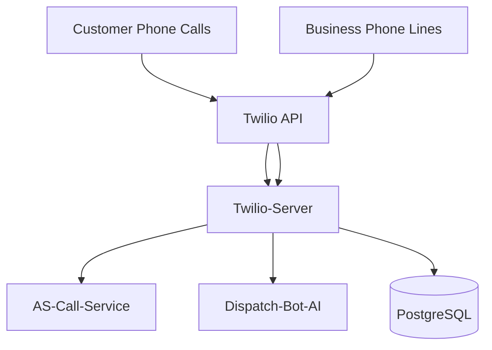
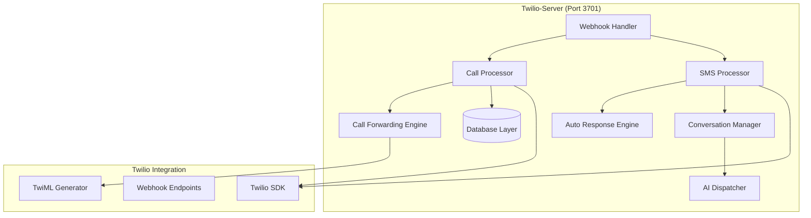

# Twilio-Server Architecture

## Context Diagram

### Users & Systems

### Service Boundaries
- **Internal**: Twilio webhook processing and call management hub
- **External**: Bridge between Twilio cloud services and NeverMissCall platform
- **Call Processing**: Core call routing, forwarding, and SMS automation system

## Components & Data Flow

### Core Components

### Data Flow Patterns
1. **Missed Call Flow**: 
   - Incoming call → Forward to business phone → No answer detection → SMS automation → Conversation initiation
2. **SMS Conversation Flow**: 
   - SMS receipt → Conversation routing → AI processing → Response generation → SMS delivery
3. **Call Forwarding Flow**: 
   - Call webhook → Number lookup → Business phone forwarding → Status tracking → Analytics
4. **AI Handoff Flow**: 
   - 60-second timer → Human response check → AI takeover decision → Conversation processing

### MVP Implementation Status
- ✅ **Basic Webhook Handler**: Express server with Twilio integration
- ✅ **Call Forwarding**: Routes calls to business phones with 20s timeout
- ✅ **Missed Call Detection**: Detects no-answer/busy/failed statuses
- ✅ **Auto SMS Response**: Sends automated SMS when calls are missed
- ⏳ **SMS Conversation Management**: Phase 2 implementation
- ⏳ **AI Integration**: Phase 2 AI dispatcher logic

## SLOs & Scaling Notes

### Service Level Objectives
- **Availability**: 99.9% uptime (critical for call processing)
- **Latency**: 
  - Webhook processing: < 500ms (P95)
  - Call forwarding: < 2s connection time
  - SMS delivery: < 5s (P95)
  - AI response: < 10s (P95)
- **Throughput**: 
  - 1000 concurrent calls
  - 500 SMS messages/minute
  - 100 webhook processes/second
- **Reliability**: 99.5% call connection success rate

### Performance Characteristics
- **Webhook Processing**: Fast webhook validation and response generation
- **Twilio Integration**: Optimized Twilio SDK usage with connection pooling
- **Call Routing**: Efficient number lookup and forwarding logic
- **Message Processing**: Async SMS processing with queue management

### Scaling Approach
- **Horizontal Scaling**: Stateless webhook processing across multiple instances
- **Load Balancing**: Twilio webhook distribution across service instances
- **Queue Management**: SMS and AI processing queues for high throughput
- **Database Optimization**: Efficient call and conversation data storage

## Risks & Mitigations

### Technical Risks
| Risk | Impact | Probability | Mitigation |
|------|---------|-------------|------------|
| Twilio service outage | Critical | Low | Service health monitoring + failover |
| Webhook delivery failures | High | Medium | Retry logic + error handling |
| Call forwarding failures | High | Medium | Fallback routing + monitoring |
| Database connection issues | Medium | Low | Connection pooling + retry logic |

### Business Risks
- **Missed Calls**: Failed call forwarding causing lost business opportunities
- **SMS Delays**: Delayed auto-responses reducing customer satisfaction
- **Conversation Gaps**: Lost conversation context affecting AI performance
- **Call Quality**: Poor call quality affecting customer experience

### Integration Risks
- **AI Service Dependency**: Dispatch-bot-AI service failures affecting automation
- **Call Service Integration**: AS-Call-Service failures affecting analytics
- **Network Connectivity**: Internet connectivity issues affecting Twilio integration
- **Configuration Errors**: Misconfigured phone numbers causing routing failures

### Mitigation Strategies
- **Health Monitoring**: Comprehensive monitoring of Twilio service health
- **Error Handling**: Robust error handling with user-friendly fallbacks
- **Redundancy**: Multiple phone number routing options
- **Testing**: Regular testing of call flows and SMS automation

## Open Questions

### Architecture Decisions Needed
- [ ] **Microservice Split**: Should SMS and call processing be separate services?
- [ ] **State Management**: How to manage conversation state across AI handoffs?
- [ ] **Event Sourcing**: Should call events use event sourcing for better auditability?
- [ ] **Queue Architecture**: Message queues for SMS processing vs direct processing?

### Twilio Integration
- [ ] **Webhook Security**: Enhanced webhook signature validation requirements?
- [ ] **Rate Limiting**: How to handle Twilio API rate limits effectively?
- [ ] **Error Recovery**: Comprehensive error recovery for failed Twilio operations?
- [ ] **Multiple Accounts**: Support for multiple Twilio accounts per tenant?

### Call Management Features
- [ ] **Advanced Routing**: Support for complex call routing rules?
- [ ] **Call Recording**: Integration with call recording and transcription?
- [ ] **Conference Calls**: Support for multi-party conference calls?
- [ ] **Call Analytics**: Real-time call quality and performance analytics?

### SMS & Messaging
- [ ] **Rich Messaging**: Support for MMS and rich media messages?
- [ ] **Message Templates**: Template system for different response scenarios?
- [ ] **Conversation Context**: How to maintain context across long conversations?
- [ ] **Message Scheduling**: Delayed message sending capabilities?

### AI Integration
- [ ] **AI Response Time**: Optimal wait time before AI takeover?
- [ ] **Context Passing**: How to pass conversation context to AI service?
- [ ] **Human Takeover**: Smooth transition from AI back to human agents?
- [ ] **AI Training**: Integration with AI training data collection?

### Performance & Scaling
- [ ] **Connection Pooling**: Optimal Twilio SDK connection management?
- [ ] **Caching Strategy**: What Twilio data should be cached?
- [ ] **Database Optimization**: Efficient storage of call and message data?
- [ ] **Load Testing**: Comprehensive load testing of call processing?

### Security & Compliance
- [ ] **Call Recording Security**: Encryption and access control for recordings?
- [ ] **Message Privacy**: Privacy protection for SMS conversations?
- [ ] **Webhook Security**: Enhanced security for webhook endpoints?
- [ ] **Compliance Requirements**: TCPA and other telecommunications compliance?

### Business Logic
- [ ] **Business Hours**: Advanced business hours handling and routing?
- [ ] **Emergency Detection**: Automatic emergency call detection and routing?
- [ ] **Customer Preferences**: Customer communication preferences management?
- [ ] **Multi-Language**: Support for multiple language auto-responses?

### Monitoring & Observability
- [ ] **Call Quality Monitoring**: Real-time call quality metrics?
- [ ] **Twilio Health**: Monitoring of Twilio service health and performance?
- [ ] **Error Tracking**: Comprehensive error tracking and alerting?
- [ ] **Business Metrics**: Call conversion and business outcome tracking?

### Future Enhancements
- [ ] **Video Calls**: Video calling capabilities through Twilio Video?
- [ ] **Chat Integration**: Integration with web chat and messaging platforms?
- [ ] **Voice AI**: Real-time voice AI during active calls?
- [ ] **Advanced Analytics**: Advanced call analytics and reporting features?